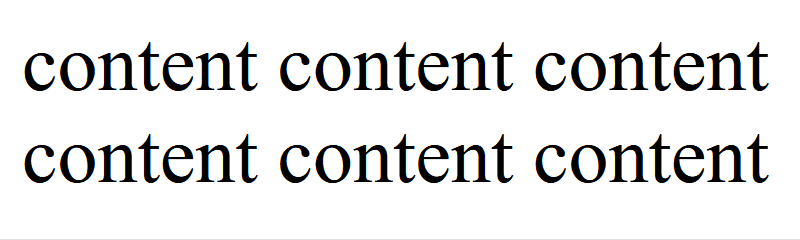
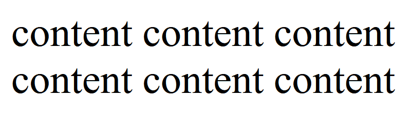

# 下划线动画（新）

``2023/12/20``

- - -

原本之前是[写过一次](Web 前端/CSS/下划线动画.md)的，之所以再发一回主要是因为看到的[ B 站上的一个视频](https://www.bilibili.com/video/BV1Rb4y1g7bp/)，觉得这种实现更加实用，在此记录。

- - -

## 实现思路

利用 CSS inline box 的特性，使用 CSS 的 ``background`` 属性，实现在多行文本下也能轻松实现下划线动画。这种方案的优势是不涉及伪元素，实现更加灵活；但同时劣势就是由于利用了 inline box 的特性，对于 ``div`` 等 block box 元素无法实现理想效果。

## 具体实现

示例使用的 HTML 结构如下：

```xml
<span>content content content <br> content content content</span>
```

在需要实现下划线动画的元素添加如下样式：

```css
span {
    /* 为元素设置背景 */
    background-image: linear-gradient(to right, #333, #333);
    background-repeat: no-repeat;
    /* 将背景位置设置到元素左下角 */
    background-position: left bottom;
    /* 设置背景尺寸，使其看起来像下划线 */
    background-size: 0 2px;
    /* 设置”下划线”的动画速率 */
    transition: background-size .3s;
}
```

在设置放上鼠标时的样式：

```css
span:hover {
    background-size: 100% 2px;
}
```

目前的效果如下：



更进一步，要想实现下面👇这样的效果：



则要对上面的 CSS 代码进行一点小修改：

```css
/* 将原本的背景位置从左下角改为右下角 */
span {
    background-position: right bottom;
}
/* 
    再在鼠标经过时改变背景位置，由于前文中没有对背景位置属性设置 transition，
    在鼠标移入元素时，背景会从左侧进入，
    而在鼠标移入元素时，背景则会从右侧退出。
*/
span:hover {
    background-position: left bottom;
}
```

在浏览器中的实际效果可以看这里：

@[下划线动画](.下划线动画（新）/demo.html)
