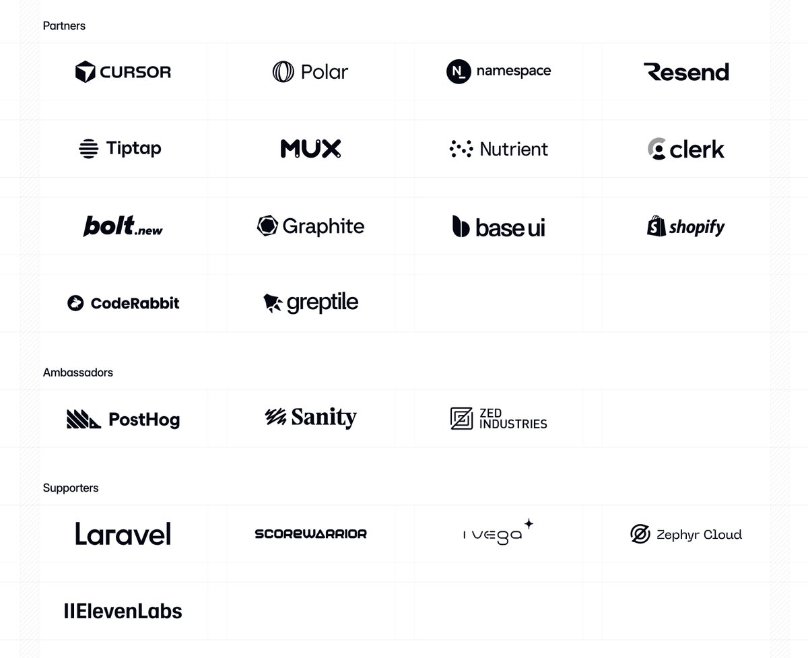

# AI 时代下被广泛使用的 TailwindCSS 遇到变现困境

``2026/1/9``

事情起源于 TailwindCSS GitHub 仓库下的[这条 PR](https://github.com/tailwindlabs/tailwindcss.com/pull/2388)

这个 PR 旨在给 TailwindCSS 添加 llms.txt 支持，以让这个在 AI Coding 时代下被广泛使用的 CSS 框架更容易被 LLM 使用。

但是这个 PR 一直没有进展。当有人询问缘由时，核心贡献者[回复](https://github.com/tailwindlabs/tailwindcss.com/pull/2388#issuecomment-3715074726)如下：

> Have more important things to do like figure out how to make enough money for the business to be sustainable right now. And making it easier for LLMs to read our docs just means less traffic to our docs which means less people learning about our paid products and the business being even less sustainable.
> 有更多重要的事情要做，比如想办法在当下让公司业务可持续地赚到足够的钱。让 LLMs 更容易读取我们的文档只会减少我们文档的访问量，这意味着更少的人了解我们的付费产品，从而使业务变得更加不可持续。
> 
> Just don't have time to work on things that don't help us pay the bills right now, sorry. We may add this one day but closing for now.
> 很抱歉，目前我们没有时间去处理那些无法帮助我们支付账单的事情。也许有一天我们会添加这个功能，但目前先关闭了。

当收到社区质疑后，作者[回复](https://github.com/tailwindlabs/tailwindcss.com/pull/2388#issuecomment-3717222957)道：

> I totally see the value in the feature and I would like to find a way to add it.
> 我完全理解这个功能的价值，并且我想找到一种方法来添加它。
> 
> But the reality is that 75% of the people on our engineering team lost their jobs here yesterday because of the brutal impact AI has had on our business. And every second I spend trying to do fun free things for the community like this is a second I'm not spending trying to turn the business around and make sure the people who are still here are getting their paychecks every month.
> 但现实是，昨天我们工程团队有 75% 的人被裁掉了，因为人工智能对我们的业务造成了严重冲击。我现在每花一秒钟来做这些有趣的、免费的社区项目，就意味着我少花一秒钟去努力扭转业务局面，确保留下来的员工每月都能按时领到工资。
> 
> Traffic to our docs is down about 40% from early 2023 despite Tailwind being more popular than ever. The docs are the only way people find out about our commercial products, and without customers we can't afford to maintain the framework. I really want to figure out a way to offer LLM-optimized docs that don't make that situation even worse (again we literally had to lay off 75% of the team yesterday), but I can't prioritize it right now unfortunately, and I'm nervous to offer them without solving that problem first.
> 我们的文档访问量相比 2023 年初下降了约 40%，尽管 Tailwind 目前比以往任何时候都更受欢迎。文档是人们了解我们商业产品的唯一途径，而如果没有客户，我们将无法承担框架的维护成本。我真的很想找到一种方法来提供针对 LLM 优化的文档，同时又不会让当前的情况变得更糟（毕竟我们昨天不得不裁掉了 75% 的团队），但遗憾的是我现在无法优先处理这件事，而且在解决这个问题之前就推出 LLM 优化文档，我感到非常担忧。
> 
> @PaulRBerg I don't see the AGENTS.md stuff we offer as part of the sponsorship program as anything similar to this at all — that's just a short markdown file with a bunch of my own personal opinions and what I consider best practices to nudge LLMs into writing their Tailwind stuff in a specific way. It's not the docs at all, and I resent the accusation that I am not disclosing my "true intentions" here or something.
> 我完全不认为我们作为赞助计划一部分提供的 AGENTS.md 内容与此有任何相似之处——那只是一个简短的 markdown 文件，包含了我的一些个人观点和我认为的最佳实践，目的是引导 LLMs 以特定方式编写他们的 Tailwind 相关内容。这根本不是文档，而且我反感那种暗示我没有在这里披露我的"真实意图"的指控。
> 
> > This feature is so that people can build MORE things with Tailwind in a FASTER and more EFFICIENT capacity.
> > 此功能的目的是让人们能够以更快、更高效的方式，用 Tailwind 构建更多内容。
> 
> @mtsears4 Tailwind is growing faster than it ever has and is bigger than it ever has been, and our revenue is down close to 80%. Right now there's just no correlation between making Tailwind easier to use and making development of the framework more sustainable. I need to fix that before making Tailwind easier to use benefits anyone, because if I can't fix that this project is going to become unmaintained abandonware when there is no one left employed to work on it. I appreciate the sentiment and agree in spirit, it's just more complicated than that in reality right now.
> Tailwind 的增长速度比以往任何时候都快，规模也达到了前所未有的程度，但我们的收入却下降了近 80%。目前，让 Tailwind 更易于使用与框架开发的可持续性之间几乎没有任何关联。我必须先解决这个问题，否则让 Tailwind 更易用所带来的好处将无从谈起，因为如果我无法解决这一问题，当再也没有人受雇于该项目时，它终将变成无人维护的废弃软件。我理解大家的善意，也从心底认同这种想法，但现实情况目前要复杂得多。

第二天，这一条回复上了 Hacker News 的[热门](https://github.com/headllines/hackernews-daily/issues/2009)，回复的截图也在 X 上火了。

作者发推表示收到了多家大公司的[赞助](https://x.com/adamwathan/status/2009017727592353959)：

- - -

此外，我也去查了下 TailwindCSS 的[商业模式](https://tailwindcss.com/plus)，发现他们的变现模式主要还是通过售卖完整的页面模板和可复用的页面组件。这正好是 AI Coding 时代下，LLM 最擅长的事。也难怪这家公司在 AI 时代下遭受冲击。
