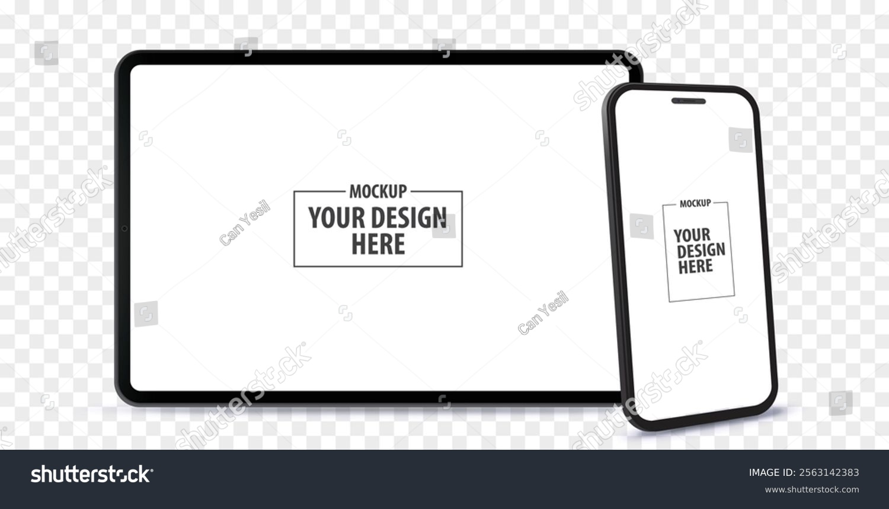
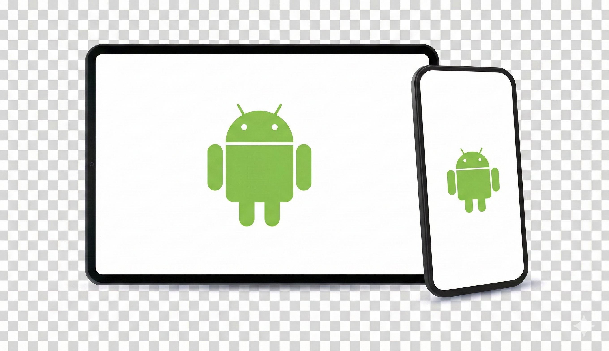

# AI 生图正在摧毁这些网站的生存根基

``2025/12/9``

你是否有这样的经历：在创作视频、制作 PPT 时需要一个图片素材，在网上翻找半天，找到一张符合需求的图片，点击下载，弹出一个付费提示框，你尝试直接下载预览图片使用，却发现预览图片没有透明背景，还有不好去除的水印，只好作罢。

但现在是 AI 时代了，这种只提供预览图片诱导访客开会员付费下载的生意以后可能会越来越难做了。

比如我在[这里](https://www.shutterstock.com/zh/image-vector/horizontal-tablet-computer-vertical-mobile-phone-2563142383?trackingId=9fbfc56d-36a1-4411-9fa3-c2bcd06d1900)找到的一张图比较符合需求：

我不需要给这个网站充值会员获取原始图片，只需要转手将图片丢给谷歌最新的 Nano Banana Pro 模型，让它帮我去掉图片中的水印，再将图片中的占位符换成我需要替换的素材，就得到这样一张图片：

当然，这里图中的“透明背景”实际上是 AI 用生成的网格图像来模仿的，并不是真正的透明背景。但是要透明也简单，让 AI 替换背景为单色，放入 PhotoShop 手动去背景即可。
