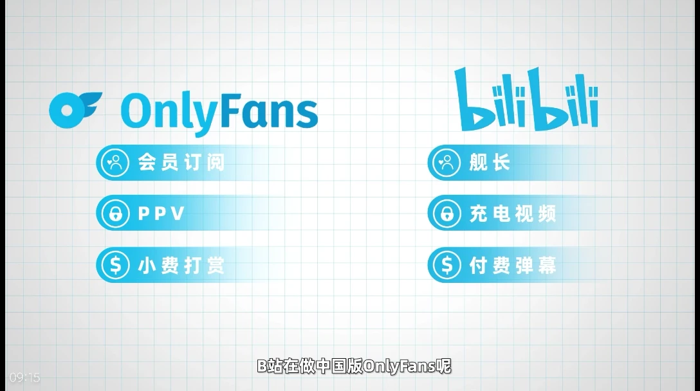

# Onlyfans 的商业模式

``2025/01/23``
信息来源：[左手外包，右手法务，OnlyFans撅爆成人平台市场](https://www.bilibili.com/video/BV1VtwbeNEXq)

- - -

以成人色情内容闻名的 Onlyfans 近年来在经济下行的大环境下过得好不滋润。
从素人到奥运冠军，甚至有知名歌手在 Onlyfans 上售卖脚照的收入超过其在 Spotify 的分成。

有趣的是，Onlyfans 中创作者的盈利模式和 B 站还有几分相像。

由于核心团队精简和较低的收入分成，Onlyfans 并不像其它平台会向创作者提供各种服务。相反，创作者在需要代聊、反盗版等情况下，通常会寻求专门的外包公司。

而 Onlyfans 平台本身，也与传统的色情网站有所不同。Onlyfans 创立之初，就宣称“我们致力于打造世界上最安全的社交媒体平台。”，为了实现这一愿景，Onlyfans 的团队基本都是法律专业人士，也全力避免平台出现儿童色情之类的违法内容。Onlyfans 的 CEO 甚至在公开演讲中宣称自己是女权主义者。

## 用户评论

> 我觉得onlyfans最值得学习的是它的商业模式。
> 1. 用户只为你需要的东西付费。性价比高，且能推动生产端的正确生产方向。
> 2. 缩小团队，平台不把钱花在花里胡哨的地方。
> 我很讨厌现在视频或者音乐平台的会员，你付费的时候必须为你不需要的垃圾一起付费。
> 例如b站的大会员，我买了几年后就停了。
> 我愿意为高清视频付费，毕竟平台流量要钱的嘛。但是我不愿意为大会员里面的别的东西付费，那些东西对我一点用都没有，我凭什么要给钱。
> 而且现在平台会员都有一种绑架用户的倾向，你的付费不一定推动了你喜欢的东西的生产，反而被平台拿去用在生产你没兴趣的东西了。
> 例如我为了高清视频付费之后，b站居然拿钱去拍综艺去请网红了。
> 如果平台能让各种内容独立付费，那么我为高清视频的付费就能推动b站弄上更好的高清视频而不是综艺。

> 感觉是全球经济下行造就了OF，大多数人经济富足时，会倾向于追求线下真实，经济预算不充足时则会倾向于追求虚拟，本质上是经济压力造成的消费降级。
> 举个很好理解的例子，年轻人之所以喜欢宅在家玩电子游戏，不出门进行社交，并不是因为电子游戏的魅力一定大于社交，一大部分原因在于外出社交的经济需求远远大于打游戏，娱乐放松又不可或缺，选择游戏也只是不得已而为之罢了。如果你是富二代，完全不必为了出门撒金而头痛，那么我想没人会选择天天宅在家。
> 另一方面这也像是“普通人见天宫”，真实世界没能力触及的高端货，在线上即可花费一笔小费见识，没法让身体感受到，但可以让大脑识别，阉割一部分体验，但降低了门槛费用，总之性价比可以接受。
