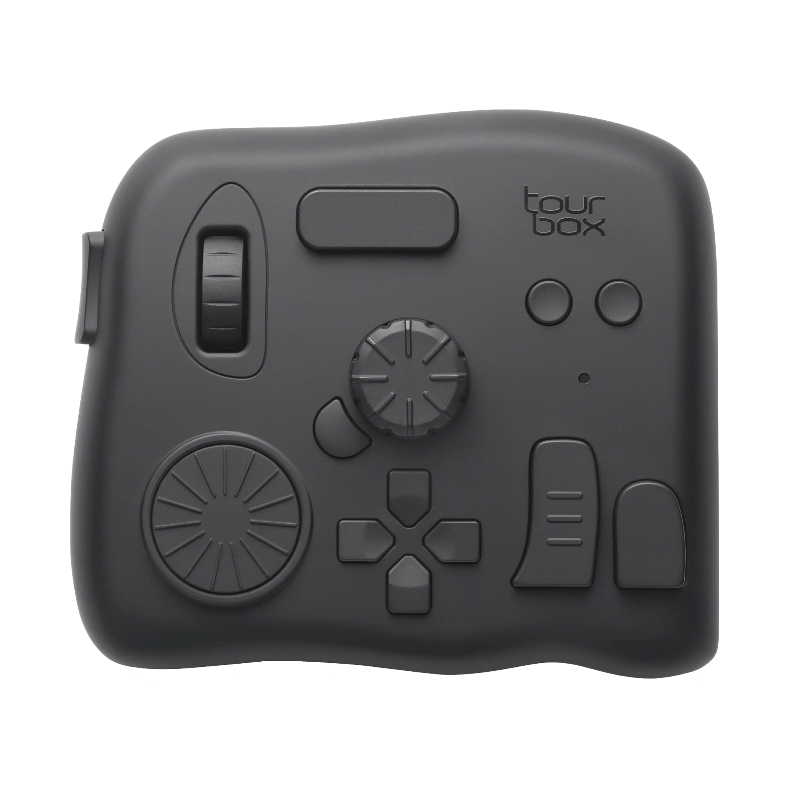

# 为数字创作软件提供实体交互媒介

信息来源：[数字时代下我们丢失的触感](https://www.bilibili.com/video/BV1ZS9tYDErw/)
相关视频：[是被阉割的青春还是无敌的性价比？【TourBox Lite青春版快捷控制器测评】](https://www.bilibili.com/video/BV1UM4m197u4/)

官网：[tourboxtech.cn](https://www.tourboxtech.cn/) [tourboxtech.com](https://www.tourboxtech.com/)

> 创意灵感不应该被繁琐的操作方式所干扰。
> 
> 产品开发的初衷，源自于创始人在日常处理照片与视频的过程中发现，为打字而生的键盘用于操作创意软件，复杂且缓慢。在创意的过程中，总会因为操作问题而被打断灵感与思路。
> 
> 市场上缺乏能够真正解决问题的产品，除了传统的鼠标与键盘，创意者缺乏更为趁手的人机交互工具，去直觉、快捷的操控创意软件。

- - -

## 这是什么？

这是一个类似于游戏手柄的控制器，旨在用实体的按键、旋钮、滚轮等更直观、更符合直觉的交互方式来替代 PS、PR 等创意专业软件的键盘快捷键。

这个控制器乍一看看不出用途，但官网很贴心地附上了很多实际使用时的视频，非常直观（顺便吐槽一下，这个产品的官网虽然设计很棒，但是对性能要求有点高，点进网站后电脑风扇就开始转了）：
>>> 使用场景
@[数字绘画](https://www.tourboxtech.cn/digital-painting/)
@[摄影后期](https://www.tourboxtech.cn/photo-editing/)
@[视频后期](https://www.tourboxtech.cn/video-editing/)
>>>

## 一些评论

> 其实是在为内容创作软件本身不到位的ux设计在额外买单

> 需要专用键盘的软件我只有达芬奇和LR，这俩软件各有各的专用键盘，轮不到这玩意儿
> > 我的桌面和我的钱袋容不下这两个主哈哈，都好贵，后面我也是权衡下选择了博主这个机器，主要是看中它无论哪个软件都能适配和自定义~
