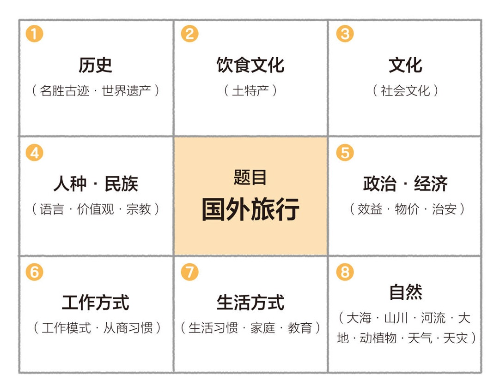

# 九宫格写作法

``2024/12/03``
信息来源：[读《九宫格写作法》](https://lutaonan.com/blog/read-grid-writing-method)

- - -

所谓“九宫格写作法”，就是在开始写作之前，从文章的中心拓展出若干个相关信息点，在写作前根据总结的这些点进行有目的地信息收集，在你把相关信息收集列出后，要写的文章的结构就自然形成了。

> 如果你准备一场旅行，打算旅行过后写一篇游记。你就应该在旅行之前就画好一个九宫格，填上这篇游记你想要写所有的要点：
> 
> 然后在你旅行的时候，才有目标进行相关信息的采集，然后填充到九宫格里面，这样当旅行结束，你已经收集到了足够的信息，把它们整理成为一篇完整的游记。而不是到了当地漫无目的地游玩，然后回来只能追溯一下往事，已经忘了可以写一些什么，最终写出来的只不过是一些浅显的感受。

> 九宫格写作法的中心思想就是：在写作之前，列出你对于这个写作主题的所有想要讨论的问题，然后再动笔。在列出九宫格的同时，整个文章的结构就自然而然地形成了。

> 九宫格写作法突出了写作前信息收集对于轻松写出一篇有价值的长文的重要性，这也是为什么作为一个有意向写作的人来说，平时做笔记那么重要。只有平时在信息输入的时候有意识地把价值输入作为笔记存到你的第二大脑（笔记工具）里，将来才可以基于平时的笔记轻松地写出一篇文章。这个过程也叫作「信息内化」。九宫格写作法辅助了你的「信息内化」能力。
