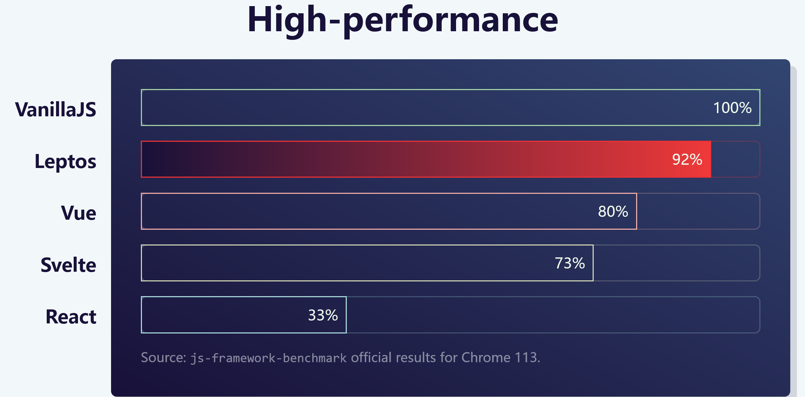

# 使用 Rust 开发全栈应用

``2024/10/27``
项目地址：[leptos](https://github.com/leptos-rs/leptos)

- - -

这个项目能让你完全使用 Rust 开发 Web 应用。

让我们看看它的示例代码：

```rust
use leptos::*;

#[component]
pub fn SimpleCounter(initial_value: i32) -> impl IntoView {
    // create a reactive signal with the initial value
    let (value, set_value) = create_signal(initial_value);

    // create event handlers for our buttons
    // note that `value` and `set_value` are `Copy`, so it's super easy to move them into closures
    let clear = move |_| set_value(0);
    let decrement = move |_| set_value.update(|value| *value -= 1);
    let increment = move |_| set_value.update(|value| *value += 1);

    // create user interfaces with the declarative `view!` macro
    view! {
        <div>
            <button on:click=clear>Clear</button>
            <button on:click=decrement>-1</button>
            // text nodes can be quoted or unquoted
            <span>"Value: " {value} "!"</span>
            <button on:click=increment>+1</button>
        </div>
    }
}

// we also support a builder syntax rather than the JSX-like `view` macro
#[component]
pub fn SimpleCounterWithBuilder(initial_value: i32) -> impl IntoView {
    use leptos::html::*;

    let (value, set_value) = create_signal(initial_value);
    let clear = move |_| set_value(0);
    let decrement = move |_| set_value.update(|value| *value -= 1);
    let increment = move |_| set_value.update(|value| *value += 1);

    // the `view` macro above expands to this builder syntax
    div().child((
        button().on(ev::click, clear).child("Clear"),
        button().on(ev::click, decrement).child("-1"),
        span().child(("Value: ", value, "!")),
        button().on(ev::click, increment).child("+1")
    ))
}

// Easy to use with Trunk (trunkrs.dev) or with a simple wasm-bindgen setup
pub fn main() {
    mount_to_body(|| view! {
        <SimpleCounter initial_value=3 />
    })
}
```

可以看到，在这个框架中，你能使用 ``#[component]`` 过程宏来定义组件，使用 ``view!`` 声明式宏来包含 HTML 元素并返回，也提供了 ``signal`` 以实现响应式。

据其官网介绍，leptos 具备比传统的 Vue、React 等前端框架更高的性能：


与此同时，leptos 也提供了后端开发的相关功能。下面的示例代码实现了一个处理表单请求的 api：

```rust
#[server(SaveFavorites, "/api")]
pub async fn save_favorites(
    favorite_cookie_type: String,
    favorite_color: String,
) -> Result<(), ServerFnError> {
    let pool = get_pool()?;

    let query = "
        INSERT INTO COOKIES 
        (favorite_cookie_type, favorite_color)
        VALUES ($1, $2)
    ";

    sqlx::query(query)
        .bind(favorite_cookie_type)
        .bind(favorite_color)
        .execute(&pool)
        .await
        .map_err(|e| 
            ServerFnError::ServerError(e.to_string())?;

    Ok(format!("Here, have some {favorite_color} {favorite_cookie_type} cookies!"))
}
```
