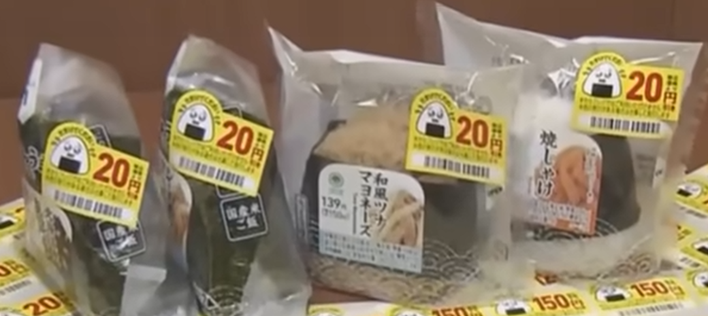

# 使用特殊标签促进临期商品销售

信息来源：
- [临期饭团对你发起求救信号！为降低消费者购买临期食品的羞耻感，推出求救贴纸……](https://www.bilibili.com/video/BV1ZbXCY4EWC/)
- [消費期限迫ったおにぎりに「たすけて」シール 食品ロス削減でファミマ【知っておきたい！】](https://www.youtube.com/watch?v=4n0pBgcqzLI)

- - -

日本的全家便利店中，在临期的食品外包装上贴有如下图所示的哭泣饭团标签。

使用这种标签能让消费者在选购临期食品时减少羞耻感，并提升使命感，“我选择这个临期的饭团不是在贪便宜，而是为了帮助这个哭泣的饭团。”

根据试点结果，若“泪珠贴纸”在全国范围内推广，预计每年可减少门店产生的餐厨垃圾约 3000 吨。

## 视频评论

> 求救小贴纸
> 好看可爱还有趣
> 节约促环保

> 日本人是这样的，为了虚无的空气，氛围，有非常多无形又有形的规律

> 我觉得这样就是很可爱啊，我可能就会买，然后吃掉，减少浪费还能获得一份情绪价值

## 个人观点

虽然评论区中有很多人认为买个临期商品而已，怎么会有羞耻感，我个人认为这样的观点来自于文化差异。就像评论“日本人是这样的，为了虚无的空气，氛围，有非常多无形又有形的规律”所说，至少在日本，确实会有由于羞耻感而不选择购买临期商品的情况。而全家的这一举措无疑是很符合当地情况的。
