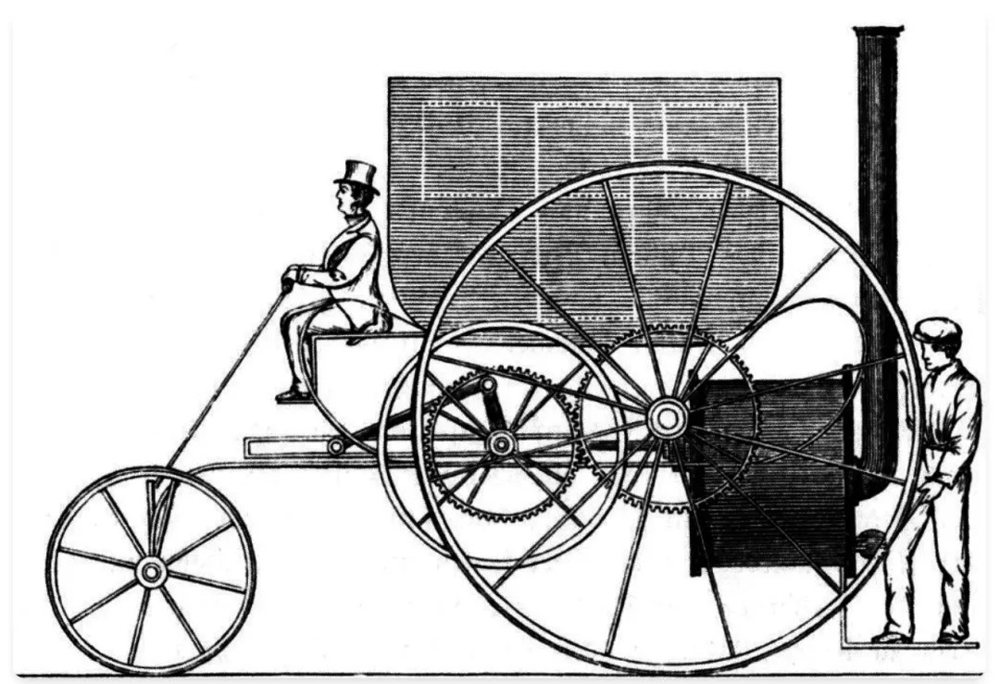

# 如何更好地开发 AI 应用程序

原文：[YC 合伙人最新观察：AI 应用的困境不在模型能力，而是产品设计](https://mp.weixin.qq.com/s/6CJOaw7Z8-fDjclUjmNoIg)

这篇文章从 Gmail 新推出的 AI 功能为引子，介绍了一个理想的 AI 原生应用应该有的样子。

- - -

## 为什么 Gmail 的 AI 功能不好用？

Gmail 的 AI 功能能够接收用户需要表达的内容，帮助用户快速写出像样的邮件。但一个很大的问题是，Gemini 写出的邮件和用户自己会写出的邮件__完全不同__。

> 语气并不是这篇邮件唯一的问题。我还花了很多精力去写提示词，甚至写提示词的字数超过了我自己写邮件的字数。

## 如何避免这种情况？

可以像这样写一些更详细的提示词：

> 告诉我的老板 Garry，我女儿醒来后得了流感，我今天不能来办公室了。邮件正文不要超过一行。尽量简洁明了，但要友好。不要担心标点符号或大小写。结尾用“Pete"或“pete",而不是“Best Regards,Pete",当然也不要用“Love, Pete"。

##但问题在于，每次想写新邮件的时候，用户都需要写类似的内容。##

## 真正的解决方案

应该向用户开放自定义系统提示词的编辑权限。当用户编写自己的系统提示时，就可以教大模型以更个性化的方式写电子邮件。
并且，而且由于系统提示会反复使用，以后的每一次用 AI 代写邮件时，都不需要先打出大段的提示词了。

## 无马马车与旧世界思维

> “无马马车”指的是早期的汽车设计，它大量借鉴了之前的马车。以下是我在维基百科上找到的一张 1803 年蒸汽马车设计图：
> 
> 这种设计的缺陷在当时是无人察觉的，但事后却显而易见。
> 我怀疑我们正经历着类似的人工智能应用时代。其中许多应用就像 Gmail 的 Gemini 集成一样，毫无用处。
> 最初的无马马车诞生于“旧世界思维”，其核心是用发动机取代马匹，而没有重新设计车辆以应对更高的速度。究竟是什么旧世界思维限制了这些人工智能应用呢？

> 现代软件行业建立在这样一个假设之上：我们需要开发人员充当我们与计算机之间的中间人。他们将我们的愿望转化为代码，并将其抽象到我们能够理解的简单、通用的界面背后。
> 分工很明确：开发人员决定软件在一般情况下的行为，用户提供输入来确定软件在特定情况下的行为。
> 在这种框架下，我们很自然地会认为编写系统提示词是开发人员的工作，编写用户提示词是用户的工作。
> 但在 Gmail 的案例中，这就行不通了。AI 助手应该是代表我，用我的方式来写邮件，而不是由谷歌产品经理和律师组成的委员会设计的千篇一律的声音。

> 但在 Gmail 的案例中，这就行不通了。AI 助手应该是代表我，用我的方式来写邮件，而不是由谷歌产品经理和律师组成的委员会设计的千篇一律的声音。
> 在以前，我只能接受通用的产品，因为我很难去编写自己的程序。但到了 AI 时代，不需要通过程序员告诉计算机应该做什么，任何人都可以编写自己的系统提示词。

> 在大多数人工智能应用中，系统提示应该由用户编写和维护，而不是软件开发人员，甚至是开发人员聘请的领域专家。
> 大多数人工智能应用程序应该是 Agent 构建器，而不是 Agent 本身。
