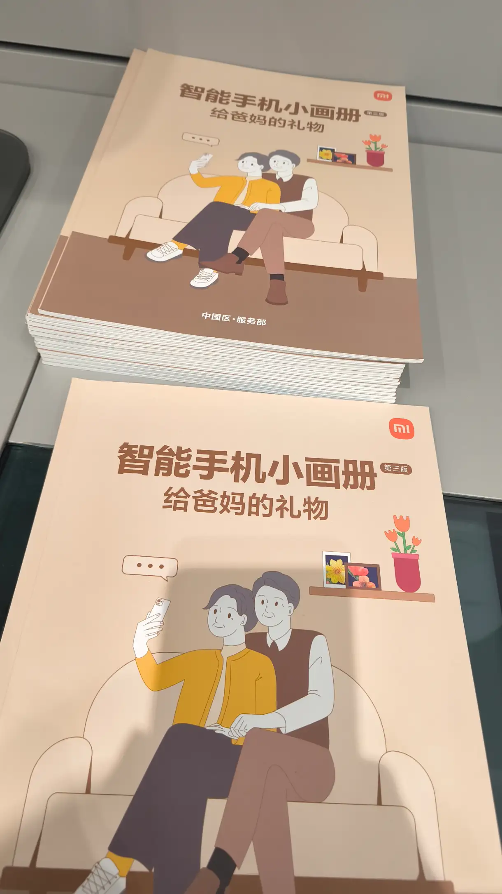
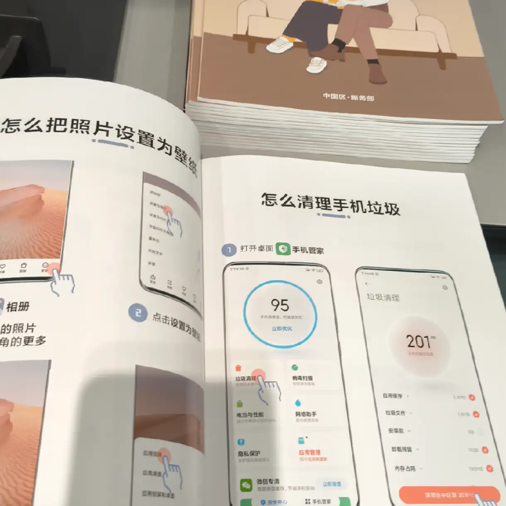
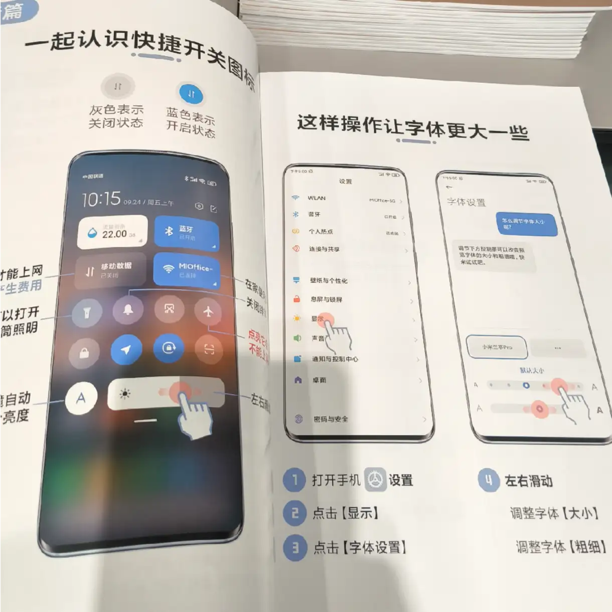
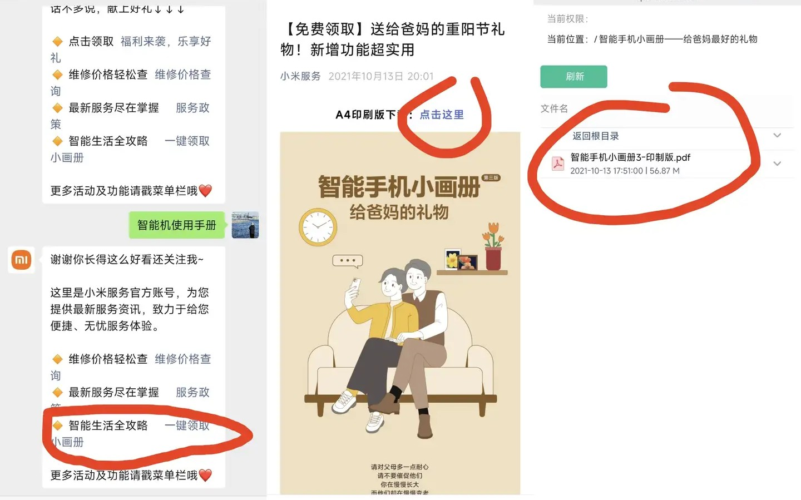

# 小米的适老化智能手机手册

信息来源：[小米真的是为国为民吗？](https://www.zhihu.com/question/637816625/answer/108976928953)

- - -

在小米之家的角落中，有着这样的一摞宣传册：

翻开手册，其中的内容像这样：

> 对于刚刚接触智能机的老年人，这本画册他们可以收藏很久，遇到想要解决的操作、设置问题，可以把它找出来，像我们上小学查字典的时候那样，简简单单掌握一个功能。

> 这个免费送的啊！前年就有，过年我逛小米之家看到的，问店员能不能拿一本回家给老人，他们说可以免费拿。

> 从其中内容的字体大小来看，这个册子的设计确实是有在为老年人群体考虑，而不仅仅是面子工程。

- - -

对于有需要的人，也可以按照下面的步骤下载电子版本：

小米服务公众号发：``智能手机小画册``，会返回电子版 PDF 的下载链接

