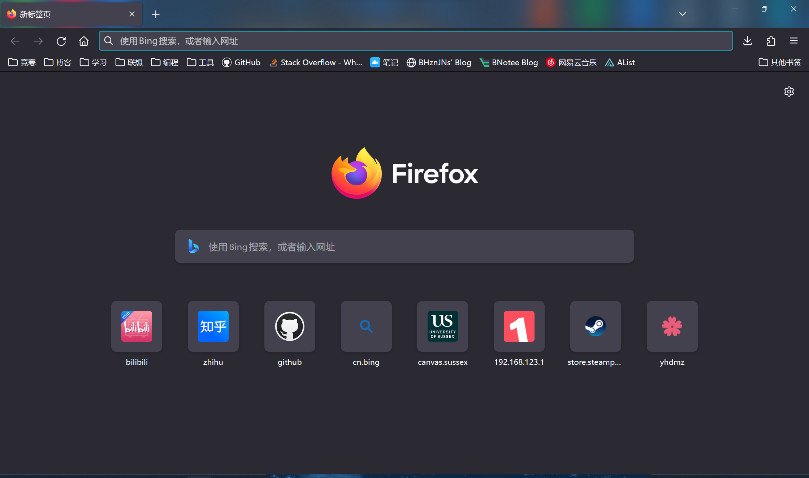

# Firefox 启用亚克力效果

本文适用于运行在 Windows 11 操作系统下的 Firefox 116。

``2023/8/19``

- - -

## 安装 MicaForEveryone

Github 地址：[MicaForEveryone](https://github.com/MicaForEveryone/MicaForEveryone)

安装后，点击左下角添加新规则，输入 firefox。规则中标题栏颜色为“由应用程序决定”，模糊类型为“亚克力”。

## 安装 WaveFox

Github 地址：[WaveFox](https://github.com/QNetITQ/WaveFox)

到浏览器 ``about:config`` 页面，添加如下规则：

```
userChrome.DarkTheme.TabFrameColor.Black.Enabled
userChrome.DarkTheme.TabFrameSaturation.VeryHigh.Enabled
userChrome.DarkTheme.TabFrameType.Border.Enabled
userChrome.LightTheme.TabFrameColor.Auto.Enabled
userChrome.LightTheme.TabFrameType.Shadow.Enabled
userChrome.TabSeparatorsMediumSaturation-Enabled
userChrome.Tabs.Option8.Enabled
userChrome.Windows.SystemEffects.Enabled
```

重启浏览器即可

## 更进一步

我们可以通过 WaveFox 的源码了解到其实现亚克力效果的机制。

在 WaveFox 的源码中搜索 ``SystemEffects``, 可以在其中的 ``special/windows_11_10.css`` 文件中找到相关的代码片段。

将其复制到单独文件：

```css
/* userChrome.css */

@media (-moz-windows-accent-color-in-titlebar: 0)
{
    #main-window[tabsintitlebar]:is(:not(:-moz-lwtheme), [lwt-default-theme-in-dark-mode])
    {
        appearance: -moz-win-borderless-glass !important;
        background-color: transparent !important;
    }

    :root[tabsintitlebar]:is(:not(:-moz-lwtheme), [lwt-default-theme-in-dark-mode]) #navigator-toolbox
    {
        background-color: transparent !important;
    }

    :root[sizemode="normal"][tabsintitlebar]:is(:not(:-moz-lwtheme), [lwt-default-theme-in-dark-mode]) #navigator-toolbox
    {
        margin-block-start: 1px !important;
    }

    /* System window control buttons */

    @media (min-resolution: 1dppx)
    {
        .titlebar-buttonbox-container
        {
            --titlebar-button-inline-padding: 16px;
            --titlebar-close-inline-padding: 17px;
        }
    }

    @media (min-resolution: 1.25dppx)
    {
        .titlebar-buttonbox-container
        {
            --titlebar-button-inline-padding: 17px;
            --titlebar-close-inline-padding: 18px;
        }
    }

    @media (min-resolution: 1.5dppx)
    {
        .titlebar-buttonbox-container
        {
            --titlebar-button-inline-padding: 17px;
            --titlebar-close-inline-padding: 17px;
        }
    }

    @media (min-resolution: 1.75dppx)
    {
        .titlebar-buttonbox-container
        {
            --titlebar-button-inline-padding: 17px;
            --titlebar-close-inline-padding: 17px;
        }
    }

    @media (min-resolution: 2dppx)
    {
        .titlebar-buttonbox-container
        {
            --titlebar-button-inline-padding: 16px;
            --titlebar-close-inline-padding: 17px;
        }
    }

    :root[tabsintitlebar]:is(:not(:-moz-lwtheme), [lwt-default-theme-in-dark-mode]):not([sizemode="fullscreen"]) .titlebar-button:not(.titlebar-close:hover, .titlebar-close:hover:active) .toolbarbutton-icon
    {
        opacity: 0 !important;
    }

    :root[tabsintitlebar]:is(:not(:-moz-lwtheme), [lwt-default-theme-in-dark-mode]):not([sizemode="fullscreen"]) .titlebar-button:not(.titlebar-close)
    {
        margin-inline-end: 1px !important;
    }

    :root[sizemode="normal"][tabsintitlebar]:is(:not(:-moz-lwtheme), [lwt-default-theme-in-dark-mode]) .titlebar-button
    {
        padding-inline: var(--titlebar-button-inline-padding) !important;
    }

    :root[sizemode="normal"][tabsintitlebar]:is(:not(:-moz-lwtheme), [lwt-default-theme-in-dark-mode]) .titlebar-close
    {
        padding-inline: var(--titlebar-close-inline-padding) !important;
    }

    :root[sizemode="maximized"][tabsintitlebar]:is(:not(:-moz-lwtheme), [lwt-default-theme-in-dark-mode]) .titlebar-button
    {
        padding-inline: var(--titlebar-button-inline-padding) !important;
    }

    :root[sizemode="maximized"][tabsintitlebar]:is(:not(:-moz-lwtheme), [lwt-default-theme-in-dark-mode]) .titlebar-close
    {
        margin-inline-end: 2px !important;
        padding-inline: var(--titlebar-close-inline-padding) !important;
    }
}

.titlebar-buttonbox-container {
    align-items: flex-start !important;
}

menupopup {
    opacity: .85;
}
```

单独使用上述 CSS 文件启动 Firefox，效果如下：


