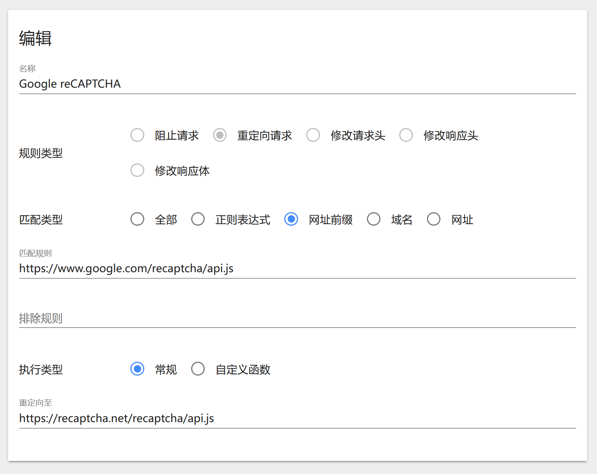

# 关于 Google reCaptcha 的小坑

``2023/7/19``

- - -

本文主要内容搬运了该文章：[reCaptcha人机验证无法显示和CSP问题解决方案](https://blog.azurezeng.com/recaptcha-use-in-china/)，在此对原作者表示感谢！

在国内，由于众所周知的原因，我们是无法访问谷歌的大多数服务的。很不幸，其中也包括谷歌的验证码服务 reCaptcha。也因此，我们在使用一些国外公司（如微软）提供时，会出现验证码无法加载的情况，严重影响这些服务的正常使用。

本文会简单的介绍在不翻墙的前提下如何正常访问使用了 Google reCaptcha 的服务。

- - -

## 浏览器安装 Header Editor 插件

对于不同浏览器安装插件的过程这里不再赘述，有需要者可以查看原文。

## 插件配置

在安装插件后打开管理界面，新建规则，设置为如下图所示：



URL 放在这里，方便复制：

```xml
https://www.google.com/recaptcha/api.js

https://recaptcha.net/recaptcha/api.js
```

在插件被启用之后，刷新你所需要访问的网页，其现在大概率可以正常访问了。

## 还不能正常使用？

这大概率是因为网站 Content-Security-Policy 内容安全政策的原因。你可以访问[这里](./.关于 Google reCaptcha 的小坑/GoogleRedirect.json)，下载 JSON 后，打开刚才安装的浏览器插件的管理界面，选择上面的``导出和导入``，将此 JSON 文件导入，再尝试使用你所需要访问的网页。

## 一条 FAQ (同样搬自原文)

Q: 我按照这个方案做了但是还是看不到验证码
A: 尝试 ping 一下，看下能不能连接到 recaptcha.net。

如果提示连接超时，则需要将能连接的 recaptcha.net IP 加入 hosts 列表中。
可以用网络上的超级 ping 工具获取其他的 recaptcha.net IP。比如使用站长之家的 ping 工具: [传送门](http://ping.chinaz.com/recaptcha.net)
通过 ping 可以测试所获取到的 IP 是否能连接。如果可以连接，把这个 IP 加入 hosts 即可解决该问题。
