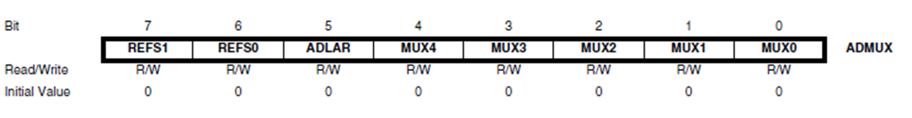
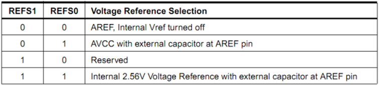
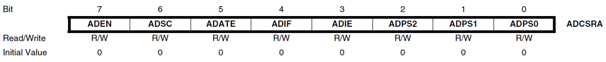

# ADC

## 模数转换计算

对于电压 3.5V，其在模数转换之后的值：
$$$
3.5V \rightarrow 0b01011001\\
\cfrac{3.5}{10} \times 256 = 89.6\\
89_{10} = 01011001_{2}
$$$

## ADC Frequency

$$$
F_{ADC} = F_{CPU}/Prescaler
$$$
Prescaler values: 2, 4, 8, 16, 32, 64 and 128

## ADC Multiplexer Selection Register (ADMUX)




## ADC Control and Status Register A (ADCSRA)



- Bit 7 – ADEN – ADC Enable 
- Bit 6 – ADSC – ADC Start Conversion
- Bits 2:0 – ADPS2:0 – ADC Prescaler Select Bits

| ADPS2 | ADPS1 | ADPS0 | Division Factor |
| 0 | 0 | 0 | 2 |
| 0 | 0 | 1 | 2 |
| 0 | 1 | 0 | 4 |
| 0 | 1 | 1 | 8 |
| 1 | 0 | 0 | 16 |
| 1 | 0 | 1 | 32 |
| 1 | 1 | 0 | 64 |
| 1 | 1 | 1 | 128 |

>>> 用例：Prescaler of 128
```c
ADCSRA = (1<<ADEN)|(1<<ADPS2)|(1<<ADPS1)|(1<<ADPS0);
```
>>>

## 例程：读取 ADC 中的值

```c
void adc_init() {
    ADMUX |= 0b11000000; // internal ref, analog channel 0
    ADCSRA = (1<<ADEN)|(1<<ADPS2)|(1<<ADPS1)|(1<<ADPS0);// ADC Enable and prescaler of 128
}

int main(void) {
    while (1) {
        int val;
        ADCSRA |= (1<<ADSC); // start single conversion, write “1” to ADSC
        while (ADCSRA & (1<<ADSC)); // wait for conversion to complete
        // ADSC becomes “0” again
        val= ADC; //read ADC value                            
    }
}
```
