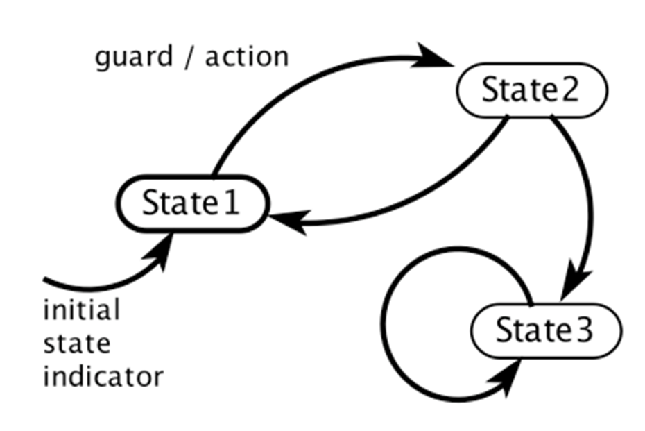
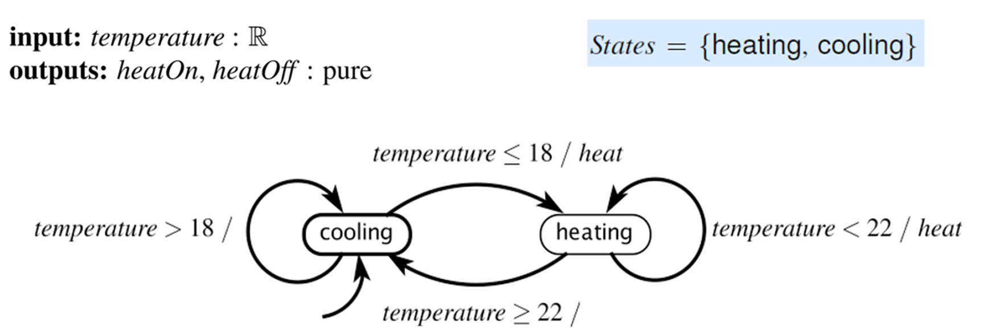
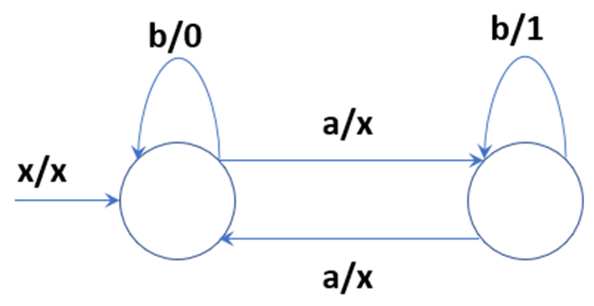

# Finite State Machine

guard 即转移条件
action 即输出

## 转移条件

- `true`: Transition is always enabled.
- $$p_1$$: Transition is enabled if $$p_1$$ is present.
- $$\neg p_1$$: Transition is enabled if $$p_1$$ is absent.
- $$p_1 \wedge p_2$$: Transition is enabled if both $$p_1$$ and $$p_2$$ are present.
- $$p_1 \vee p_2$$: Transition is enabled if either $$p_1$$ or $$p_2$$ is present.
- $$p_1 \wedge \neg p_2$$: Transition is enabled if $$p_1$$ is present and $$p_2$$ is absent.
- $$p_3$$: Transition is enabled if $$p_3$$ is present (not absent).
- $$p_3 = 1$$: Transition is enabled if $$p_3$$ is present and has value 1.
- $$p_3 = 1 \wedge p_1$$: Transition is enabled if $$p_3$$ has value 1 and $$p_1$$ is present.
- $$p_3 > 5$$: Transition is enabled if $p_3$ is present with value greater than 5.

## 例 1

## 一道例题

Inputs: x, a, b 
Outputs:
- x = no output
- 0 = output a zero
- 1 = output a one

Questions:
1. Suppose the following sequences of inputs is given: b, b. What is the <output>(00)?
2. Suppose the following sequences of inputs is given: a, b, b. What is the <output>(11)?
3. Suppose the following sequences of inputs is given: a, a, b, a, b, b, a, a. What is the <output>(011)?
