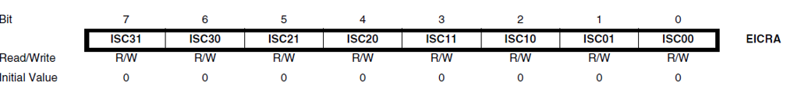

# Interrupts | 中断

## 启用/禁用 中断

``sei()`` Set enable interrupt
``cli()`` Clear interrupt enable

## 中断函数体编程

1. Keep it short
2. Don't use ``delay()``, serial prints
3. No input variables or returned values 
4. All changes have to be made on global variables
5. Shared variables should be declared "volatile" 

## 中断控制寄存器

EIMSK(External interrupt mask register)


EICRA(External interrupt control register A) and EICRB(External interrupt control register B)



| ISCn1 | ISCn0 | Description |
| 0     | 0     | The low level of INTn generates an interrupt request |
| 0     | 1     | Any edge of INTn generates asynchronously an interrupt request |
| 1     | 0     | The falling edge of INTn generates asynchronously an interrupt request |
| 1     | 1     | The rising edge of INTn generates asynchronously an interrupt request  |

## 直接端口操作例程

```c
#include <avr/io.h>
#include <avr/interrupt.h>

int main(void) {
    DDRD &= (0<<PD2); // PD2 is an input
    DDRD |= (1<<PD1); // PD1 is an output
    EIMSK |= (1<<INT2); // Enable INT2
    EICRA &=0b11001111; // Low level INT2 generates an interrupt
    sei(); // Enable global interrupt
    while (1) {
        // Do nothing
    }
}

ISR (INT2_vect) {
    PORTD &= (0<<PD1); //Turn on LED
}
```

## Arduino 例程

```c
void setup() {
    pinMode(20, OUTPUT); // PD1 is an output
    pinMode(19, INPUT); // button connected at digital pin 19 (PD2)
    attachInterrupt(digitalPinToInterrupt(19), pin_ISR, CHANGE); // Attach an interrupt to the ISR vector 
}
void loop() {
    // Do nothing!
} 
void pin_ISR() { 
    digitalWrite(20, LOW);
}
```
