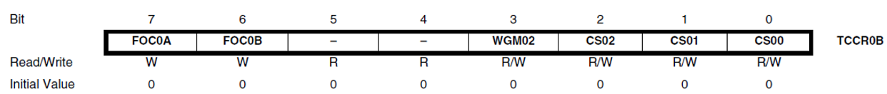

# 计时器/计数器

以 CPU 频率 16MHz 为例（time period: $$\cfrac{1}{16MHz} = 0.0000625ms$$）
使用 Prescaler 以降低时钟频率：$$F_{CPU} / Prescaler$$

| Prescaler | Clock frequency | 8 bit Timer (max delay) | 16 bit Timer (max delay) |
| 8         | 2MHz            | 0.128ms                 | 32.768ms                 |
| 64        | 250KHz          | 1.024ms                 | 262.144ms                |
| 256       | 62.5KHz         | 4.096ms                 | 1,048.576ms              |
| 1024      | 15.625KHz       | 16.384ms                | 4,194.304ms              |

## 两个计算公式

$$$
Clock\ period = \cfrac{1}{Clock\ frequency}\\
Timer\ count = \cfrac{Required\ delay}{Clock\ period} + 1
$$$

> [note] 
> Timer count 的值必须是一个整型且必须在范围 <(0 - 255)>(对于 8-bit 计数器) 或 <(0 - 65,535)>(对于 16-bit 计数器) 内

## 相关寄存器

### Timer/Counter0 registers: TCNT0

存储计时器计数器当前的值

### Timer/Counter Control Register: TCCR0B



| CS02 | CS01 | CS00 | Description                                                 |
| 0    | 0    | 0    | No clock source (Timer/Counter stopped)                   |
| 0    | 0    | 1    | clk,,__I/O__,, (No prescaling)                         |
| 0    | 1    | 0    | clk,,__I/O__,,/8 (From prescaler)                      |
| 0    | 1    | 1    | clk,,__I/O__,,/64 (From prescaler)                     |
| 1    | 0    | 0    | clk,,__I/O__,,/256 (From prescaler)                    |
| 1    | 0    | 1    | clk,,__I/O__,,/1024 (From prescaler)                   |
| 1    | 1    | 0    | External clock source on T0 pin. Clock on falling edge    |
| 1    | 1    | 1    | External clock source on T0 pin. Clock on rising edge     |

## 计时器例程

```c
#include <avr/io.h>

void timer0_init() {
    TCCR0B |= (1 << CS02)|(1 << CS00);// set up timer with prescaler = 1024
    TCNT0 = 0;// initialize counter
}

int main(void) {
    DDRL |= (1<<PL0); // connect LED to pin PL0
    timer0_init();    // initilise timer 0
    while (1) {
        if (TCNT0 >=124) { // check if timer count reach 124 
            PORTL ^= (1<<PL0); // toggles the LED
            TCNT0=0; // reset counter
        }
    }
}
```

## 计时器中断

当计时器溢出时调用中断。

### Timer/Counter0  Interrupt Flag Register TIFR0

TOV0 (0th bit) 
- Set to one whenever TIMER0 overflows
- Reset to zero whenever the Interrupt Service Routine (ISR) is executed

### 例程

```c
ISR(TIMER0_OVF_vect) {
    // TIMER0 overflow interrupt service routine. 
    // This ISR is called automatically whenever TCNT0 overflows
    tot_overflow++; // count the number of overflows
}
int main(void) {
    DDRL |= (1 << PL0); // connect LED to PL0
    timer0_init(); // initialise Timer0
    while (1) {
        if (tot_overflow >= 12) { // check if no. of overflows = 12
            if (TCNT0 >= 53) {    // check if the timer count reaches 53
                PORTL ^= (1 << PL0); // toggles the led
                TCNT0 = 0;           // reset the counter
                tot_overflow = 0;    // reset the overflow counter
            }
        }
    }
}
```
