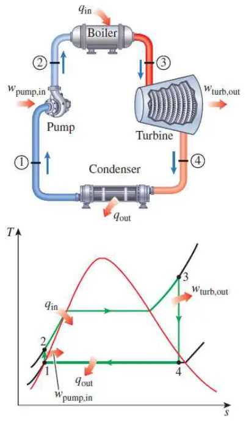
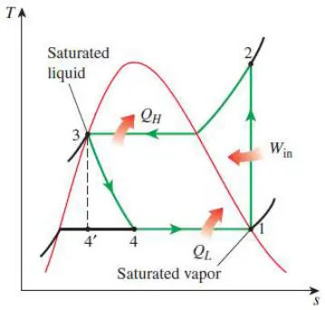
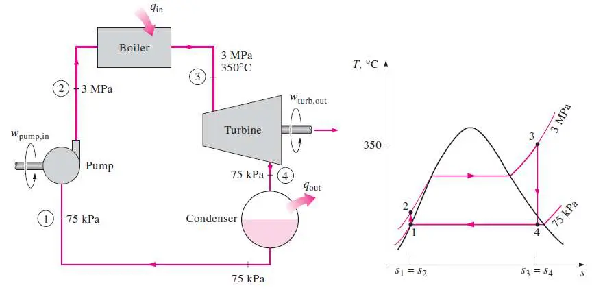
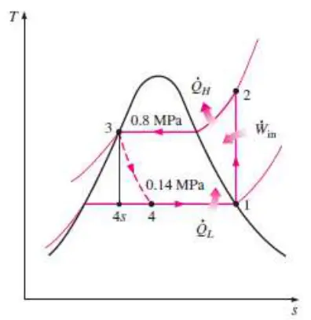

# 兰金循环和冰箱循环 | Rankine and Refrigeration Cycles

## 兰金循环 | Rankine Cycles

- 1-2 等熵压缩 Isentropic compression in a pump
- 2-3 等压加热 Constant pressure heat addition in a boiler
- 3-4 等熵扩张 Isentropic expansion in a turbine
- 4-1 等压降热 Constant pressure heat rejection in a condenser

## The ideal vapor-compression refrigeration cycle

$$$
q_H = h_2 - h_3\\
q_L = h_1 - h_4\\
w_{net, in} = h_2 - h_1\\
$$$

- - -

## 例题1

A steam power plant operating on the simple ideal Rankine cycle. Steam enters the turbine at 3 MPa and 350°C and is condensed in the condenser at a pressure of 75 kPa.
Determine the ##thermal efficiency## of this cycle.

## 例题2

A refrigerator uses refrigerant-134a as the working fluid and operates on an ideal vapour-compression refrigeration cycle between 0.14 and 0.8 MPa. If the mass flow rate of the refrigerant is 0.05 kg/s,
determine
(a) the rate of heat removal from the refrigerated space and the power input to the compressor,
(b) the rate of heat rejection to the environment, and (c) the COP of the refrigerator.

