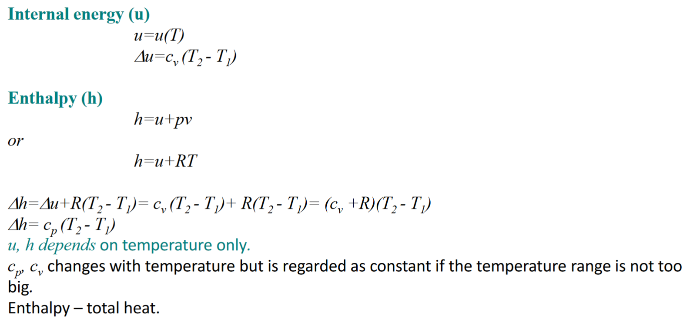
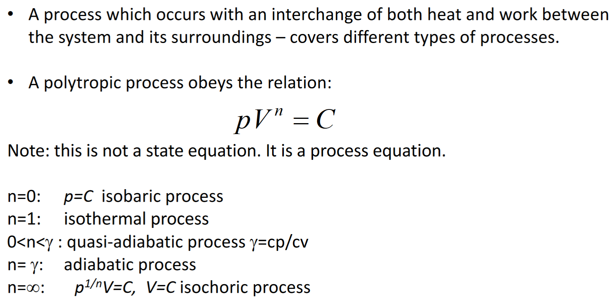

# 热力学基础

## 温度 | Temperature

### 计量单位 | Scales

- Celsius scale
- Fahrenheit scale
- Kelvin scale
- Rankine scale

## 第零定律 | Zeroth Law of Thermodynamic

If two bodies are in thermal equilibrium with a third body, they are also in thermal equilibrium with each other.

## 过程与循环 | Processes and Cycle

- Any change that a system undergoes from one equilibrium state to another is called a process.
- A series of states through which a system passes during a process is called the path.
- A system is said to have undergone a cycle if it returns to its initial state at the end of the process.

### 一些常见过程别称

- Constant temperature process - ##Isothermal## process
- Constant pressure process - ##Isobaric## process
- Constant volume process - ##Isometric## process or ##isochoric## process
- Adiabatic Process - no heat is transferred.
  - If the process happens so quickly that there is no time to transfer heat,
  - or If a system is very well insulated from its surroundings.
- Polytropic process - occurs with an interchange of both heat and work between the inside and outside.

## 系统与边界 | Systems and Boundary

- System: a quantity of matter or a region in space chosen for study.
- Surrounding: the mass or region outside the system.
- Boundary: the real or imaginary surface that separates the system from its surroundings.

## 理想气体法则 | Ideal Gas Laws

### Boyle’s Law (1662)

$$P_1 * V_1 = P_2 * V_2$$ Constant ##temperature##

### Charles' law (1780) (Joseph Louis Gay-Lussac in 1802)

$$V_1 / T_1 = V_2 / T_2$$ Constant ##pressure##

### Combined ideal gas law

$$$
\frac{P_1 * V_1}{T_1} = \frac{P_2 * V_2}{T_2}\\
PV = mRT
$$$

## 比热容 | Specific heat capacity

## 内能和热含量 | Internal Energy and Enthalpy

## 多方过程 | Polytropic Process

- - -

## 例题

A piston–cylinder device initially contains 0.7 m''3'' of air at 100 kPa and 80°C. The air is now compressed to 0.1 m''3'' in such a way that the temperature inside the cylinder remains constant. Determine the work done during this process.

知识点：[边界移动功](学习笔记/工程热力学/非流动过程.md)

此题中温度不变，使用公式：$$: W_b = \int_1^2 {p} \ dV = \int_1^2 {\frac C V} \ dV = C \ln \frac{V_2}{V_1}$$
将 $$pV = C$$ 代入上式，得 $$W = p_1 V_1 \ln{\frac{V_2}{V_1}}$$
