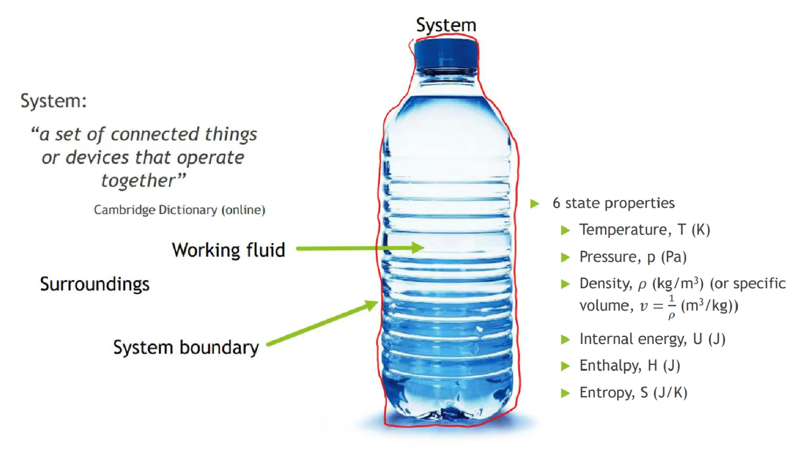
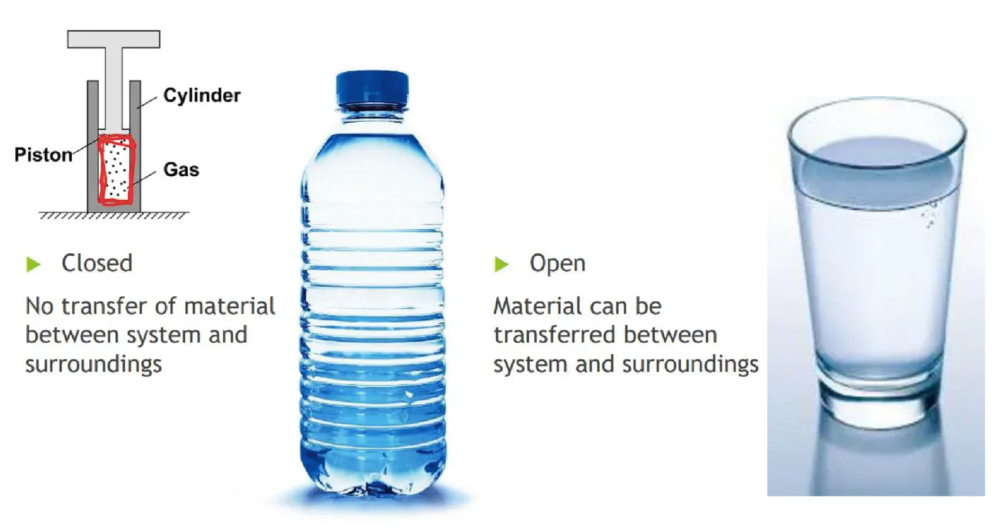

# 热力学第一定律

## 系统和边界 | Systems and Boundaries

### 系统的封闭与开放

#### 封闭系统 | Closed systems
A closed system, also known as a control mass, consists of a fixed amount of mass, and no mass can cross its boundary - an isolated system.

#### 开放系统 | Open systems
- An open system, also called a ##control volume## (cv), is a properly selected region in space. 
- Both mass and energy can cross the boundary of a control volume. 
- Any arbitrary region in space can be selected as a control volume. 
- There are no concrete rules for the selection, depending on convenience of analysis.

## 能量的形式 | Forms of energy

动能 | Kinetic energy

&frac12mv''2''

势能 | Potential energy

``mgz``

内能 | Internal energy

``U``

静止系统的总能量 | Total energy of a system (non-flowing)

E = E,,k,, + E,,p,, + U

## 热力学第一定律 | First Law of Thermodynamics

The first law of thermodynamics, is also known as the conservation of energy principle.

> Energy can be neither created nor destroyed during a process, it can only change forms.

According to the first law, the energy balance of a system
E,,in,, – E,,out,, = E,,system,,
E,,in,, – E,,out,, = E,,final,, – E,,initial,,

## 能量转换效率 | Energy Conversion Efficiency

``Efficiency`` = ``Desired Output`` / ``Required Iuput``
