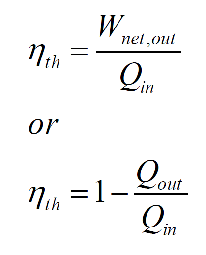
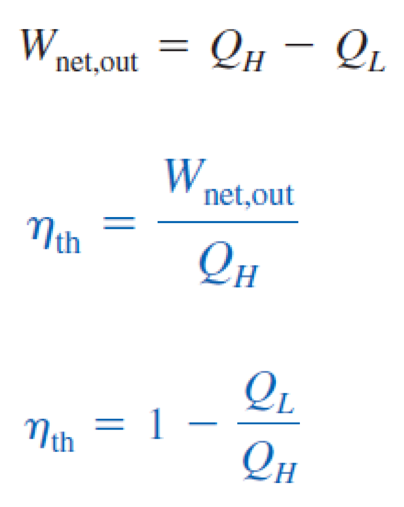
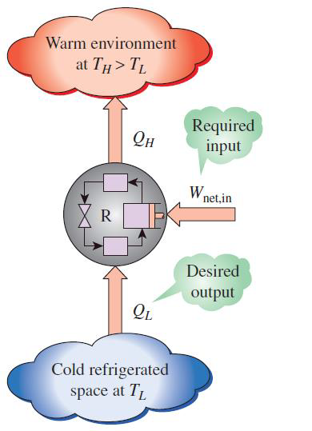
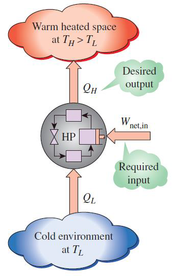
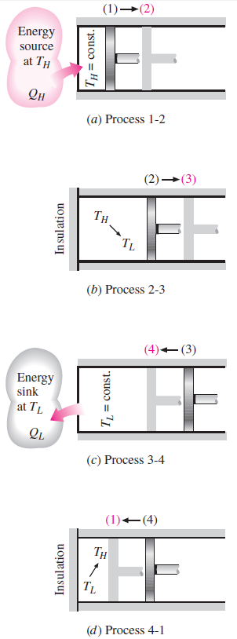
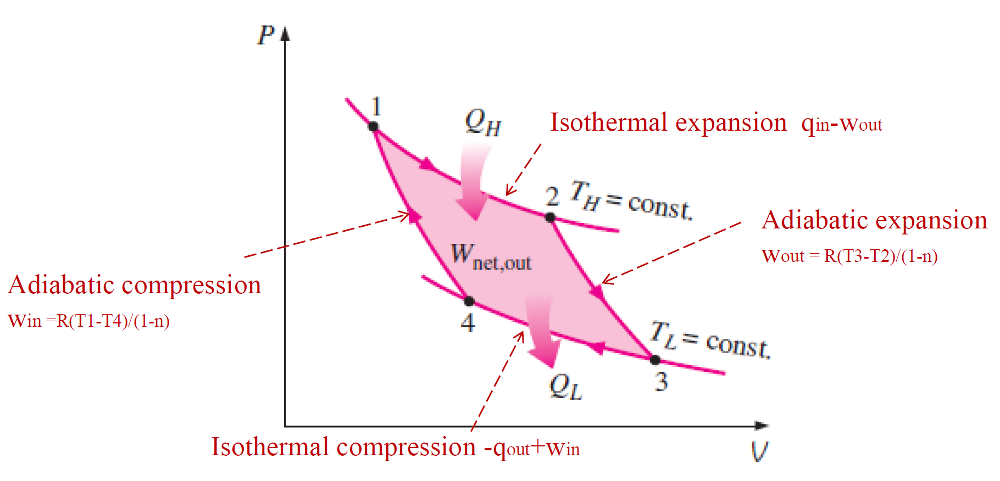
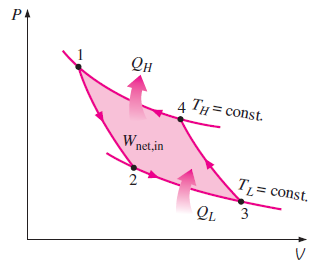
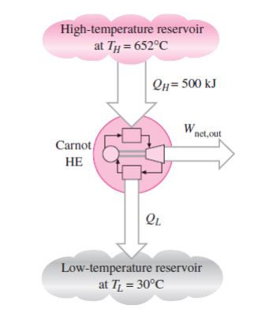

# 热力学第二定律 | Second Law of Thermodynamics

The second law of thermodynamics asserts that processes occur in a certain direction and that energy has quality as well as quantity.

## 热机 | Heat Engines

Converting ##heat to work## requires special devices called heat engines.

- ##receive heat## from a high temperature source (solar energy, oil furnace, nuclear reactor, etc.).
- ##convert part of this heat to work## (usually in the form of a rotating shaft).
- ##reject the remaining waste heat## to a low temperature sink (the atmosphere, rivers, etc.).
- operate on a cycle.

### 热能效率 | Thermal efficiency

Q,,H,, magnitude of heat transfer between the cyclic device and the high temperature medium at T,,H,,.

Q,,L,, the magnitude of heat transfer between the cyclic device and the low temperature medium at T,,L,,.

### 冰箱 | Refrigerators

Transfers heat from a low temperature medium to a high temperature one.

##refrigerant## (制冷剂): The working fluid used in the refrigeration cycle.

#### 冰箱的效率系数 | coefficient of performance (COP,,R,,)

$$$
COP_R = \frac{Q_L}{W_{net, in}}
$$$

根据能量守恒定律, $$W_{net, in} = Q_H - Q_L$$

$$$
COP_R = \frac{Q_L}{Q_H - Q_L}
$$$

### 空调 | Air Conditioners

Air conditioners are basically refrigerators whose refrigerated space is a room or a building instead of the food compartment.

### 热泵 | Heat Pumps

Transfers heat from a low-temperature medium to a high-temperature one.

#### 热泵的效率系数 | coefficient of performance (COP,,HP,,)

$$$
COP_{HP} = \frac{Q_H}{W_{net,in}} 
$$$

根据能量守恒定律, $$W_{net,in} = Q_H - Q_L$$

$$$
COP_{HP} = \frac{Q_H}{Q_H - Q_L} = \frac{Q_H + Q_L - Q_L}{Q_H - Q_L} = COP_R + 1
$$$

- - -

## 热力学第二定律 - 克劳修斯陈述 | The Second Law of Thermodynamics - Clausius Statement

It is impossible to construct a device that operates in a cycle and produces no effect other than the transfer of heat from a lower temperature body to a higher temperature body.

### 永动机 | Perpetual Motion Machines

## 可逆过程 | Reversible process

A reversible process a process that can be reversed without leaving any trace on the surroundings. Both the system and the surroundings are returned to their initial states at the end.

- Reversible process takes place only if the net heat and net work exchange between the system and surroundings is 0.
- Reversible processes actually do not occur in nature.

### 不可逆性 | Irreversibility

The factors that cause a process to be irreversible.

### 内部和外部的可逆过程 | Internally and Externally Reversible Processes

- A process is called internally reversible if no irreversibilities occur ##within## the boundaries of the system during the process.
- A process is called externally reversible if no irreversibilities occur ##outside## the system boundaries during the process.
- A process is called totally reversible, or simply reversible, if it involves ##no irreversibilities within the system or its surroundings##.

- - -

## 卡诺循环 | Carnot Cycle

- Process 1 - 2: 可逆等温扩张 Reversible Isothermal Expansion (T,,H,, constant).
- Process 2 - 3: 可逆绝热扩张 Reversible Adiabatic Expansion (temperature drops from T,,H,, to T,,L,,).
- Process 3 - 4: 可逆等温压缩 Reversible Isothermal Compression (T,,L,, constant).
- Process 4 - 1: 可逆绝热压缩 Reversible Adiabatic Compression (temperature rises from T,,L,, to T,,H,,).

### 逆向卡诺循环 | Reversed Carnot Cycle

### 卡诺定理 | Carnot Principles

1. 所有不可逆的热机，其热效率会比使用相同高温和低温热源的卡诺热机要低 | The efficiency of an irreversible heat engine is always less than the efficiency of a reversible one operating between the same two reservoirs.
2. 所有可逆的热机，其热效率会等于相同高温和低温热源的卡诺热机 | The efficiencies of all reversible heat engines operating between the same two reservoirs are the same.

### 卡诺热机效率 | Carnot Heat Engine

任意热机的热效率 (thermal efficiency): 

$$$
\eta _{th} = 1 - Q_L / Q_H
$$$

Q,,H,, is heat transferred to the heat engine from a high-temperature reservoir at T,,H,,, and Q,,L,, is heat rejected to a low-temperature reservoir at T,,L,,.

对于可逆的热机：$$Q_L / Q_H = T_L / T_H$$
所以 $$\eta _{th, rev} = 1 - T_L / T_H$$

卡诺热机效率：$$\eta _{th} = \frac{Q_H - Q_L}{Q_H} = 1 - \frac{Q_L}{Q_H} = $$``$$1 - \frac{T_L}{T_H}$$``

### 卡诺冰箱和卡诺热泵 | Carnot Refrigerator and Heat pump

$$$
COP_{R, rev} = \frac{1}{(T_H / T_L) - 1} = \frac{T_L}{T_H - T_L}\\
COP_{HP, rev} = \frac{1}{1 - (T_L / T_H)} = \frac{T_H}{T_H - T_L}\\
$$$

- - -

## 例题1

The food compartment of a ##refrigerator## is maintained at 4°C by removing heat from it at a rate of 360 kJ/min. If the required power input to the refrigerator is 2 kW, determine
(a) the coefficient of performance of the refrigerator and 
(b) the rate of heat rejection to the room that houses the refrigerator.

(a) 使用冰箱的效率系数公式 $$COP_R = \frac{Q_L}{W_{net, in}}$$,
本题中，$$Q_L = 360 kJ/min = 6 kW, W_{net, in} = 2kW$$,
所以 $$COP_R = \frac{Q_L}{W_{net, in}} = 3$$
(b) $$Q_H = Q_L + W_{net, in} = 8 kW$$

## 例题2

A ##heat pump## is used to meet the heating requirements of a house and maintainit at 20°C. On a day when the outdoor air temperature drops to -2°C,the house is estimated to lose heat at a rate of 80,000 kJ/h. If the heat pump under these conditions has a COP of 2.5, determine 
(a) the power consumed by the heat pump
(b) the rate at which heat is absorbed from the cold outdoor air.

(a) 由题目热量流失速度可知，$$Q_H = 80000 kJ/h$$
又知 $$COP = 2.5$$，由公式 $$COP_{HP} = \frac{Q_H}{W_{net, in}}$$,
$$$
W_{net, in} = \frac{Q_H}{COP}
$$$
(b) $$Q_L = Q_H - W_{net, in}$$

## 例题3

A Carnot heat engine receives 500 kJ of heat per cycle from a high-temperature source at 652 ℃ and rejects heat to a low-temperature sink at 30 ℃. 
Determine:
(a) the thermal efficiency of this Carnot engine
(b) the amount of heat rejected to the sink per cycle.

(a) 直接应用卡诺热机效率公式 $$\eta _{th} = 1 - \frac{T_L}{T_H}$$。注意⚠️要将温度转化为开尔文温标（加上 273）进行计算。
(b) the amount of heat rejected 即求 $$Q_L$$。
由卡诺热机效率公式 $$\eta _{th} = 1 - \frac{Q_L}{Q_H}$$
可得 $$Q_L = Q_H (1 - \eta _{th})$$

## 例题4

A heat pump is to heat a house during the winter. The house is to be maintained at 21℃ at all times. The house is estimated to be losing heat at a rate of 135,000 kJ/h when the outside temperature drops to -5°C. 
Determine the minimum power required to drive this heat pump.

$$Q_H = 135000 kJ/h = 37.5 kW$$
由公式 $$COP_{HP, rev} = \frac{T_H}{T_H - T_L}$$ 可算出该热泵的热效率
再用公式 $$W_{net, in} = \frac{Q_H}{COP_{HP, rev}}$$ 可得答案。
