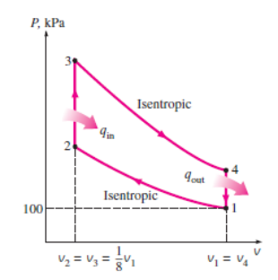

# 热机循环 | Engine Cycles

## 分类 | Catagories

Thermodynamic cycles:

- ##power cycles##: output work
- ##refrigeration cycles##: take heat from low temperature place

- ##gas cycles##: the working fluid remains in the gaseous phase
- ##vapour cycles##: the working fluid exists in vapour phase during one part of the cycle and in liquid phase during another part

- ##closed cycles##: working fluid is returned to the initial state at the end of the cycle and is re circulated
- ##open cycles##: the working fluid is renewed at the end of each cycle instead of being re circulated For example, automobile engines, the combustion gases are exhausted and replaced by fresh air fuel mixture at the end The same working fluid does not go through a whole cycle

- - -

Heat engines:

- ##Internal combustion## engines: Burning the fuel within the piston cylinder system boundaries
- ##External combustion## engines: Heat is supplied to the working fluid from an external source such as a furnace, a geothermal well, a nuclear reactor, or even the sun

- - -

## 热机效率 | Thermal efficiency of engines

$$$
\eta _{th} = W_{net} / Q_{in}
$$$

## 奥托循环和迪塞尔循环 | Otto Cycle and Diesel Cycle

TDC - Top dead centre
BDC - Bottom dead centre

### 奥托循环 - 理想火花塞点火引擎 | Otto Cycle - ideal cycle for spark ignition engines

压缩比 ``r``

r = v,,max,, / v,,min,, = v,,BDC,, / v,,TDC,,

- - -

平均有效压力 | Mean effective pressure (MEP)

W,,net,, = MEP * Displacement volume

therefore, MEP = W,,net,, / (V,,max,, - V,,min,,)

#### 理想循环过程 | Ideal processes

- 1-2 Isentropic compression
- 2-3 Constant-volume heat addition
- 3-4 Isentropic expansion
- 4-1 Constant-volume heat rejection

$$$
\eta _{th,Otto} = 1 - \frac{1}{r^{\gamma - 1}},\ where\ \gamma = c_p / c_v
$$$

### 迪塞尔循环 - 理想压缩点火引擎 | Diesel Cycle - ideal cycle for compression ignition reciprocating engines

- 1-2 isentropic compression,
- 2-3 constant pressure heat addition
- 3-4 isentropic expansion
- 4-1 constant volume heat rejection.

where is v,,3,, / v,,2,, = r,,c,, defined as the cut off ratio.

## 焦耳循环 | Joule Cycle

Tour internally reversible processes:
- 1-2 Isentropic compression (in a compressor)
- 2-3 Constant-pressure heat addition
- 3-4 Isentropic expansion (in a turbine)
- 4-1 Constant-pressure heat rejection

(q,,in,, - q,,out,,) + (w,,in,, - w,,out,,) = h,,exit,, - h,,inlet,,

### 焦耳循环的回功比 | Joule Cycle - back work ratio

Back work ratio: fraction of the turbine work has to be used to drive the compressor.

- - -

## 例题1

An ideal Otto cycle has a compression ratio of 8. At the beginning of the compression process, air is at 100 kPa and 17°C, and 800 kJ/kg of heat is transferred to air during the constant-volume heat-addition process. Use cold-air-standard assumptions, determine:
(a) the maximum temperature and pressure that occur during the cycle,
(b) the net-work output,
(c) the thermal efficiency, and
(d) the mean effective pressure for the cycle.

(a) 由压缩比 $$r = 8$$ 得 $$\frac{v_1}{v_2} = 8$$
对于压缩过程：
使用理想气体的恒熵过程公式 $$\frac{T_2}{T_1} = (\frac{v_1}{v_2})^{\gamma - 1}$$
可得压缩后气体温度 $$T_2 = T_1 r^{1.4 - 1}$$
再由理想气体公式 $$\frac{P_1 * V_1}{T_1} = \frac{P_2 * V_2}{T_2}$$
可得压缩后气体压强 $$P_2 = P_1 \frac{T_2}{T_1} \frac{V_1}{V_2}$$

对于等容升温过程：
由 $$q_{in} = \Delta u = c_v(T_3 - T_2)$$ 得
升温后温度 $$T_3 = \frac{q_{in}}{c_v} + T_2$$
由理想气体公式，在等容情况下 $$\frac{p_3}{T_3} = \frac{p_2}{T_2}$$
升温后压强 $$p_3 = \frac{p_2 T_3}{T_2}$$

由于奥托循环性质，等容升温后温度和压强最高。

(b) 对于奥托循环，净功输出 $$w_{out} = q_{in} - q_{out}$$
对于等容降温过程：
由公式 $$\frac{T_4}{T_3} = (\frac{v_3}{v_4})^{\gamma - 1}$$
等熵扩张后温度 $$T_4 = T_3(\frac 1 r)^{1.4 - 1}$$
则降温释放热量 $$q_{out} = c_v(T_4 - T_1)$$

(c) 奥托循环的热机效率 $$\eta = w_{out} / q_{in}$$

(d) 由公式 $$pv = RT$$
压缩过程开始时气体体积 $$v_1 = \frac{RT_1}{p_1}$$
由{MEP}(平均有效压力)公式 $$MEP = W_{net} / (V_{max} - V_{min})$$
单位质量平均有效压力 $$MEP = \frac{w_{out}}{v_1 - v_2}$$
