# 热机循环 | Engine Cycles

## 分类 | Catagories

Thermodynamic cycles:

- ##power cycles##: output work
- ##refrigeration cycles##: take heat from low temperature place

- ##gas cycles##: the working fluid remains in the gaseous phase
- ##vapour cycles##: the working fluid exists in vapour phase during one part of the cycle and in liquid phase during another part

- ##closed cycles##: working fluid is returned to the initial state at the end of the cycle and is re circulated
- ##open cycles##: the working fluid is renewed at the end of each cycle instead of being re circulated For example, automobile engines, the combustion gases are exhausted and replaced by fresh air fuel mixture at the end The same working fluid does not go through a whole cycle

- - -

Heat engines:

- ##Internal combustion## engines: Burning the fuel within the piston cylinder system boundaries
- ##External combustion## engines: Heat is supplied to the working fluid from an external source such as a furnace, a geothermal well, a nuclear reactor, or even the sun

## 热机效率 | Thermal efficiency of engines

&eta;,,th,, = W,,net,, / Q,,in,,

## 奥托循环和迪塞尔循环 | Otto Cycle and Diesel Cycle

TDC - Top dead centre
BDC - Bottom dead centre

### 奥托循环 - 理想火花塞点火引擎 | Otto Cycle - ideal cycle for spark ignition engines

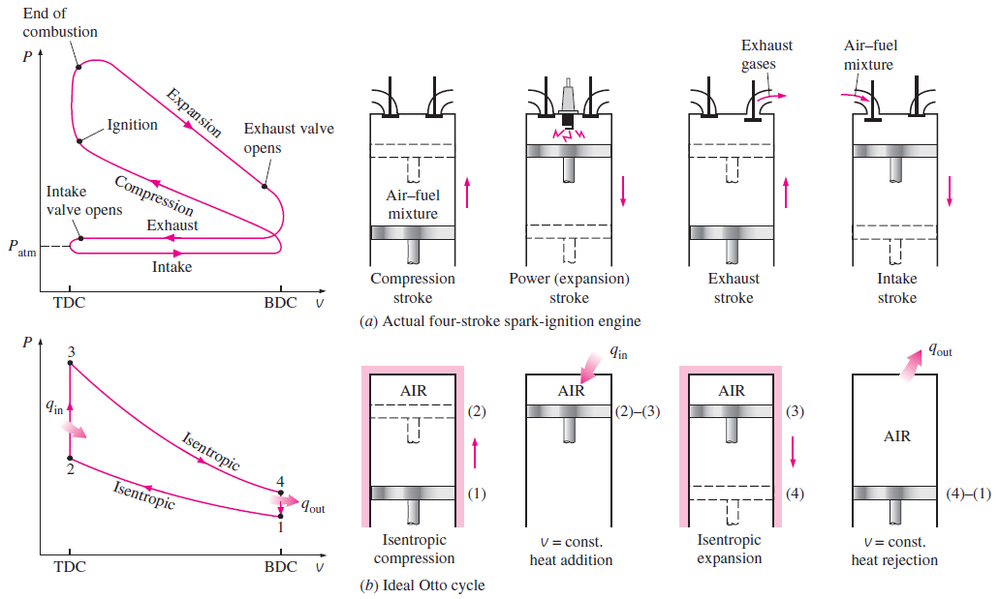

压缩比 ``r``

r = v,,max,, / v,,min,, = v,,BDC,, / v,,TDC,,

- - -

平均有效压力 | Mean effective pressure (MEP)

W,,net,, = MEP * Displacement volume

therefore, MEP = W,,net,, / (V,,max,, - V,,min,,)

#### 理想循环过程 | Ideal processes

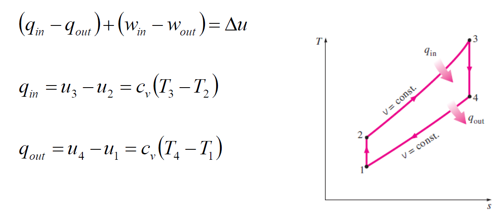

- 1-2 Isentropic compression
- 2-3 Constant-volume heat addition
- 3-4 Isentropic expansion
- 4-1 Constant-volume heat rejection

&eta;,,th, Otto,, = 1 - 1 / r''&gamma;-1'', where &gamma; = c,,p,, / c,,v,,

### 迪塞尔循环 - 理想压缩点火引擎 | Diesel Cycle - ideal cycle for compression ignition reciprocating engines

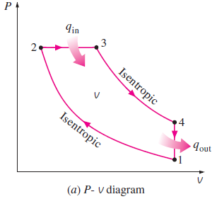
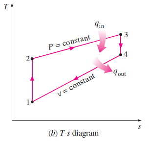

- 1-2 isentropic compression,
- 2-3 constant pressure heat addition
- 3-4 isentropic expansion
- 4-1 constant volume heat rejection.

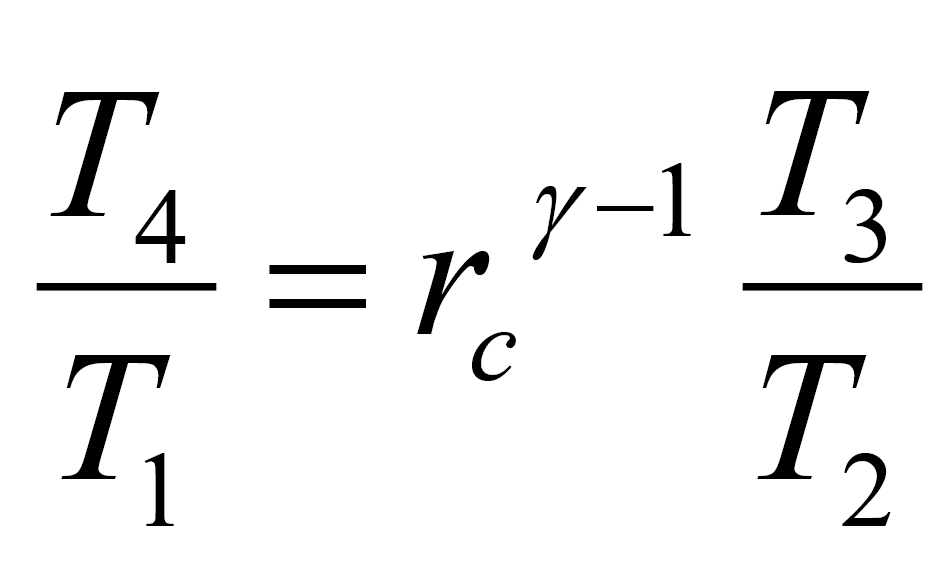

where is v,,3,, / v,,2,, = r,,c,, defined as the cut off ratio.

## 焦耳循环 | Joule Cycle

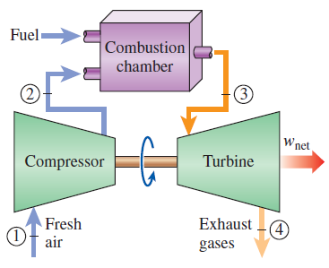
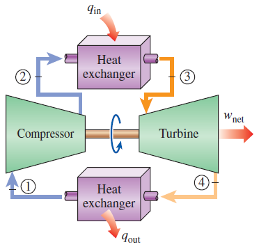

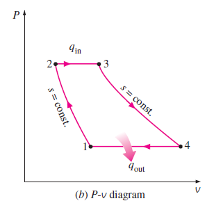
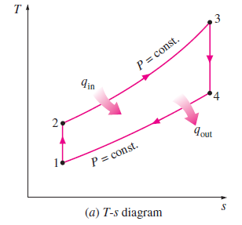

Tour internally reversible processes:
- 1-2 Isentropic compression (in a compressor)
- 2-3 Constant-pressure heat addition
- 3-4 Isentropic expansion (in a turbine)
- 4-1 Constant-pressure heat rejection

(q,,in,, - q,,out,,) + (w,,in,, - w,,out,,) = h,,exit,, - h,,inlet,,

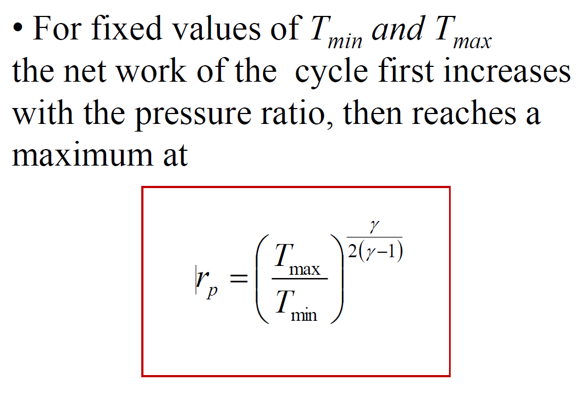

### 焦耳循环的回功比 | Joule Cycle - back work ratio

Back work ratio: fraction of the turbine work has to be used to drive the compressor.

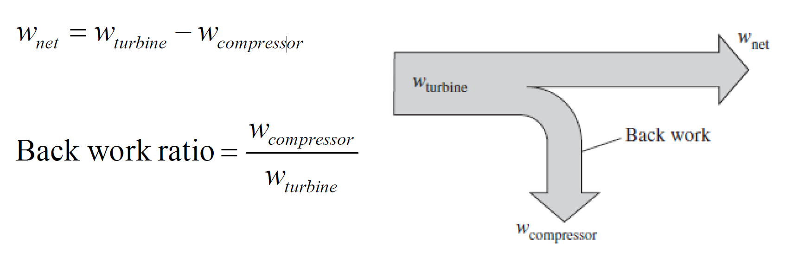
