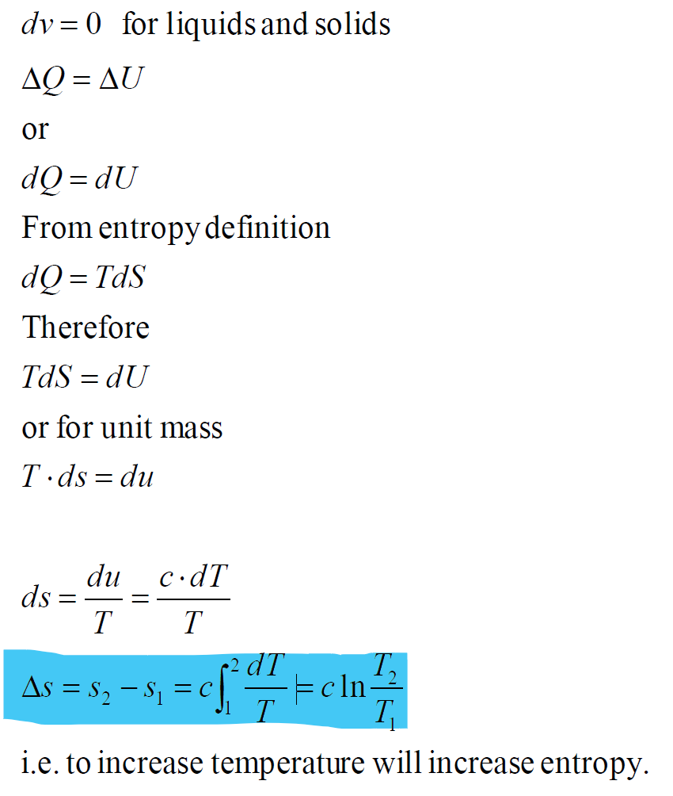
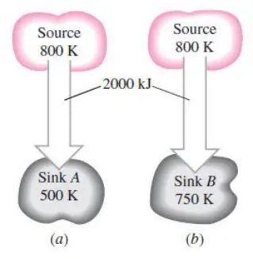

# 熵和热力学第三定律 | Entropy and Third Law of Thermodynamics

## 熵 | Entropy

$$$
dS = \frac{dQ}{T}
$$$

- S – entropy kJ/K
- s - entropy per unit mass, unit kJ/kg · K
- Q is the heat transfer between the system and surroundings

### 熵变 | Entropy change

$$$
\Delta S = S_2 - S_1 = \int_1^2 \frac{dQ}{T}
$$$

对于等温过程，有

$$$
\Delta S = \frac{Q}{T_0}
$$$

### 熵增法则 | Entropy Increase Principle

The entropy of an isolated system ##always increases## or, there is an entropy generation, except in the limiting case of a reversible process, remains constant.

A system and its surroundings can be viewed as the two subsystems of an isolated system, and the entropy change is the sum:

$$$
\Delta S_{total} = \Delta S_{system} + \Delta S_{surroundings} \geq 0
$$$

## 热力学第三定律 | Third law of thermodynamics

The entropy of a pure crystalline substance at absolute zero temperature is zero.

### 液体和固体的熵的变化 | Entropy change in liquids/solids

### 理想气体熵的变化 | Entropy change in ideal gases

$$$
\Delta s = s_2 - s_1 = c_{p, avg}\ln{\frac{T_2}{T_1}} - R\ln{\frac{p_2}{p_1}}\\
\Delta s = s_2 - s_1 = c_{v, avg}\ln{\frac{T_2}{T_1}} + R\ln{\frac{v_2}{v_1}}\\
c_p - c_v = R
$$$

### 理想气体的恒熵过程 | Isentropic processes of ideal gases

$$$
\frac{T_2}{T_1} = (\frac{v_1}{v_2})^{\gamma - 1}
$$$

- - -

## 例题1

A heat source at 800K loses 2000kJ of heat to a sink at ##(a) 500K and (b) 750K##. Determine which heat transfer process is more irreversible.

这一题需要使用等温熵变公式 $$\Delta S = \frac{Q}{T_0}$$ 同时对 heat source 和 sink 做熵变的计算，再相加为总的熵变。
注意⚠️：这种题要注意计算总熵变

(a)
$$$
\Delta S_{source} = \frac{-2000 kJ}{800K}\\
\Delta S_{sink} = \frac{2000 kJ}{500K}\\
\Delta S_{total} = S_{source} + S_{sink}\\
$$$

(b)
$$$
\Delta S_{source} = \frac{-2000 kJ}{800K}\\
\Delta S_{sink} = \frac{2000 kJ}{750K}\\
\Delta S_{total} = S_{source} + S_{sink}\\
$$$

## 例题2

0.5 kg of coffee initially at 90℃, cools off to room temperature 20℃.
Calculate entropy changes of coffee and surroundings, and total entropy change.

本题需要使用固液体熵变公式 $$\Delta S = mc\ln{\frac{T_2}{T_1}}$$

对于咖啡，$$\Delta S_{coffee} = mc\ln{\frac{T_2}{T_1}}$$
咖啡能量损失 $$\Delta Q = mc\Delta T$$
对于周围环境，$$\Delta S_{surroundings} = \frac{\Delta Q}{T_{room}}$$
总的熵变 $$\Delta S_{total} = \Delta S_{coffee} + \Delta S_{surroundings}$$

## 例题3

A 50-kg iron block and a 20-kg copper block, both initially at 80°C, are dropped into a large lake at 15°C. Thermal equilibrium is established after a while as a result of heat transfer between the blocks and the lake water. Determine the total entropy change for this process. $$c_{iron} = 0.45 kJ/kg°C$$ and $$c_{copper} = 0.386 kJ/kg°C$$.

本题需要综合使用等温熵变和固液体熵变公式。

对于 iron 和 copper，其熵变：
$$$
\Delta S_{iron} = m_{iron}c_{iron}\ln{\frac{T_2}{T_1}}\\
\Delta S_{copper} = m_{copper}c_{copper}\ln{\frac{T_2}{T_1}}\\
$$$

对于湖，计算其熵变需要先计算其吸收的热能：
$$$
Q_{in} = m_{iron}c_{iron}\Delta T + m_{copper}c_{copper}\Delta T
$$$
则其熵变：
$$$
\Delta S_{lake} = \frac{Q_{in}}{T_{lake}}
$$$

最后，总熵变：
$$$
\Delta S_{total} = S_{iron} + S_{copper} + S_{lake}
$$$

## 例题4

