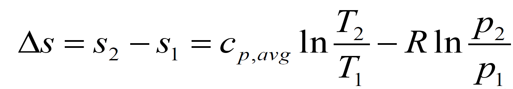
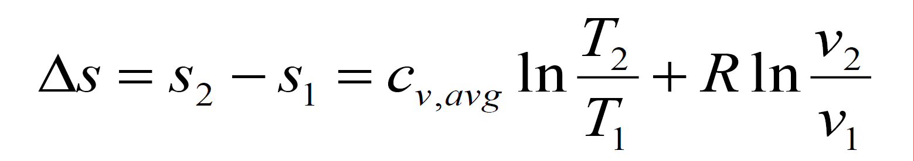

# 熵和热力学第三定律 | Entropy and Third Law of Thermodynamics

## 熵 | Entropy

S = Q / T

- S – entropy kJ/K
- s - entropy per unit mass, unit kJ/kg · K
- Q is the heat transfer between the system and surroundings

### 熵变 | Entropy change

&Delta;S = (S,,2,, - S,,1,,)

### 熵增法则 | Entropy Increase Principle

The entropy of an isolated system ##always increases## or, there is an entropy generation, except in the limiting case of a reversible process, remains constant.

A system and its surroundings can be viewed as the two subsystems of an isolated system, and the entropy change is the sum:

&Delta;S,,total,, = &Delta;S,,sys,, + &Delta;S,,surroundings,, ``>=`` 0

## 热力学第三定律 | Third law of thermodynamics

The entropy of a pure crystalline substance at absolute zero temperature is zero.

### 液体和固体的熵的变化 | Entropy change in liquids/solids

### 理想气体熵的变化 | Entropy change in ideal gases

### 理想气体的恒熵过程 | Isentropic processes of ideal gases

