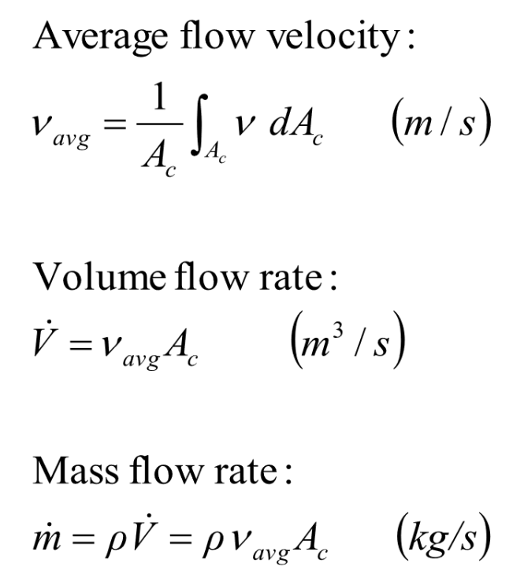
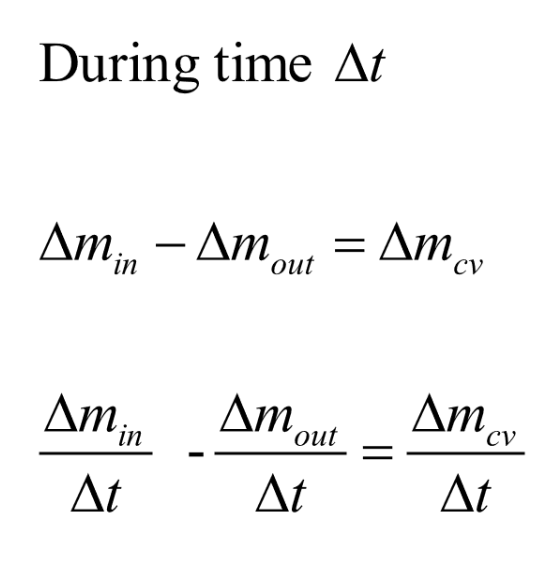
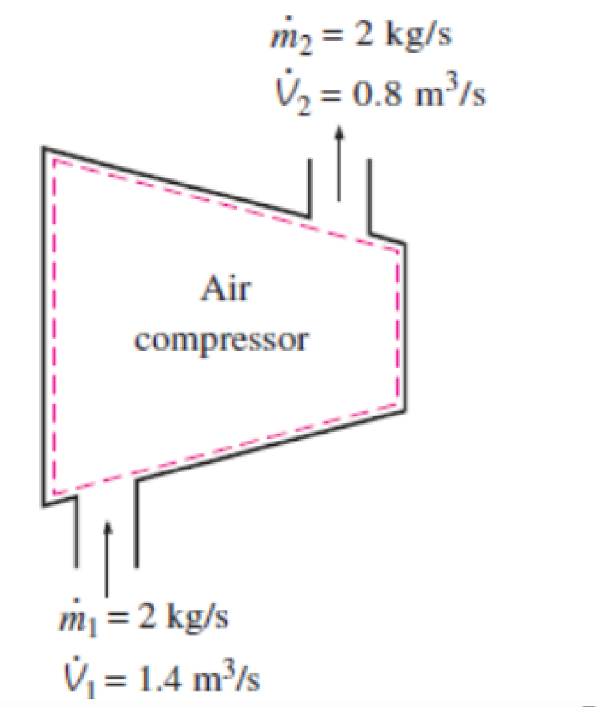
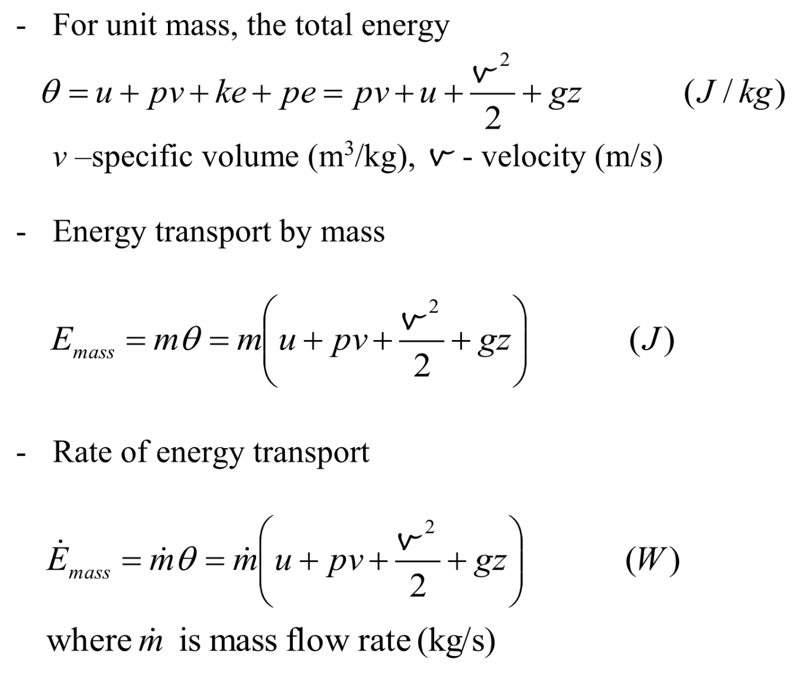
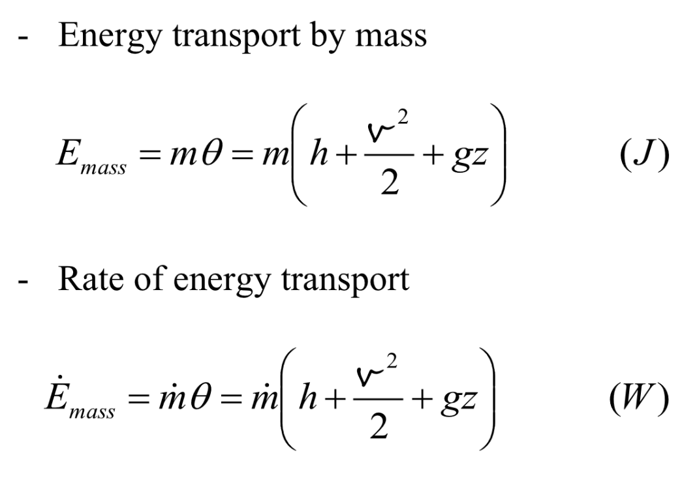
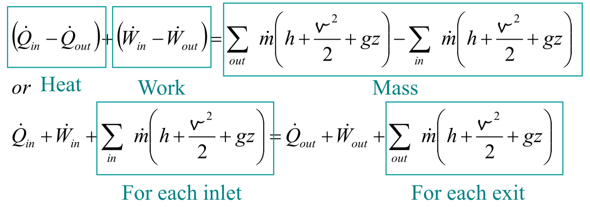
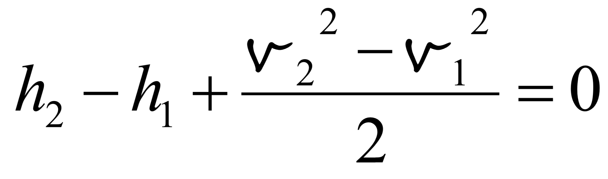

# 稳流过程 | Steady Flow Processes

## 控制体积

Control volume (open system) – A system that involves mass flow across their boundaries

## 稳流系统

Steady flow systems – control volume with steady mass flow

## 质量守恒 | Conservation of mass

m,,in,, and m,,out,, ``->`` mass flow rate

m,,cv,, ``->`` control volume mass change rate

## 稳流过程：压缩和非压缩过程 | Steady flow process – Compressible / Incompressible Flows

对于稳流过程，有公式：

m,,1,, = m,,2,,

&rho;,,1,,v,,1,,A,,1,, = &rho;,,2,,v,,2,,A,,2,, , where ``v`` is velocity.

对于存在压缩的情况, &rho;,,1,, ``!=`` &rho;,,2,, , v,,1,, ``!=`` v,,2,,

对于不存在压缩的情况, &rho;,,1,, = &rho;,,2,, , v,,1,,A,,1,, = v,,2,,A,,2,, , or volume flow rate V,,1,, = V,,2,,

## 流体功 | Flow work

Work done by the flow push.

F = pA

W,,flow,, = FL = pAL = pV

where ``p`` is pressure and ``V`` is volume.

## 流动流体的总能量 | The total energy of a flowing fluid

### 焓 | Enthalpy

h = u + pv (J/kg)

用焓代入上面的公式，得到：

## 稳流系统 | Steady flow systems

In engineering devices, such as turbines, compressors, andnozzles operate for long periods of time under the sameconditions, once the transition start-up period is completed andsteady operation is established, they are classified as steady flow devices, which means the process is a steady flow process.

在一段时间内 &Delta;t: &Delta;E,,in,, - &Delta;E,,out,, = &Delta;E,,system,,

对于不存在能量存储的情况，E,,in,, = E,,out,,

所以，

### 管道与管道流动 | Pipe and duct flow

E,,in,, - E,,out,, = E,,system,, = 0

### 喷嘴和扩散器 | Nozzles and diffuser

A nozzle is a device that ##increases the velocity## of a fluid at the expense of pressure.

A diffuser is a device that ##increases the pressure## of a fluid by slowing it down.

### 节流阀 | Throttling valves

节流阀可以被看做是##绝热的(adiabatic)##因此节流阀中可以看做不存在焓变。

h,,in,, = h,,out,,

流体能 pv (pressure * volume) 增加

p,,in,,v,,in,, < p,,out,,v,,out,,

内能降低

u,,in,, > u,,out,,

### 混合室 | Mixing chambers

Mixing two streams of fluids.

### 热交换器 | Heat exchangers

### 压缩器 | Compressors

## 伯努利方程 | Bernoulli’s equation

In most flows of liquids, and of gases at low Mach number

pv + &frac12;V''2'' + gz = constant

v ``->`` 单位体积 specific volume (m''3''/kg) v = 1 / &rho;

V ``->`` 速度 velocity (m/s)

p + &frac12;&rho;v''2'' = constant
