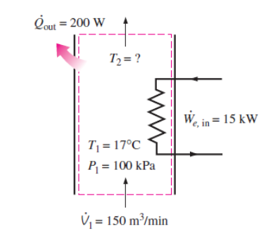

# 稳流过程 | Steady Flow Processes

## 控制体积

Control volume (open system) – A system that involves mass flow across their boundaries

## 稳流系统

Steady flow systems – control volume with steady mass flow

## 质量守恒 | Conservation of mass

m,,in,, and m,,out,, ``->`` mass flow rate

m,,cv,, ``->`` control volume mass change rate

## 稳流过程：压缩和非压缩过程 | Steady flow process – Compressible / Incompressible Flows

对于稳流过程，有公式：

$$$
m_1 = m_2\\
\rho _1 v_1 A_1 = \rho _2 v_2 A_2
$$$
where ``v`` is velocity.

对于存在压缩的情况, $$\rho _1 \neq \rho _2,\ v_1 \neq v_2$$

对于不存在压缩的情况, $$\rho _1 = \rho _2,\ v_1 A_1 = v_2 A_2\ OR\ \dot{V_1} = \dot{V_2}$$

## 流体功 | Flow work

Work done by the flow push.

F = pA

W,,flow,, = FL = pAL = pV

where ``p`` is pressure and ``V`` is volume.

## 流动流体的总能量 | The total energy of a flowing fluid

### 焓 | Enthalpy

$$$
h = u + pv (J/kg)
$$$

用焓代入上面的公式，得到：

## 稳流系统 | Steady flow systems

In engineering devices, such as turbines, compressors, andnozzles operate for long periods of time under the sameconditions, once the transition start-up period is completed andsteady operation is established, they are classified as steady flow devices, which means the process is a steady flow process.

在一段时间内 $$\Delta t = \Delta E_{in} - \Delta E_{out} = \Delta E_{system}$$

对于不存在能量存储的情况，E,,in,, = E,,out,,

所以，

### 管道与管道流动 | Pipe and duct flow

E,,in,, - E,,out,, = E,,system,, = 0

### 喷嘴和扩散器 | Nozzles and diffuser

A nozzle is a device that ##increases the velocity## of a fluid at the expense of pressure.

A diffuser is a device that ##increases the pressure## of a fluid by slowing it down.

### 节流阀 | Throttling valves

节流阀可以被看做是##绝热的(adiabatic)##因此节流阀中可以看做不存在焓变。

h,,in,, = h,,out,,

流体能 pv (pressure * volume) 增加

p,,in,,v,,in,, < p,,out,,v,,out,,

内能降低

u,,in,, > u,,out,,

### 混合室 | Mixing chambers

Mixing two streams of fluids.

### 热交换器 | Heat exchangers

### 压缩器 | Compressors

## 伯努利方程 | Bernoulli’s equation

In most flows of liquids, and of gases at low Mach number
$$$
pv + \frac 1 2 V^2 + gz = constant
$$$

v ``->`` 单位体积 specific volume (m''3''/kg) $$v = 1 / \rho$$;

V ``->`` 速度 velocity (m/s)

$$$
p + \frac 1 2 \rho v^2 = constant
$$$

- - -

## 例题

The electric heating systems used in a house consist of a simple duct with a resistance heater. Air is heated as it flows over resistance wires. Consider a 15 kW electric heating system. Air enters the heating section at 100 kPa and 17°C with a volume flow rate of 150 m''3''/min. If heat is lost from the air in the duct to the surroundings at a rate of 200 W,
determine the exit temperature of air. c,,p,, = 1.005 kJ/kg·°C at room temperature.

由公式流体的总能量 $$E_{mass} = m\theta = m(h + \frac{V^2}{2} + gz)$$，系统能量变化 $$\Delta E_{system} = (Q_{in} - Q_{out}) + (W_{in} - W_{out})$$，

对于本题，$$W_{in} - Q_{out} = m\Delta h$$
由于压强 p 和体积 v 不变，$$\Delta h = \Delta u$$，$$W_{in} - Q_{out} = mc_p(T_2 - T_1)$$

由公式 $$pV = mRT$$，$$m_1 = \frac{p_1 V_1}{RT_1}$$。
则最终的温度 $$T_2 = \frac{W_{in}}{Q_{out}}{mc_p} + T_1$$
