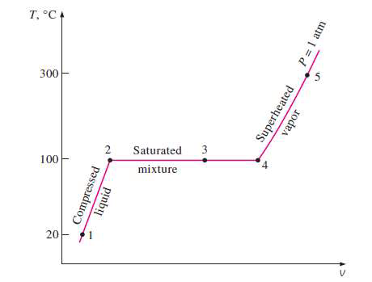
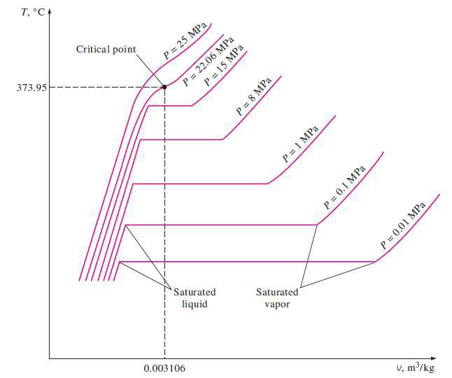
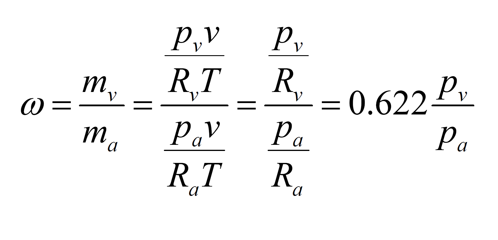
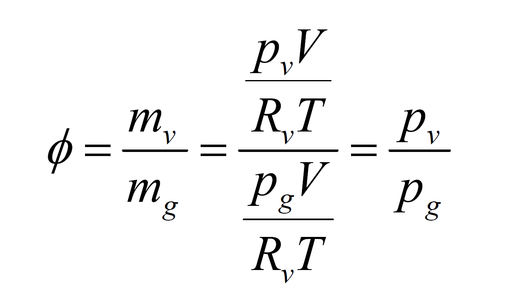

# 蒸汽性质 | Properties of Vapours

## 物质形态 | Phases of Pure Substances

Substances normally exist in different phases: ##solid##, ##liquid## and ##gas##.
##Liquid state:##
1. A liquid that is about to vaporize (将要蒸发的液体) is called a ##saturated liquid##
2. A saturated liquid–vapour mixture since the liquid and vapour phases coexist in ##equilibrium##
3. A vapour that is about to condense (将要凝结的蒸汽) is called a ##saturated vapour##
4. A vapour that is not about to condense (不将要凝结的蒸汽) is called a ##superheated vapour##

- - -

- Compressed liquid (state 1): At certain low temperature, liquid is not about to vaporize
- Saturated liquid (state 2): A liquid that is about to vaporize
- Saturated liquid (State 3): vapour mixture
- Saturated vapour (state 4): A vapour that is about to condense
- Superheated vapour (state 5): A vapour that is not about to condense

- - -

Saturation temperature: At a given pressure, the temperature at which a substance changes phase T,,sat,,
Saturation pressure: At a given temperature, the pressure at which a substance changes phase p,,sat,,

## 蒸汽相关物态 | Vapour related phrases

- Gas: a state of matter (solid, liquid, gas, plasma)
- Vapour: substance in gas state, it can be condensed to liquid
- Steam: water vapour
- Moisture: presence of a liquid (often water) in trace amount

## 潜热 | Latent heat

Latent heat: The amount of energy absorbed or released during a phase-change process
在温度保持不变的条件下，物质在从某一个相转变为另一个相的相变过程中所吸入或放出的热量。

## 恒压下相变过程的 T-v 图 | T-v diagram of constant-pressure phase-change processes

##临界点 (Critical point)## - the point at which the saturated liquid and saturated vapour states are identical.

## 三相点 | Triple point

At triple-point pressure and temperature, a substance exists in three phases in equilibrium.

## 升华 | Sublimation

物体由固体无需融化直接转变为气体 | Solids evaporates directly without melting first.

- - -

## 液体与蒸汽状态的焓 | Enthalpy of saturated liquid and saturated vapour states

$$$
h = u + pv
$$$

``f``: for saturated ##liquid##
``g``: for saturated ##vapour##
``fg``: for difference between the saturated vapour and saturated liquid values of the same property

v,,f,,: specific volume of saturated liquid
v,,g,,: specific volume of saturated vapour
v,,fg,,: difference between v,,g,, and v,,f,, that is, v,,fg,, = v,,g,, – v,,f,,
h,,fg,,: enthalpy of vaporization (or latent heat of vaporization), represents the amount of energy needed to vaporize a unit mass of saturated liquid at a given temperature or pressure.

### 超临界流体 | Supercritical fluid

- any substance at a temperature and pressure above its critical point, where distinct liquid and gas phases do not exist.
- can effuse(喷出) through solids like a gas, and dissolve(溶解) materials like a liquid.

- - -

## 饱和气液混合物 | Saturated Liquid–Vapour Mixture

``x`` 为蒸气在气液混合物中的比例
Define quality ``x`` as the ##ratio## of the mass of ##vapour## to the ##total## mass of the mixture.

$$$
Quality\ x = \frac{m_{vapour}}{m_{total}}\\
v_{avg} = (1 - x)v_f + x v_g = v_f + x v_{fg} \rightarrow x = \frac{v_{avg} - v_f}{v_{fg}}
$$$

同样地，对于内能、焓和熵，也有：

$$$
x = \frac{u_{avg} - u_f}{u_{fg}}\\
x = \frac{h_{avg} - h_f}{h_{fg}}\\
x = \frac{s_{avg} - s_f}{s_{fg}}\\
$$$

## 湿度 | Humidity

Absolute humidity | specific humidity | humidity ratio:

单位质量干燥空气中存在水蒸气的质量。

where R,,a,, = 0.287 kJ/kgK, R,,v,, = 0.462 kJ/kgK

饱和状态下的绝对湿度为当前温度下所能达到的最大湿度。

- - -

Relative humidity:

空气中实际水蒸气的质量与饱和状态下所能容纳的水蒸气质量之比。

where p,,g,, is p saturated at T.

The amount of moisture air can hold is proportional to the saturation pressure, which increases with temperature. Air can hold more moisture at higher temperatures.

## 蒸汽压强 | Vapour pressure

p,,atm,, = p,,a,, + p,,v,,

pv = ϕp,,sat @T,,
where p,,sat @T,, is the saturation pressure of water at the specified temperature.

## 水暴露于空气的标准相平衡 | Phase equilibrium criterion for water exposed to air

当环境湿度达到 100%，空气饱和，于是此时不存在从液态到气态的相变，并且这两种物态达到##平衡##。
When the environment relative humidity is 100% , the air is saturated, there is no transformation from the liquid phase to the vapour phase, and the two phases are in ##phase equilibrium##.

对于暴露于空气的液态水而言，标准相平衡则为：##空气中的蒸汽压强与水温下水的饱和压强相等##。
For liquid water that is open to the atmosphere, the criterion for phase equilibrium is: ##the vapour pressure in the air must be equal to the saturation pressure of water at the water temperature##.

p,,v,, = p,,sat @T,,

## 一些与湿度相关的环境变化

- Drying condition
- Fog and dew
- Clouds
- Rainfall
- Cold front
- Supercooling
- Snow

- - -

## 例题1

A mass of 200 g of saturated liquid water is completely vaporized at a constant pressure of 100 kPa.
Determine
(a) the volume change
(b) theamount of energy transferred to the water.

(a) 查表可知，在 100 kPa 下，$$v_f = 0.001043, v_g = 1.6941$$
其蒸发过程中的体积变化 $$\Delta V = m (v_g - v_f)$$

(b) 查表可知，在 100 kPa 下，$$h_{fg} = 2257.5 kJ/kg$$
潜热公式 $$H = mh_{fg}$$

## 例题2

A rigid tank contains 10 kg of water at 90°C. If 8 kg of the water is in the liquid form and the rest is in the vapour form,
determine
(a) the pressure in the tank
(b) the volume of the tank.

(a) 由题可知，此时水箱中液体和蒸气处于平衡状态。
则其压强通过查表可得 $$p_{@90 \degree C} = 70.183 kPa$$
(b) 水箱的体积可分为液体体积和蒸气体积两部分
$$$
V_{tank} = V_{liquid} + V_{vapour}
$$$
查表可得，此时液体和蒸气的单位体积 $$v_f\ and\ v_g$$
则总体积为：$$V_{tank} = v_f m_{liquid} + v_g m_{vapour}$$

## 例题3

An 80-L vessel contains 4 kg of refrigerant-134a at a pressure of 160 kPa.
Determine
(a) the temperature,
(b) the quality,
(c) the enthalpy of the refrigerant,
(d) the volume occupied by the vapour phase.

(a) 要通过查表得知当前温度，首先要确定当前是否处于 {saturated mixture region}(液气饱和状态)
当前单位体积 $$v_{totol} = V / m$$
查表可知，当前压强下液态和气态单位体积 $$v_f\ and\ v_g$$
由于 $$v_f < v_{totol} < v_g$$
故当前处于液气饱和状态
所以当前温度 $$T_{@160kPa} = -15.6 \degree C$$

(b) 已知当前平均单位体积 $$v_{avg}$$、液态单位体积 $$v_f$$ 和液气态单位体积差$$v_{fg}$$
由公式 $$x = \frac{v_{avg} - v_f}{v_{fg}}$$ 可得答案。

(c) 查表可知当前焓 $$h_f\ h_{fg}$$
由公式 $$x = \frac{h_{avg} - h_f}{h_{fg}}$$
当前的平均焓 $$h_{avg} = h_{fg}x + h_f$$

(d) 当前气体质量 $$m_g = x m_{total}$$
当前气体体积可以通过 $$V = m v_g$$ 得出

## 例题4

Determine the internal energy of water at 200 kPa and 300°C.
查表可知，在压强 200kPa 下饱和温度 $$T_{sat} = 120.21 \degree C$$
由于当前气体温度大于饱和温度，所以当前状态为 {superheated water}(过热水)
查表可知，当前内能 $$u = 2808.08 kJ/kg$$

## 例题5

Determine the temperature of water at a state of p = 0.5 MPa and h = 2890 kJ/kg.

查表可知，在压强 0.5 MPa 下，{饱和水蒸气}(saturated water vapour)的焓 $$h_g = 2748.1  kJ/kg$$，小于题目中所给的焓。

可知题目中的水为{过热蒸气态}(superheated vapour)，表中对应的值为：

| T°C | h kJ/kg |
| 200 | 2855.8  |
| 250 | 2961.0  |

由于题目所给的焓介于温度 200-250 对应的焓之间，通过##线性关系##来计算其温度：

$$$
\frac{T_2 - T_1}{h_2 - h_1} = \frac{T - T_1}{h - h_1}
$$$
