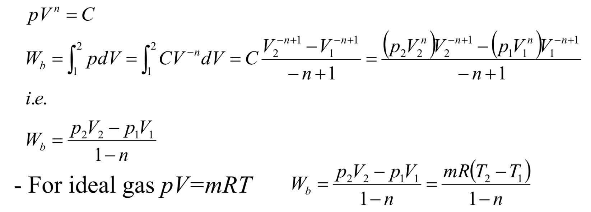

# 非流动过程 | Non-Flow Processes

## 非流动物质的能量 | Total energy for non-flowing mass

对于总能量：

$$E = U + \frac 1 2 mv^2 + mgz$$

这里的 ``U`` 是内能，``v`` 是速度。

对于单位质量的能量：

$$e = u + \frac 1 2 v^2 + gz$$

对于封闭系统的能量平衡：

$$(Q_{in} - Q_{out}) + (W_{in} - W_{out}) = \Delta E_{system}$$

## 对于非流动系统的边界移动功 | Moving boundary work of non-flow systems

$$W_b = \int_1^2 {p} \ dV$$

其中 ``v`` 表示体积。

## 净做功输出 | Net Work Output

定义：系统在一个循环的膨胀过程（体积增大）中对外界做的功与缩小过程中外界对其做的功之差。

## 边界移动功 | Moving boundary work

恒体积过程的边界功 | Boundary work for a constant-volume process

$$$
W_b = \int_1^2 {p} \ dV = 0
$$$

恒压过程的边界功 | Boundary work for a constant-pressure process

$$$
W_b = \int_1^2 {p} \ dV = p_0 \int_1^2 dV = p_0(V_2 - V_1)
$$$

恒温压缩过程的边界功 | Work by isothermal compression process

$$$
With\ pV = C\ (Boyle's\ law)\,\\
W_b = \int_1^2 {p} \ dV = \int_1^2 {\frac C V} \ dV = C \ln \frac{V_2}{V_1}
$$$

- - -

多方过程的边界功 | Work by polytropic process

- - -

## 例题1

A spring–loaded piston-cylinder device contains 1 kg of carbon dioxide. This system is heated from 100kPa and 25°C to 150kPa and 300°C. Determine the total heat transfer to and work produced by this system. 
(The properties of CO2 are R = 0.1889 kJ/kg⋅K and c,,v,, = 0.657 kJ/kg⋅K)

知识点：[热力学第一定律等式](热力学第一定律.md)、边界移动功

根据热力学第一定律 $$(Q_{in} - Q_{out}) + (W_{in} - W_{out}) + (E_{mass,in} - E_{mass,out}) = \Delta E_{system}$$，有 $$Q_{in} - W_{out} = \Delta E_{system}$$。

由胡克定律 $$F = kx$$，弹簧做功 $$W = F_{avg} \Delta x = \frac{F_2 + F_1}{2}(x_2 - x_1) = \frac{Ap_2 + Ap_1}{2}(x_2 - x_1) = \frac{p_2 + p_1}{2}(V_2 - V_1)$$

由系统能量总变化公式 $$\Delta E_{system} = \Delta U + \Delta E_k + \Delta E_p$$，$$\Delta E_{system} = \Delta U$$

由条件 c,,v,,，$$\Delta U = mc_v(T_2 - T_1)$$
所以，$$Q_{in} = W_{out} + \Delta U$$。

## 例题2

A piston–cylinder device contains 0.05 m''3'' of a gas initially at 200 kPa. At this state, a linear spring, k=150 kN/m is touching the piston but exerting no force on it. Now heat is transferred to the gas, causing the piston to rise and to compress the spring until the volume doubles. If {A = 0.25 m''2''}(横截面积),
determine
##(a)## the final pressure inside the cylinder,
##(b)## the total work done by the gas,
##(c)## the fraction of this work done against the spring to compress it.

(a) 由力的平衡可知，气体的最终压强 = 气体自身压强 + 弹簧压强。
$$$
Displacememnt\ x = (V_1 - V_0) / A\\
Pressure\ by\ spring\ p_{spring} = F_{spring} / A = (kx) / A\\
Gas\ final\ pressure\ p_1 = p_0 + p_{spring}
$$$

(b) 使用边界移动功公式 $$W = p_{avg}\Delta V = \frac{p_0 + p_1}{2}(V_1 - V_0)$$ 既可求解。

(c) 使用公式 $$W = Fx$$ 得，
$$$
W_{spring} = F_{avg}x = \frac{kx + 0}{2}x
$$$
