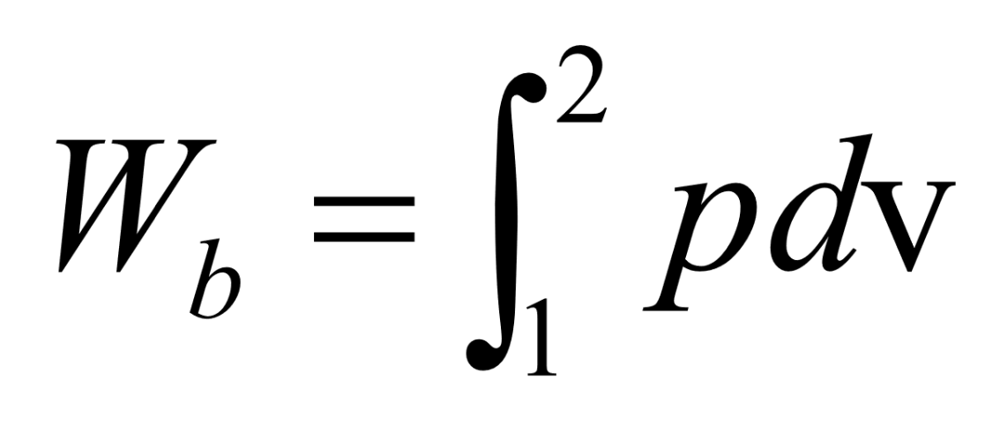
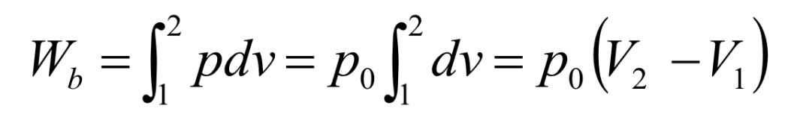
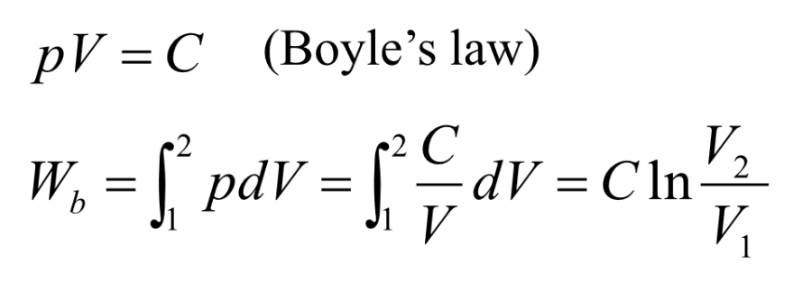
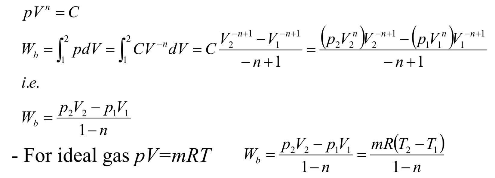

# 非流动过程 | Non-Flow Processes

## 非流动物质的能量 | Total energy for non-flowing mass

对于总能量：

E = U + &frac12;mv''2'' + mgz

这里的 ``U`` 是内能，``v`` 是速度。

对于单位质量的能量：

e = u + &frac12;v''2'' + gz

对于封闭系统的能量平衡：

(Q,,in,, - Q,,out,,) + (W,,in,, - W,,out,,) = &Delta;E,,system,,

## 对于非流动系统的边界移动功 | Moving boundary work of non-flow systems

其中 ``v`` 表示体积。

## 净做功输出 | Net Work Output

定义：系统在一个循环的膨胀过程（体积增大）中对外界做的功与缩小过程中外界对其做的功之差。

## 边界移动功 | Moving boundary work

恒体积过程的边界功 | Boundary work for a constant-volume process

恒压过程的边界功 | Boundary work for a constant-pressure process

恒温压缩过程的边界功 | Work by isothermal compression process

多方过程的边界功 | Work by polytropic process

