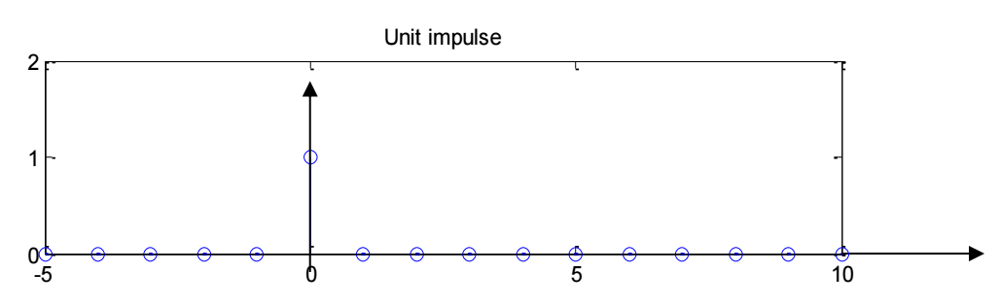
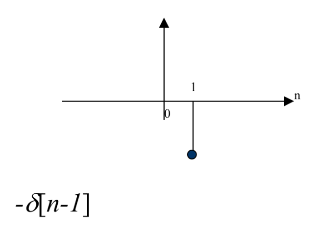

# 信号

## 信号和样本

样本：即信号中的其中一个值，如 X[5]
信号：多个样本的组合，如 X[n]

## Shannon's Sampling Theorem

设一个信号中的最高频率为 $$f_e$$，则对这个信号的{采样率}(Sampling rate)：
$$$
f_s \ge 2 f_e
$$$

## 基本信号

### Unit Impulse

$$$
\delta [n]=\begin{cases} 1 & n=0 \\ 0 & n\ne 0 \end{cases}
$$$

### Unit Step

$$$
u[n] = \begin{cases}
1 & n \geq 0 \\
0 & n < 0
\end{cases}
$$$

### Ramp

$$$
r[n] = n u[n]
$$$

## 信号变换

### Signal shifting

### Signal flipping

### Signal inverting

## Other signals

### Complex signals 

$$$
\exp(j\Omega n) = \cos(\Omega n) + j \sin(\Omega n)
$$$
