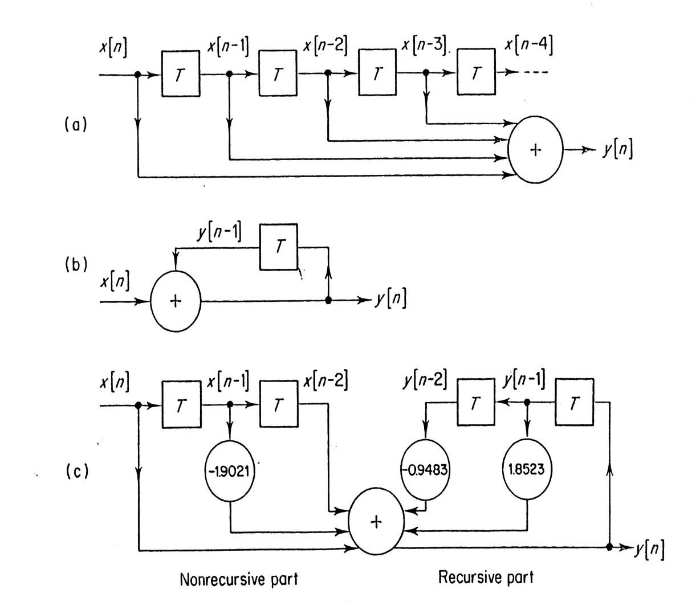

# 时域分析

## {差分方程}(Difference Equations)

e.g. $$\frac{dy(t)}{dt} + ay(t) = bx(t)$$

Let $$\frac{dy(t)}{dt} = \frac{y[n] - y[n-1]}{T}$$,

then $$\frac{y[n] - y[n-1]}{T} + ay[n] = bx[n]$$

or $$(1+Ta)y[n] = y[n-1] + Tbx[n]$$

$$y[n] = \frac{1}{1+Ta}y[n-1] + \frac{Tb}{1+Ta}x[n]$$

or $$y[n] = a_1y[n-1] + b_1x[n]$$

Further, for second derivative

$$$
\frac{d^2 y(t)}{dt^2} = \frac{\frac{y[n] - y[n-1]}{T} - \frac{y[n-1] - y[n-2]}{T}}{T} = \frac{1}{T^2}(y[n] - 2y[n-1] + y[n-2])
$$$

### 递归与非递归的差分方程

Recursive difference equation:

$$$
y[n] = a_1y[n-1] + a_2y[n-2] + a_3y[n-3] + b_1x[n] + b_2x[n-1]
$$$

Non-recursive difference equation:

$$$
y[n] = b_1x[n] + b_2x[n-1] + b_3x[n-2]
$$$

### 方框图示例

a. y[n]=x[n]+x[n-1]+x[n-2]+...
b. y[n] = y[n-1] +x[n]
c. y[n]=1.8523 y[n-1] - 0.9403 y[n-2] + x[n] - 1.9021 x[n-1] + x[n-2]

## {因果系统}(Causal systems)

h[n] =0 before n=0

>>>示例：根据数字系统的差分方程求脉冲响应
$$$
y[n]=3 x[n] + x[n-1] + 4 x[n-2]
$$$
Replace input x[n] by δ[n] and response y[n] by h[n]
$$$
h[n]=3 \delta[n] + \delta[n-1] + 4 \delta[n-2]
$$$
>>>

>>>示例：对于因果系统，由其差分方程求脉冲响应
$$y[n] = 1.5 y[n-1] - 0.85 y[n-2] + x[n]$$
$$h[n] = 1.5 h[n-1] - 0.85 h[n-2] + \delta[n]$$

$$h[0] = 0 - 0 + 1 = 1$$ (Because of causal, $$h[-1] = h[-2] = 0$$)
$$h[1] = 1.5 \times 1 - 0 - 0 = 1.5$$
$$h[2] = 1.5 \times 1.5 - 0.85 \times 1 + 0 = 1.4$$
$$h[3] = 1.5 \times 1.4 - 0.85 \times 1.5 + 0 = 0.825$$
>>>

## {卷积和}(Convolution Sum)

直接看例子：

Calculate convolution between input $$x[n] = [1, 2, 3, 4, -1]$$, and impulse response $$h[n] = [1, -1]$$.

Step 1: Flip over $$h[n]$$ to get $$h'[n]$$:
| n | ... | -2 | -1 | 0 | 1 | 2 | 3 | 4 | 5 | 6 | ... |
| $$h[n]$$ | ... | 0 | 0 | 1 | -1 | 0 | 0 | 0 | 0 | 0 | ... |
| $$h[-n]$$ | ... | 0 | -1 | 1 | 0 | 0 | 0 | 0 | 0 | 0 | ... |

Step 2: Get the sum of products between $$x[n]$$ and $$h'[n]$$ of a series of shifts:
| n         | -2 | -1 | 0 | 1 | 2 | 3 | 4 | 5 | ... |
| $$x[n]$$  | 0 | 0 | 1 | 2 | 3 | 4 | -1 | ... | |
| $$h[-n]$$ | -1 | 1 | 0 | 0 | 0 | 0 | 0 | ... | $$\leftarrow y[-1]$$ |
|           | 0 | -1 | 1 | 0 | 0 | 0 | 0 | ... | $$\leftarrow y[0]$$ |
|           | 0 | 0 | -1 | 1 | 0 | 0 | 0 | ... | $$\leftarrow y[1]$$ |
|           | 0 | 0 | 0 | -1 | 1 | 0 | 0 | ... | $$\leftarrow y[2]$$ |
|           | 0 | 0 | 0 | 0 | -1 | 1 | 0 | ... | $$\leftarrow y[3]$$ |
|           | 0 | 0 | 0 | 0 | 0 | -1 | 1 | ... | $$\leftarrow y[4]$$ |

$$y[-1]$$ = Shift $$h'[n]$$ to left by 1 sample, get the sum: $$0 \times 0 = 0$$
$$y[0]$$ = Get from the sum of vertically multiplied pairs: $$1 \times 1 = 1$$
$$y[1]$$ = Shift $$h'[n]$$ to right by 1 sample, get the sum: $$1 \times (-1) + 2 \times 1 = 1$$
$$y[2]$$ = Shift $$h'[n]$$ to right by 2 samples, get the sum: $$2 \times (-1) + 3 \times 1 = 1$$
$$y[3]$$ = $$3 \times (-1) + 4 \times 1 = 1$$
$$y[4]$$ = $$4 \times (-1) + (-1) \times 1 = -5$$
$$y[5]$$ = $$-1 \times (-1) = 1$$
$$y[6]$$ = $$0$$

Therefore:
$$y[n] = [1 \ 1 \ 1 \ 1 \ -5 \ 1 \ 0]$$
