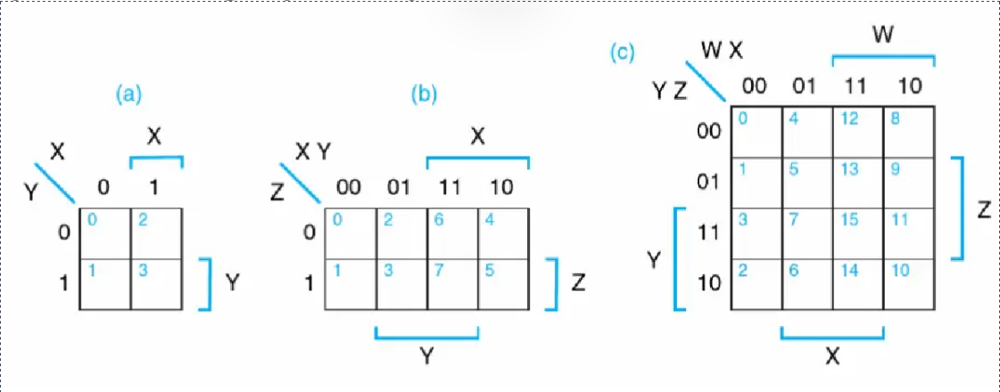
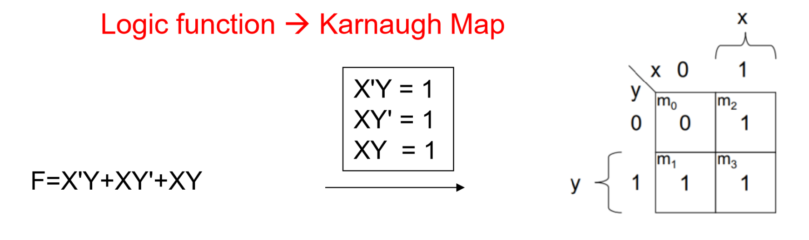
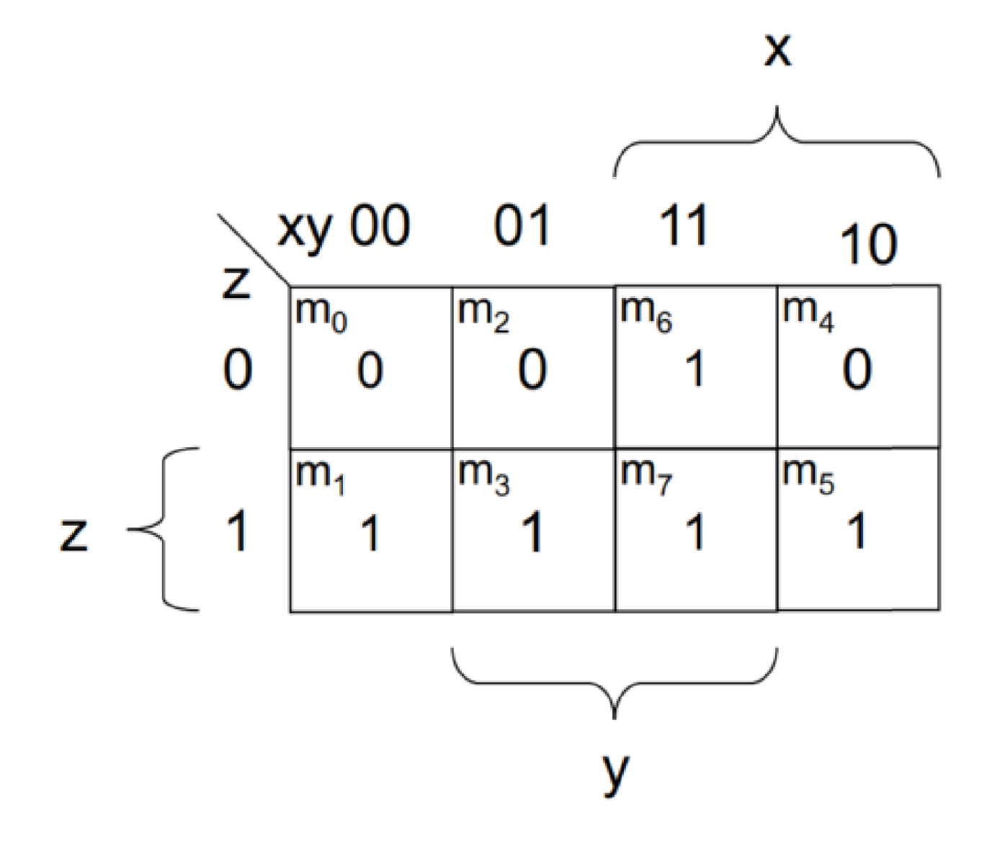
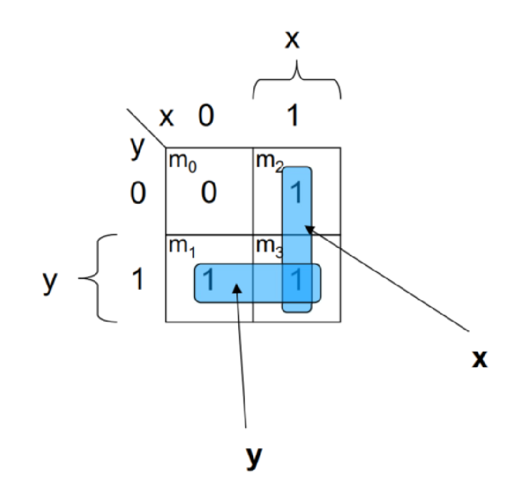
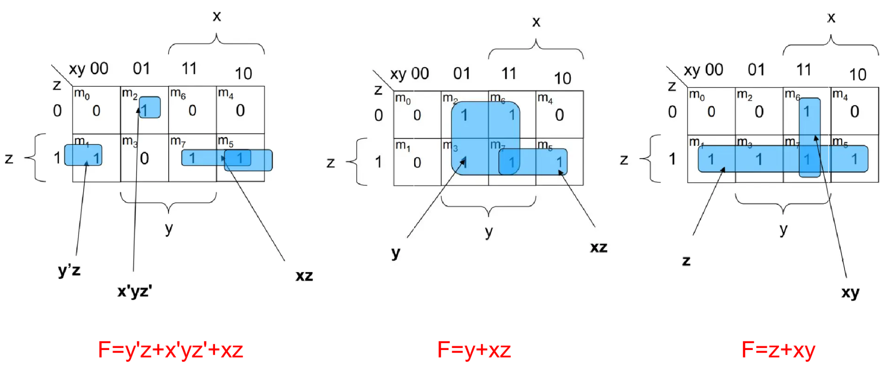
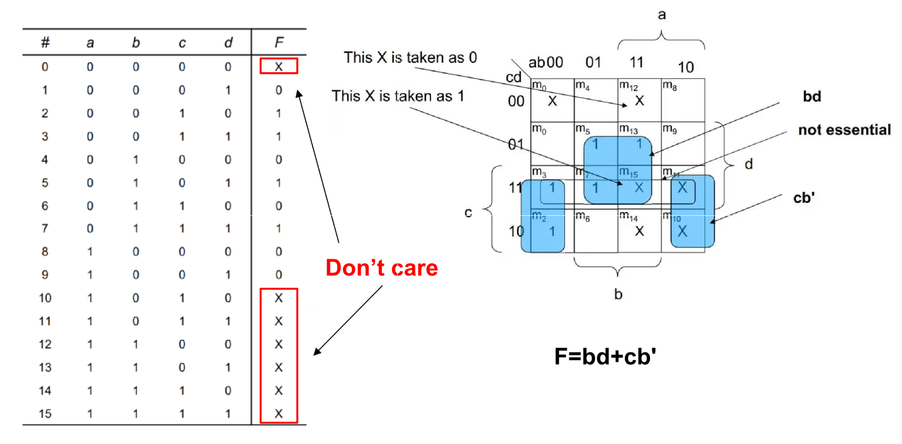
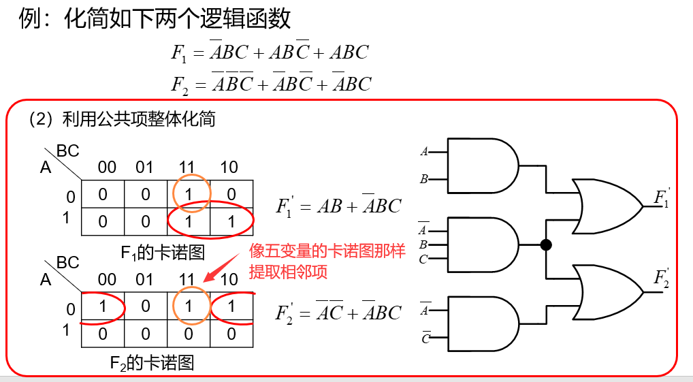
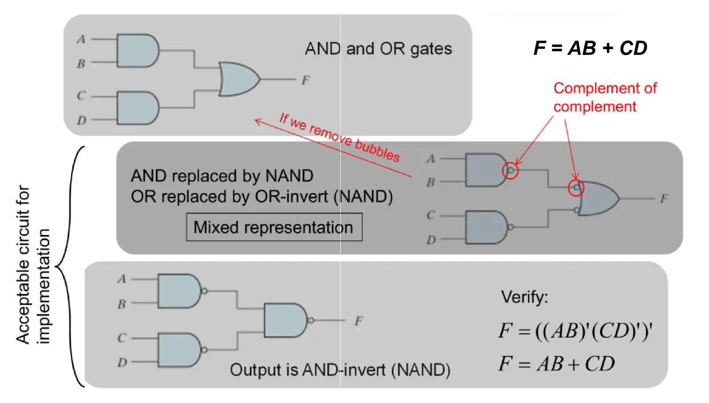

# 卡诺图 | Karnaugh maps

通过图形化方式较为直观地辅助##简化##电路表达式。

两变量到四变量的卡诺图示例：

## 逻辑函数到卡诺图

> [warning]
> 卡诺图中使用 Gray Code，即 00, 01, 11, 10
> 这样可以使卡诺图中每个相邻的格子只有一位不同。

>>> 一个例子
$$F = XY + Z$$ 对应的卡诺图如下：

>>>

## 卡诺图的使用

##画圈##的三点注意⚠️：
1. 圈出相邻的“1”，只能圈成矩形并且只能圈 2''n'' 个格子
2. 优先圈大的格子，由大圈到小
3. 让每个“1”都至少被圈到一次

画完圈后，每个圈对应一个 Product Term，将每个圈对应的 Term 相加即为简化后的逻辑函数。

>>> 另一个例子
原函数：$$F = X'Y + XY' + XY$$

简化后函数：$$F = X + Y$$
>>>

>>> 还不懂？再看看这个例子

>>>

- - -

## Don't Care Conditions

在一些时候，真值表中的一些输入组合可以不用考虑。
对于这些输入组合，其对应的卡诺图格子可以不被圈到。

## 多输出电路

对于多输出电路，化简步骤如下：

1. 画出每个输出对应的卡诺图
2. 找出在多张卡诺图中均为 1 的格子
3. 对于每张卡诺图，排除公共项后进行化简
4. 对于每张卡诺图的化简结果，加上公共项的单独化简结果

## 使用 NAND 和 NOR 门代替 AND 和 OR 门

由于 NAND(NOR) 门比 AND(OR) 门更简单，使用 NAND(NOR) 门代替 AND(OR) 门能够简化电路：

