# 基本数字电路组件

## {多路复用器}(MUX Multiplexer)

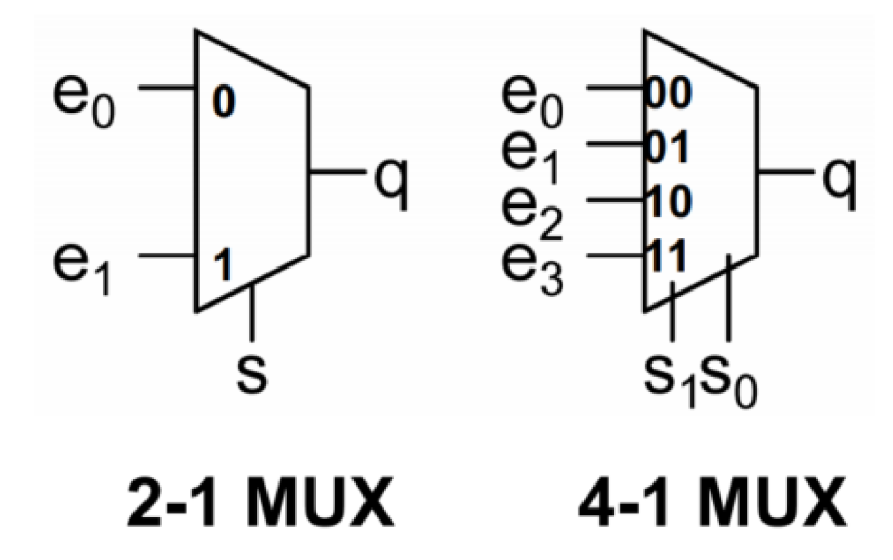

### {2-1}(2 inputs, 1 output) MUX

| s | q      |
| 0 | e,,0,, |
| 1 | e,,1,, |

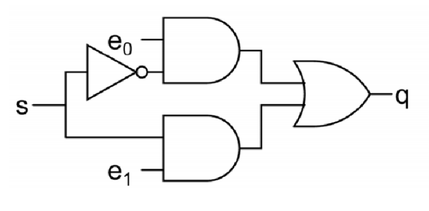

$$$
q=\overline{s}\cdot e_0+s\cdot e_1
$$$

### 使用小的 MUX 组成更大的 MUX

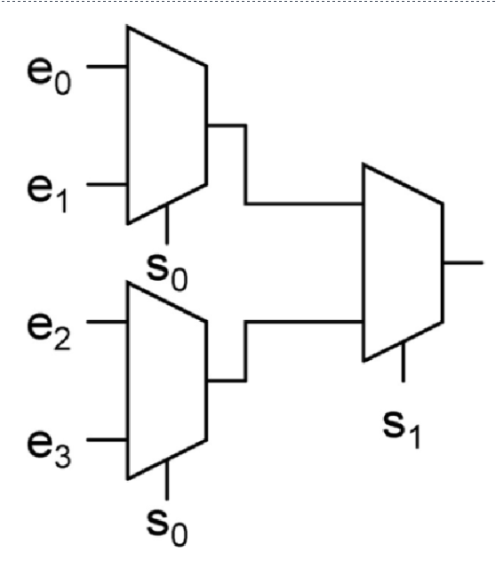

### 使用 MUX 实现函数

>>> MUX -> minterm
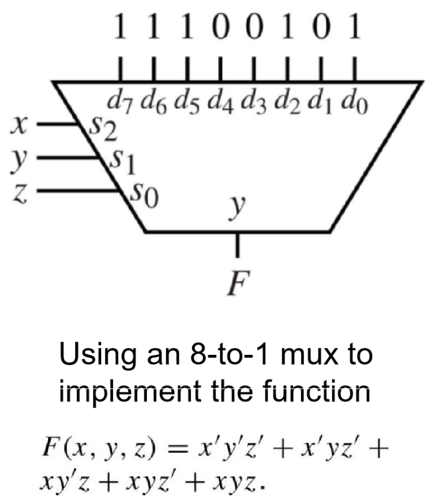
>>>

>>> 使用 MUX 实现异或门
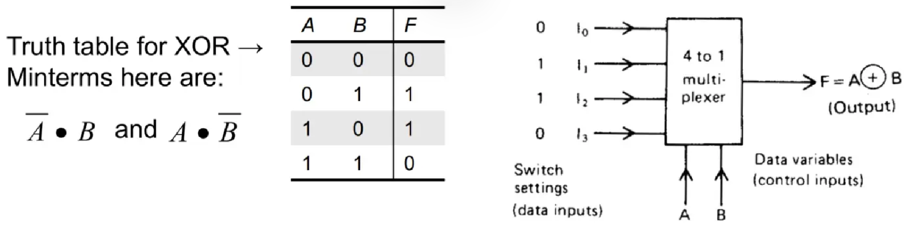
>>>

>>> 使用 MUX 实现与门
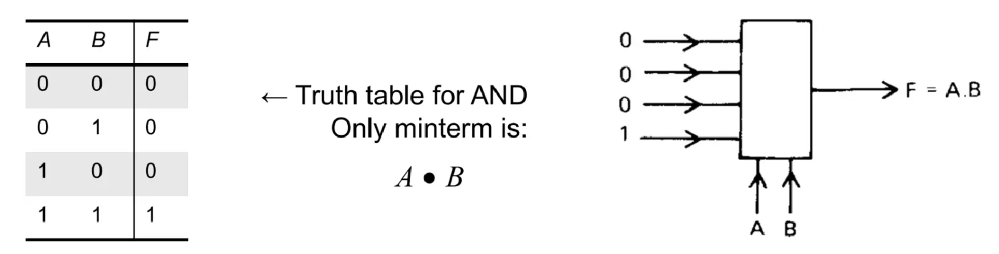
>>>

## {多路分用器}(DEMUX Demultiplexer)

## {解码器}(dec Decoder)

### {独热码}(One-hot code / 1-out-of-m code)

输出多个 bit，其中只有一个 bit 为 1。

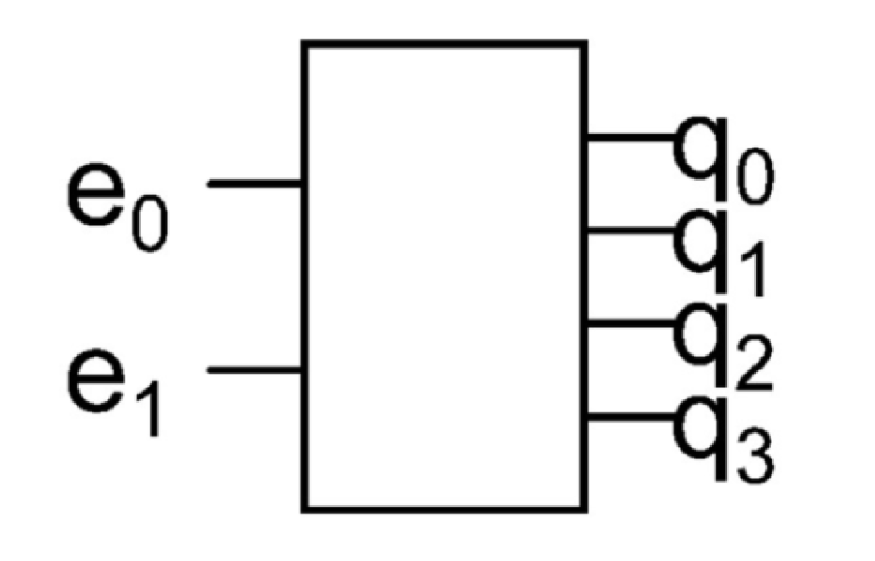

| e1 | e0 | q3 | q2 | q1 | q0 |
| 0  | 0  | 0  | 0  | 0  | 1  |
| 0  | 1  | 0  | 0  | 1  | 0  |
| 1  | 0  | 0  | 1  | 0  | 0  |
| 1  | 1  | 1  | 0  | 0  | 0  |

### 使用解码器实现函数

通常需要配合其它逻辑门实现

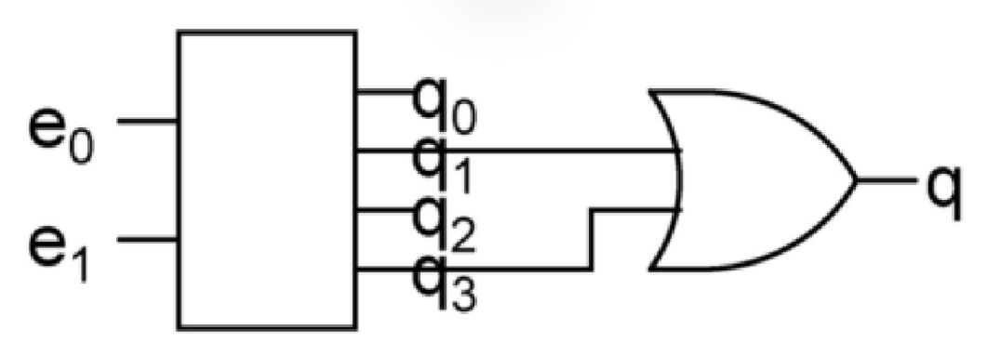

$$$
q = e_1'e_0 + e_1e_0
$$$

## {编码器}(enc Encoder)

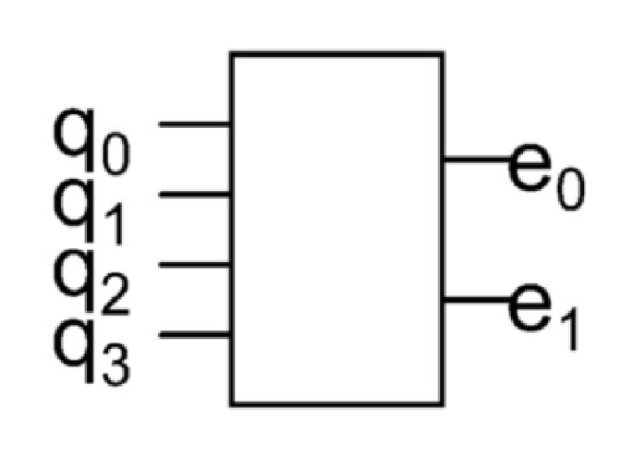

| q3 | q2 | q1 | q0 | e1 | e0 |
| 0  | 0  | 0  | 1  | 0  | 0  |
| 0  | 0  | 1  | 0  | 0  | 1  |
| 0  | 1  | 0  | 0  | 1  | 0  |
| 1  | 0  | 0  | 0  | 1  | 1  |

### {优先编码器}(Priority Encoder)

当多个输入同时为有效状态时，优先编码器会选择具有最高优先级的有效输入，并产生相应的二进制编码输出。

| q3 | q2 | q1 | q0 | r | e1 | e0 |
| 0  | 0  | 0  | 0  | 0 | X  | X  |
| 0  | 0  | 0  | 1  | 1 | 0  | 0  |
| 0  | 0  | 1  | X  | 1 | 0  | 1  |
| 0  | 1  | X  | X  | 1 | 1  | 0  |
| 1  | X  | X  | X  | 1 | 1  | 1  |

## {逻辑移位}(Logic Shift)

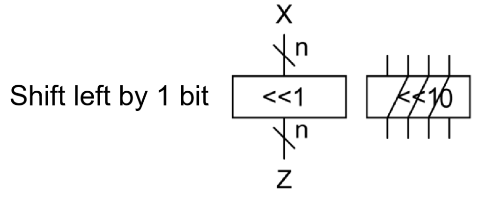
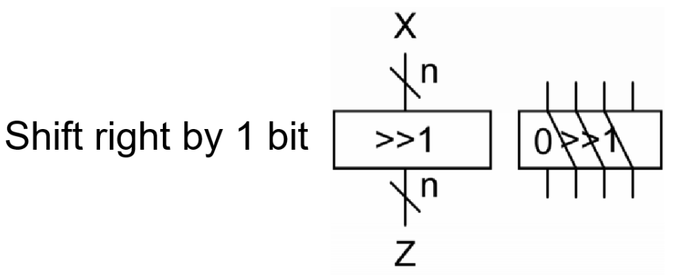

> [note]
> 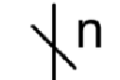
> 使用上述的符号来表示有 n 个 bit 输入/输出

## {算术移位}(Arithmetic Shift)

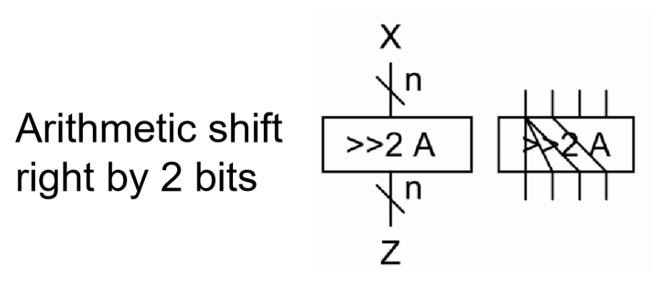
在进行位的移位时，保持最高位的值。

## {旋转}(rot Rotation)

##Rotate Left##: 将最左侧的位移到最右
##Rotate Right##: 将最右侧的位移到最左

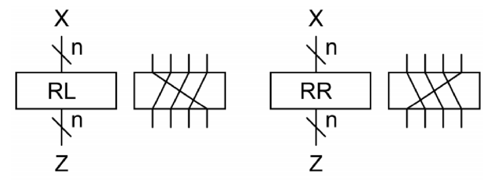

## {加法器}(add Adder)

### {半加器}(Half Adder)

no carry in
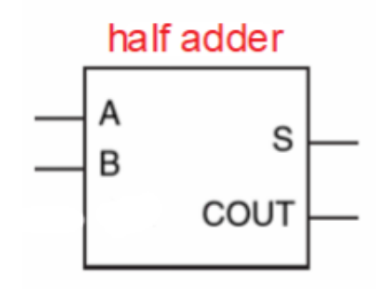

### {全加器}(Full Adder)

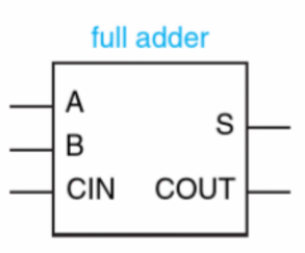
$$$
S = a'b'Cin + a'bCin' + abCin + ab'Cin'\\
\ \ \ \ = a\ xor\ b\ xor\ C_{in}\\
C_{out} = a \cdot b + a \cdot C_{in} + b \cdot C_{in}
$$$

##ripple-carry adder##: chain n-bit full adders
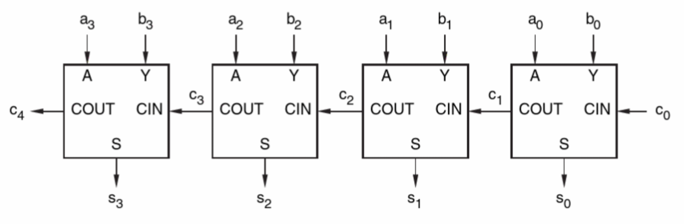

## {运算逻辑单元}(ALU)

ALU 能组合多个运算单元(logic, add, compare 等)，通过 MUX 的输入决定具体进行什么运算。

## {比较器}(cmp Comparator)

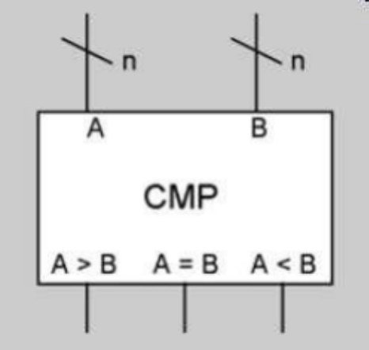

- The output A>B is 1 if the number A is larger than B
- The output A=B is 1 if the number A and B are equal
- The output A<B is 1 if the number A is smaller than B 

## {使能信号}(Enable Input)

决定电路元件是否正常工作。
当 enable=0 时，元件会进入{高阻态}(high impedance)状态

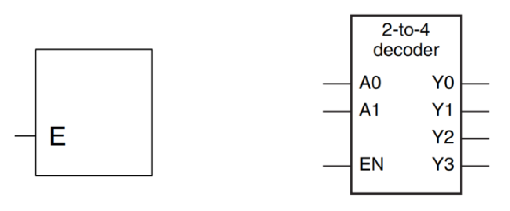
