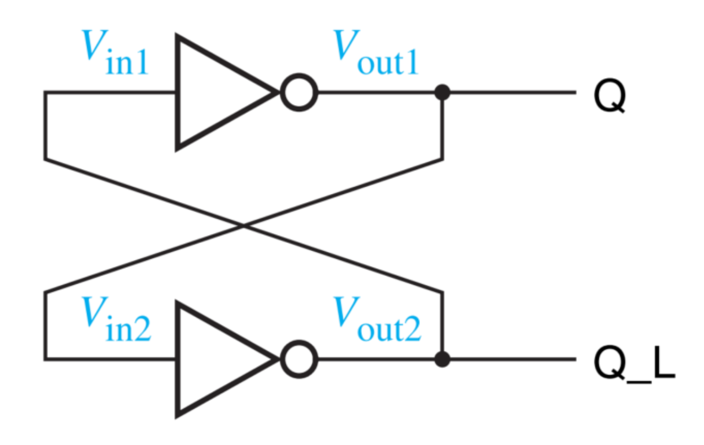
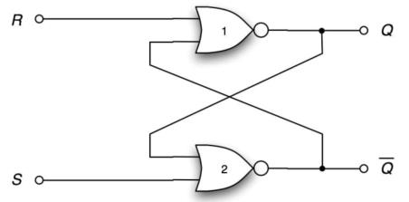
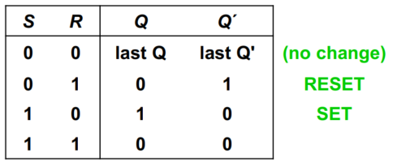
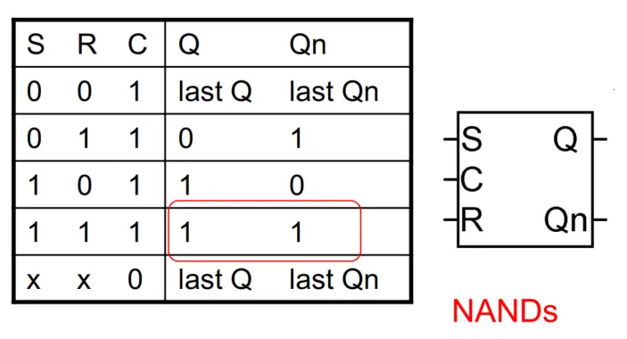
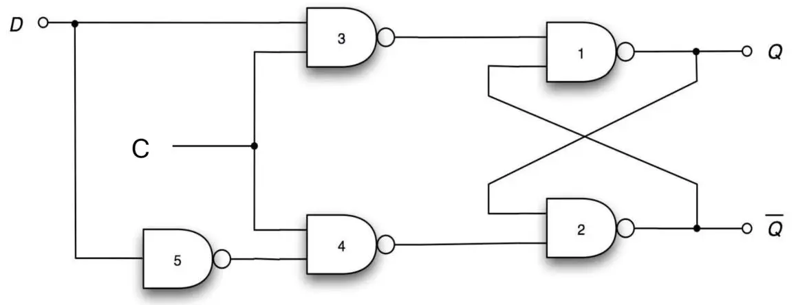
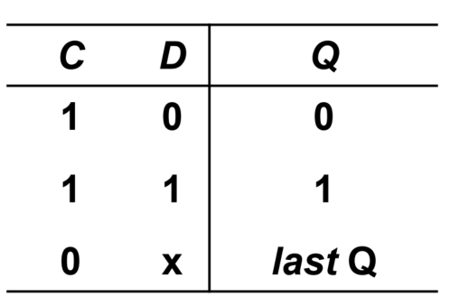

# 时序逻辑电路 | Sequential logic elements

Q: 时序逻辑电路和我们之前学的电路有什么不同？
A: 我们之前学的电路叫作{组合逻辑电路}(Combinational Circuits)，时序逻辑电路和组合逻辑电路最大的不同就是，时序逻辑电路具有##记忆##能力，它能够存储和保持状态。

- - -

## 双稳态电路 | Bistable

## {异步}(Asynchronouse)和{同步}(Synchronous)的区别

异步时序电路能够不受时钟周期影响，在任意时间发生变化；
同步时序电路只能伴随时钟信号变化而随之变化。

## 锁存器 | Latches

### S-R Latch

- when, Q = 1 and Q' = 0 → SET STATE (or 1-state)
- when, Q = 0 and Q' = 1 → CLEAR STATE (or 0-state)

##Unpredictable states##:
1. ``S`` 和 ``R`` 同时从 1 变为 0
2. ``S`` 或 ``R`` 发生脉冲（即突然变为 1 又变为 0）

#### 使能

C = 0 时，无视 S 和 R 的输入，保持之前的状态

### D Latch

- The D latch holds data when C=0.
- The D latch updates the output when C=1
    – If D = 1, Q » 1 → SET State
    – If D = 0, Q » 0 → CLEAR State 

