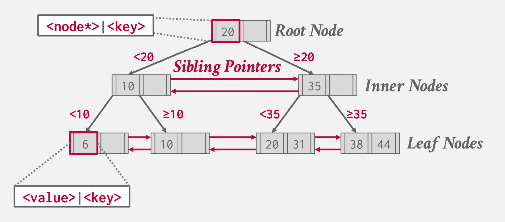

# B Plus Tree Index

## B+ Tree

- Self-balancing
- Ordered
- searches, sequential access, insertion and deletion in ##O(log n)##

##Properties##

- Perfectly balanced (every leaf node is at the same depth in the tree)
- Every non-root node has key count of ``(M / 2 - 1) <= #keys <= (M - 1)`` 
- Every inner node with ##k## keys has ##k + 1## non-null children

## B Tree VS. B+ Tree

@[B 树操作介绍](https://player.bilibili.com/player.html?isOutside=true&aid=1255010724&bvid=BV1tJ4m1w7yR&cid=1561833169&p=1)
@[B+ 树操作介绍](https://player.bilibili.com/player.html?isOutside=true&aid=1855620175&bvid=BV1bs421u7pY&cid=1579513393&p=1)

B 树在树的任意节点存储键值对，而 B+ 树只在叶子节点存储值。

B+ 树具有更好的并发访问性能和顺序 I/O 性能

## Basic Operations

B+ 树操作可视化，仅供参考 [B+ Trees](https://www.cs.usfca.edu/~galles/visualization/BPlusTree.html)

### Insert

通过大小关系找到目标叶子节点 ``L``，插入 entry
如果插入节点后的元素数小于 ``M``，结束
如果插入节点后的元素数等于 ``M``，分割节点，将 key 提升到父节点

### Delete

通过大小关系找到目标叶子节点 ``L``，删除 entry
如果删除节点后的元素数量大于 ``M / 2 - 1``，结束
如果删除节点后的元素数量等于 ``M / 2 - 1``，则进行重新分配，从相邻的兄弟叶子节点分配 entry。
如果重新分配失败，即节点和兄弟节点在删除节点后元素数都小于等于 ``M / 2 - 1``，则合并两个叶子节点

### Selection Conditions

### Duplicate Keys

对于插入以及存在的 key，有两种方法：

1. 和插入不同的 key 一样直接插入
2. 添加 overflow 节点，将 key 插入 overflow 节点

### Clustered Indexes

将表按照主键的顺序存储在硬盘上

### Index Scan Page Sorting

找到查询需要的所有 tuple，基于其 page ID 进行排序

### B+ Tree Design Choices

#### Node Size

The slower the storage device, the larger the optimal node size for a B+Tree.
- HDD: ~1MB
- SSD: ~10KB 
- In-Memory: ~512B

#### Merge Threshold

使用一个节点合并阈值以延迟合并操作

Delaying a merge operation may reduce the amount of reorganization.
It may also be better to just let smaller nodes exist and then periodically rebuild entire tree.

#### Variable-Length Keys

1. Pointers
  - 在节点中存储指向 key 实际数据的指针
  - 会导致产生非连续 IO (nonsequential IO)
2. Variable-Length Nodes
3. Padding
4. Key Map / Indirection
