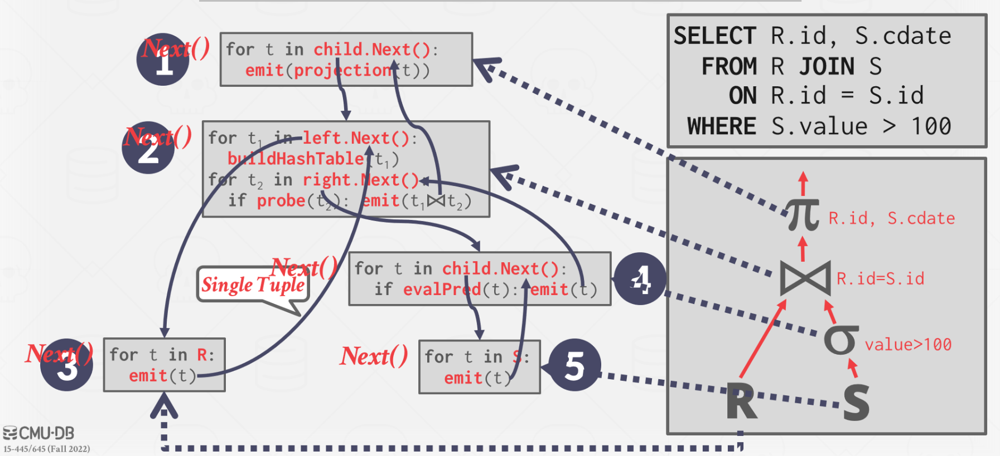
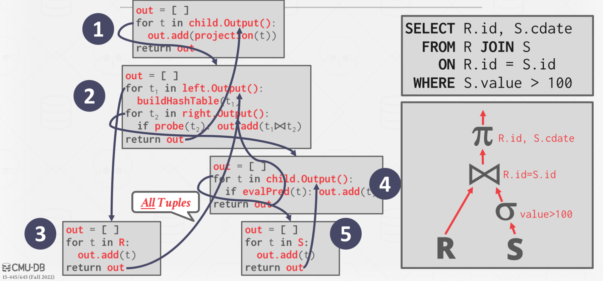
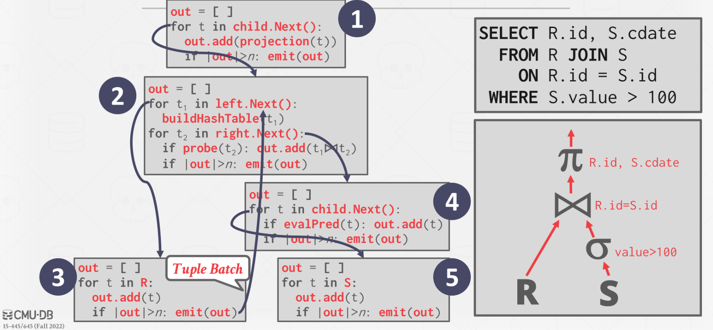

# Query Execution 1

## Processing Models

Defines how the system executes a query plan.

### Iterator Model

::Also the __Volcano__ or the __Pipeline__ Model::

Each query plan operator implements a ``Next()`` function.
- On each invocation, the operator returns either a single tuple or a eof marker if there are no more tuples.
- The operator implements a loop that calls ``Next()`` on its children to retrieve their tuples and then process them.

类似于一些编程语言中的{迭代器}(iterator)



- 易于实现和维护
- 大量的函数调用带来额外开销

### Materialization Model

Each operator processes its input ##all at once## and then emits its output ##all at once##.
- The operator "materializes" its output as a single result.
- The DBMS can push down hints (e.g., LIMIT) to avoid scanning too many tuples.
- Can send either a materialized row or a single column.



Better for OLTP workloads because queries only access a small number of tuples at a time.
- Lower execution / coordination overhead.
- Fewer function calls.
Not good for OLAP queries with large intermediate results.

适用于访问少量数据的场景。

### Vectorization Model

和{迭代器}(Iterator)模型类似，每个{操作符}(operator)都实现自己的 ``Next()`` 函数，但是与迭代器模型每次只返回一个 tuple 不同，{向量化}(Vectorization)模型每次返回多个 tuple。
- The operator’s internal loop processes multiple tuples at a time.
- The size of the batch can vary based on hardware or query properties.



向量化模型是迭代器模型和 Materialization 模型的折中版本。

向量化模型相对于迭代器模型大幅减少了函数调用次数，这使得它很适合 OLAP 查询的场景。
可以使用向量化的质量（如 SIMD）来处理批量的数据。

## Plan Processing Direction

##Approach #1##: Top-to-Bottom
- Start with the root and “pull” data up from its children.
- Tuples are always passed with function calls.

##Approach #2##: Bottom-to-Top
- Start with leaf nodes and push data to their parents.
- Allows for tighter control of caches/registers in pipelines.
- More amenable to dynamic query re-optimization.

## Access Methods

### Sequencial Scan

Pseudo-code:
```
for page in table.pages:
  for t in page.tuples:
    if evalPred(t):
      // Do Something!
```

DBMS 会维护一个指向上次最后遍历到的位置的内部指针。

#### Optimization: Data Skipping

##### Approximate Queries (Lossy)

Execute queries on a sampled subset of the entire table to produce approximate results.

##### Zone Maps (Lossless)

提前计算一个 page 的每一列的聚合数据（最大值、最小值、平均值等），在执行查询时通过这些聚合数据来决定是否访问遍历这一个 page 的数据。

### Index Scan

### Multi-Index Scan

当一个查询涉及多条属性时，使用数据对应的多个索引根据条件获取相应的数据集合后，进行取并集 OR 取交集获得最终结果。

## Modification Queries

##UPDATE/DELETE##:
- Child operators pass Record IDs for target tuples.
- Must keep track of previously seen tuples.

##INSERT##:
- Choice #1: Materialize tuples inside of the operator.
- Choice #2: Operator inserts any tuple passed in from child operators.

### Halloween Problem

当更新某个 tuple 的数据时，被更新的数据又重新满足更新条件，从而导致这些数据被多次更新。
可以通过记录更新过的 tuple 的 id 来避免。


## Expression Evaluation

- Just-in-time (JIT) compilation
