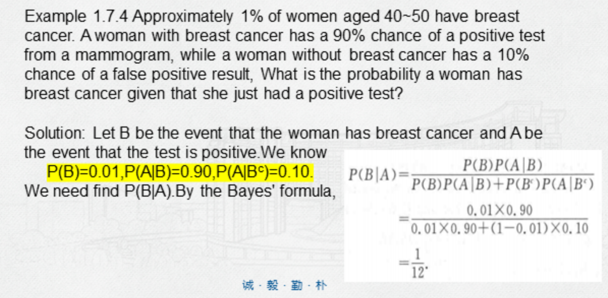

# 条件概率、全概率和贝叶斯

## {Conditional Probability}(条件概率)

事件 B 发生后事件 A 发生的概率：$$P(A | B)$$

$$$
P(A | B) = \cfrac{P(AB)}{P(B)}\\
P(AB) = P(B)\ P(A | B) = P(A)\ P(B | A)\\
P(A | B) + P(A' | B) = 1\\
$$$

当事件 A, B 互相独立时，$$P(AB) = P(A)\ P(B)$$

## {Total Probability}(全概率)

设样本空间 S，其中的若干事件 $$B_1,\cdots,B_n$$ ##互斥##，且 $$\cup_{i=1}^{n}B_i = S$$
则事件 $$B_1,\cdots,B_n$$ 为 S 的 partition。

对于 S 中的任意事件 A，有 $$P(A) = \sum_{i=1}^{n}P(B_i)P(A|B_i)$$

### {Bayes' Theorem}(贝叶斯定理)

$$$
P(B_i | A) = \cfrac{P(B_i)P(A | B_i)}{\sum_{i=1}^{n}P(B_i)P(A|B_i)},\ i=1,\cdots,n
$$$

由上可推出：

$$$
P(A) = P(B)P(A | B) + P(B^c)P(A | B^c)\\
P(B | A) = \cfrac{P(B)P(A | B)}{P(B)P(A | B) + P(B^c)P(A | B^c)}
$$$

>>> 来道例题？

>>>
