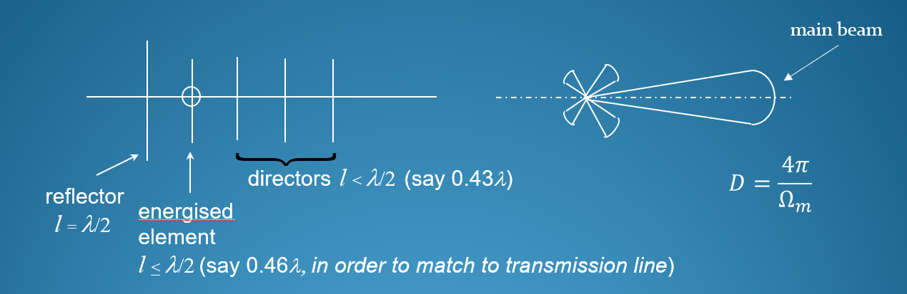

# Array Antennas

## Yagi-Uda Array

### 结构组成

- 反射器 (Reflector)
    - 功能：通过减少或消除来自天线后方的辐射，来增强天线的方向性。它就像一面镜子，把本应向后发射的能量“反射”到前方。
    - 位置：通常是天线振子中最长的一根，位于有源振子的后方。
- 驱动/有源振子 (The driven/energised element)
    - 功能：这是整个天线中唯一一个与信号源（如电视机、发射机）通过电缆连接的部分。它负责将电信号转换成电磁波发射出去，或者将接收到的电磁波转换成电信号。
    - 特征：通常是一个长度约为半波长（λ/2）的偶极子天线。
- 引向器 (Directors / parasitic element)
    - 功能：它们的作用是增强天线的方向性，将能量进一步向前方集中。
    - 工作原理：它们不直接连接到信号源，而是通过与有源振子之间的电磁耦合（EM coupling）来产生感应电流并辐射电磁波。正因为它们是被动工作的，所以也被称为无源振子或寄生单元 (parasitic element)。
    - 位置：位于有源振子的前方，通常有多根，并且长度会依次略微缩短。
- 支撑杆/主梁 (Boom)
    - 功能：这是一根贯穿始终的金属杆，是整个天线的“龙骨”，用于固定和支撑反射器、有源振子和所有引向器，并确保它们之间的相对位置和间距保持精确。

### 方向系数

$$$
D \approx 8 \cfrac{L}{\lambda}
$$$

使用 dB 表示：
$$$
D \approx 10 \log(8 \frac{L}{\lambda})
$$$

- L: 天线阵列的总长度（从反射器到最后一个引向器的距离）
- λ: 信号的波长

注：这里的方向系数同时也是天线增益的近似值

### 天线长度计算

$$$
L = (0.25 + \frac{n}{\pi}) \lambda
$$$

- n: directors 的数量（可以通过 elements 的总数减 2 得到）
