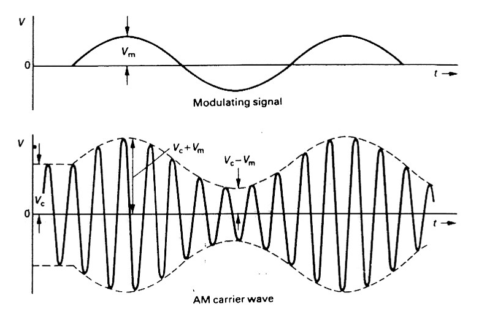
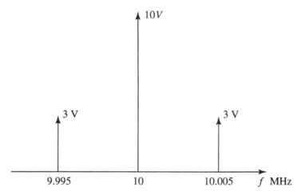
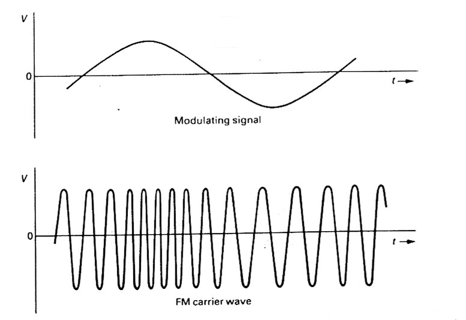

# Modulation

## {Amplitude Modulation}(幅度调制)

AM 就是把低频的声音信号，附加在一个高频的载波信号上，通过改变载波的幅度来把信息发出去。

### {Modulation Index}(调制度)

$$$
m = \cfrac{V_m}{V_c}
$$$

表示信号相对于载波有多强。
- V,,m,,：信号波的幅度
- V,,c,,：载波的幅度

### {USB}(Upper Sideband) and {LSB}(Lower Sideband)

$$$
f_{usb} = (f_c + f_m)\\
f_{lsb} = (f_c - f_m)
$$$

### {Sideband Amplitude}(边带幅度)

即原始信号幅度 (V,,m,,​) 的一半。
$$$
Sideband\ Amplitude = \cfrac{m V_c}{2} = \cfrac{V_m}{2}
$$$

>>>AM 计算示例
A carrier wave of frequency 10 MHz and amplitude 10 V is amplitude modulated with a 5 kHz sine wave of amplitude 6 V. Determine the modulation index and the frequency and amplitude of the spectral components. Draw the spectrum.

##Modulation index:##  $$m = \frac{V_m}{V_c} = \frac{6}{10} = 0.6$$

##USB frequency:##  $$(f_c + f_m) = 10.000 + 0.005 = 10.005 \text{ MHz}$$

##LSB frequency:##  $$(f_c - f_m) = 10.000 - 0.005 = 9.995 \text{ MHz}$$

##Sideband amplitude## $$= \frac{mV_c}{2} = \frac{0.6 \times 10}{2} = 3 \text{ V}$$

>>>

## {Frequency Modulation}(频率调制)

通过改变载波的频率来携带信息。
通俗理解：当原始信号电压变高时，载波就震动得快一点（波变得很密）；当原始信号电压变低时，载波就震动得慢一点（波变得很稀疏）。

特点：
1. 发射功率恒定，因为波的幅度不变
2. 抗干扰

### Modulation Index

$$$
m_f = \cfrac{\Delta f_c}{f_m}
$$$

### FM 带宽占用

$$$
B_{FM} = 2(m_f + 1)f_m = 2(\Delta f + f_m)
$$$
