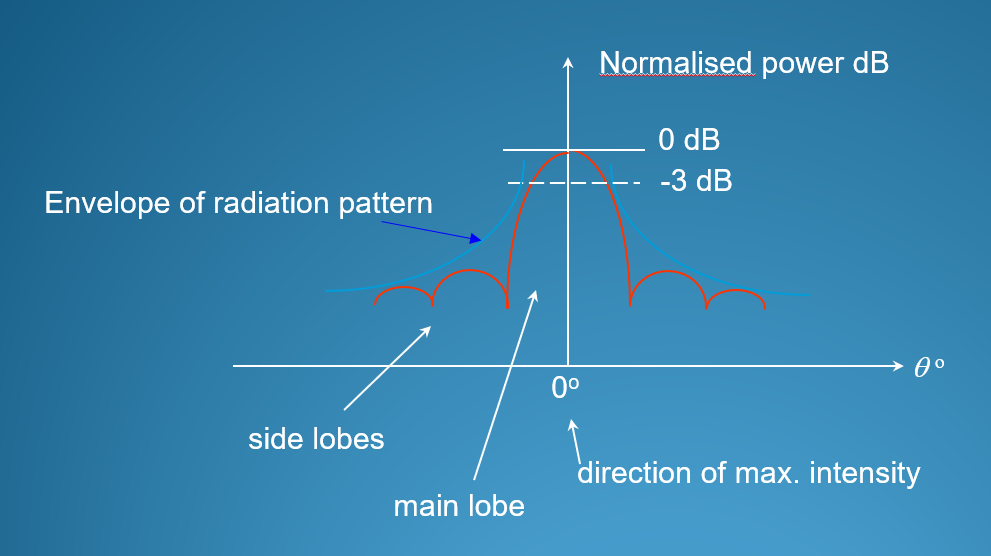

# Near Field & Far Field

## 区分近场远场

$$$
R \geq \cfrac{2D^2}{\lambda}
$$$
where D is the largest antenna dimension

>>>计算示例
Determine the boundary between the near field and far field regions for the following two cases

i) ##An antenna with a length of 1.2 m at a frequency of 1 GHz.##

$$$
\lambda = \frac{c}{f} = \frac{3 \times 10^8}{1 \times 10^9} = 0.3 \text{ m}
$$$

$$$
R \ge \frac{2 \times 1.2^2}{0.3} = 9.6 \text{ m}
$$$

ii) ##A dish antenna 2 m in diameter transmitting a 6 GHz.##

$$$
\lambda = \frac{c}{f} = \frac{3 \times 10^8}{6 \times 10^9} = 0.05 \text{ m}
$$$

$$$
R \ge \frac{2 \times 2^2}{0.05} = \frac{8}{5} \times 100 = 160 \text{ m}
$$$
>>>

## 天线方向图

1. 坐标轴：
  - X 轴：角度 ($$\theta^\circ$$)。0 度代表天线的正前方。
  - Y 轴：归一化功率 (Normalised power dB)。最高点是 0 dB，表示最大功率。
2.  主瓣 (Main Lobe):
  - 中间那个最高、最宽的波峰。
  - 这是天线主要辐射能量的方向（或者主要接收信号的方向）。
  - 箭头指向 "Direction of max. intensity"，即最大强度方向。

3.  旁瓣 (Side Lobes):
  - 主瓣两侧那些矮小的波峰。
  - 这是泄露出去的能量，通常是我们不需要的（浪费能量，或者容易接收到干扰）。
  - 好的天线设计通常追求“低旁瓣”。

4.  波束宽度 (Beam Width):
  - 这是衡量天线“聚光”程度的指标。就像手电筒的光斑大小。图中给出了两种定义方式：
    - 定义 A (最常用): -3 dB 带宽。即功率下降一半（$$10 \log_{10} 0.5 \approx -3$$）时两个点之间的角度宽度。这对应图中的虚线位置。
    - 定义 B: 两个零点 (First minimum) 之间的角度宽度。即主瓣两边第一个掉到坑底（能量极小）的位置之间的宽度。

## {Polarisation}(极化)

以电场 (E) 矢量的方向来定义天线的极化方式。

### 极化中的互易性原理

一个设计用来发射垂直极化波的天线，在接收时，对垂直极化波的接收效率也最高。它几乎无法接收到与之正交的水平极化波。这就是为什么发射和接收天线的极化方式必须匹配才能实现高效通信的原因。
