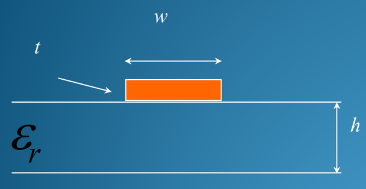

# Stripline and Microstrip

整体结构位置：
- 上方就是这个橙色的导体（信号线）。
- 中间是介质层（Dielectric Substrate，蓝色区域，厚度为 h，介电常数为 $$\epsilon_r$$
- 下方是接地的金属板（Ground Plane，图中底部的白线）。

## {有效介电常数}(Effective dialectric constant)

有效介电常数 $$\epsilon_{eff}$$ 的计算分为两种情况：
- Wide line $$( \cfrac{w}{h} \gg 1 )$$
  - $$\epsilon_{eff} \to \epsilon_r$$
- Narrow line $$( \cfrac{w}{h} \ll 1 )$$
  - $$\epsilon_{eff} \cong \frac{1}{2} (\epsilon_r + 1)$$

通用公式：
$$$
\varepsilon_{eff} = 1 + q(\varepsilon_r - 1)
$$$

## Wavelength on microstrip

$$$
\omega_m = \cfrac{\omega}{\sqrt{\epsilon_{eff}}}
$$$

- 在真空中（或空气中），电磁波跑得很快（光速 $$c$$），波长是 $$\lambda_0$$。
- 一旦电磁波进入电路板（微带线），由于介质的存在，**波速变慢了**。
- 根据公式 $$v = f \times \lambda$$（速度=频率×波长），频率 $$f$$ 是源头决定的（不会变），所以当速度 $$v$$ 变慢时，**波长 $$\lambda$$ 必然会缩短**。
