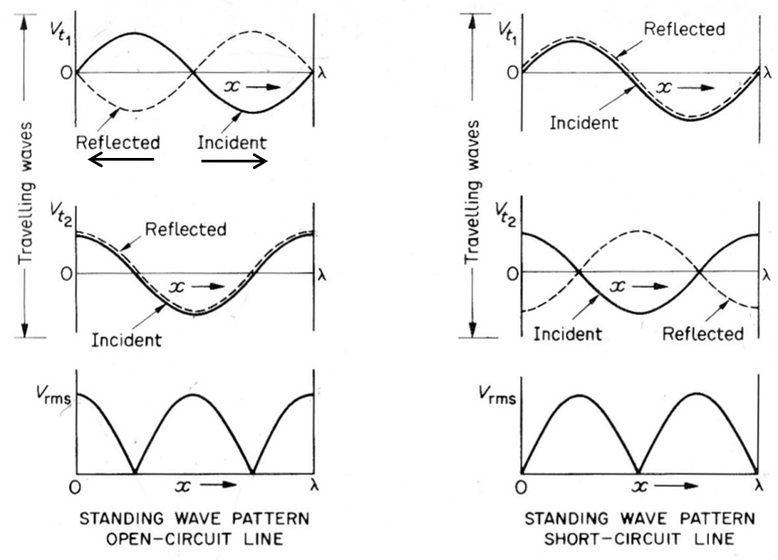

# Transmission Lines

## 传输线的四个基本属性

1. 串联电阻 (Resistance, R)
2. 串联电感 (Inductance, L)
3. 并联电容 (Capacitance, C)
4. 并联电导 (Conductance, G)

## Characteristic Impedance, $$Z_0$$

在导线的任意处，测量电压和电流的比值等于特性阻抗

$$$
Z_0 = \cfrac{V}{I}
$$$

对于传输线，$$Z_0$$ 的计算公式：
$$$
Z_0 = \sqrt{\cfrac{R + j\omega L}{G + j\omega C}}
$$$

对于忽略传输损耗的情况下（即忽略 R 和 G），
$$$
Z_0 = \sqrt{\cfrac{L}{C}}
$$$

## Terminated Transmission line

一根特性阻抗为 $$Z_0$$ 的传输线，末端接入了阻抗为 $$Z_t$$ 的负载，在传输线和负载的边界会出现##反射波##，使得 $$\cfrac{V_{inc} + V_{ref}}{I_{inc} + I_{ref}} = Z_t$$。

反射系数：

$$$
\rho = \cfrac{Z_t - Z_0}{Z_t + Z_0}
$$$

电压反射系数：
$$$
\rho = \cfrac{V_{ref}}{V_{inc}}
$$$

电流反射系数：
$$$
\rho_c = \cfrac{I_{ref}}{I_{inc}} = -\rho
$$$

电压传输系数：
$$$
J = \cfrac{V_t}{V_i} = \cfrac{2Z_t}{Z_0 + Z_t}
$$$

## Coaxial cable

单位长度电感：
$$$
L \approx \cfrac{\mu_0 \mu_r}{2\pi} \ln\left(\frac{D}{d}\right) \quad (\text{H/m})
$$$

单位长度电容：
$$$
C \approx \cfrac{2\pi \varepsilon_0 \varepsilon_r}{\ln(D/d)} \quad (\text{F/m})
$$$

## 在不同频率下的特征阻抗

$$$
Z_0 = \sqrt{\cfrac{R + j\omega L}{G + j\omega C}}
$$$

在高频下，
$$$
Z_0 = \sqrt{\cfrac{L}{C}}
$$$

在低频下，
$$$
Z_0 \approx \sqrt{\cfrac{R}{G}}
$$$

### Skin Effect

$$$
|J| = J_s e^{-d/\delta_s}
$$$

$$J_s$$: 表面电流密度。
$$d$$: 从表面向内走的距离。
当 $$d = δ_s$$ 时，$$|J| = J_s * e⁻¹ ≈ 0.37 * J_s$$。

其中 $$\delta_s$$ 的计算公式为：
$$$
\delta_s = \cfrac{1}{\sqrt{\pi f \mu \sigma_{\text{cond}}}}
$$$

$$σ_{cond}$$: 电导率
$$\mu$$: 磁导率

## Standing Waves

### {Voltage Standing Wave Ratio}(电压驻波比) – VSWR

> VSWR is defined as the ratio of maximum standing wave voltage to the minimum
入射波与反射波的合波（也就是驻波）在空间上振幅最大处 (V_max) 与振幅最小处 (V_min) 的比值。

$$$
S = \cfrac{1 + |\rho|}{1 - |\rho|}
$$$

>>> 公式推导
$$$
S = \cfrac{|V_{\text{max}}|}{|V_{\text{min}}|} = \cfrac{|V_i| + |V_r|}{|V_i| - |V_r|}\\
S = \cfrac{|V_{\text{max}}|}{|V_{\text{min}}|} = \cfrac{|V_i|\left(1 + \left|\cfrac{V_r}{V_i}\right|\right)}{|V_i|\left(1 - \left|\cfrac{V_r}{V_i}\right|\right)}\\
S = \cfrac{1 + |\rho|}{1 - |\rho|}
$$$
>>>

- - -

## 附：$$z = A + jωB$$ 形式复数的 magnitude 和 phase 计算

Magnitude: $$|z| = A^2 + (ωB)^2​$$
Phase: $$\Phi = arctan(\cfrac{\omega B}{A}​)$$

注：
- 如果 A>0，直接使用上述公式即可。
- 如果 A<0，计算出的角度通常需要加上 180∘（或 π 弧度），以确保相位落在正确的象限。
