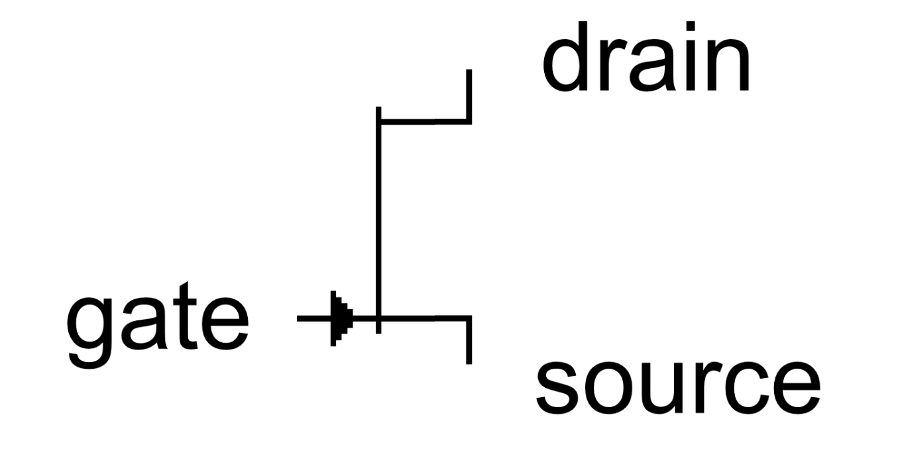
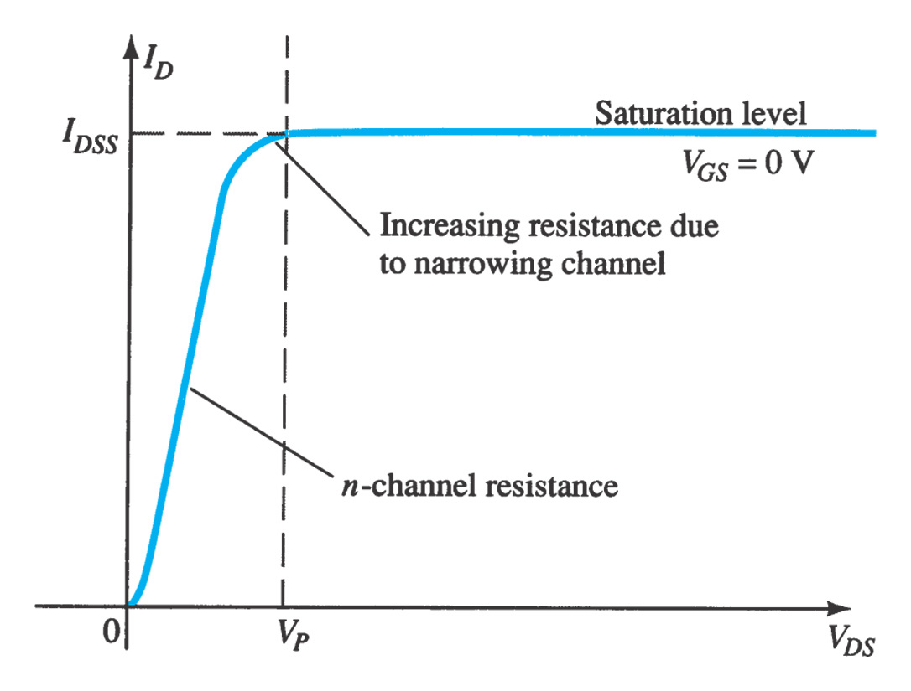
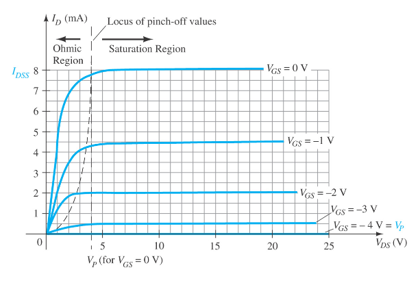
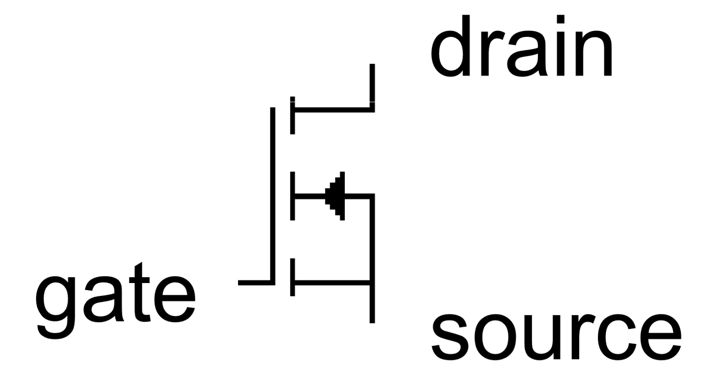
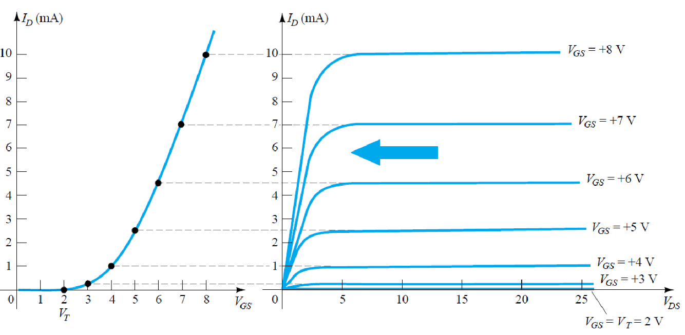
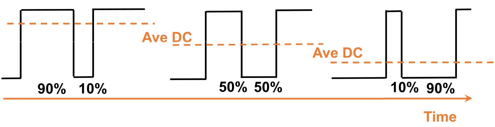

# 场效应管 | Field Effect Transistors (FETs)

## 结型场效应管 | Junction Field Effect Transistor (JFET)

结型场效应管有如下性质：
1. $$V_p \rightarrow \text{pinch-off voltage}$$
2. 当 $$V_{GS} = 0 V$$ 时，$$I_{DS}$$ 饱和
3. 在 $$I_{DS}$$ 饱和前，有 $$I_{DS} = I_{DSS} (1 - \frac{V_{GS}}{V_p})^2$$
4. 当 $$V_{GS} = -V_p$$ 时，$$I_{DS} = 0 V$$ (Cut off)
5. 当 $$V_p \leq V_{DS} < V_{break\ down}$$，$$I_{DS} = constant$$ (Pinch-off)
6. $$I_D = I_S$$, $$I_G ≅ 0 A$$

## 金属氧化物半导体场效应晶体管 | Metal Oxide Semiconductor Field Effect Transistor (MOSFET)

金属氧化物半导体场效应晶体管有如下性质：
1. 当 $$V_{GS} > V_T \text{(threshold voltage)}$$ 时，MOSFET 流通
2. 当有电流通过 MOSFET 时，有 $$I_D = k (V_{GS} - V_T)^2$$

## 脉宽调制 | Pulse Width Modulation (PWM)

$$$
Duty\ cycle = \frac{Time\ ON}{Total\ period} \times 100\%
$$$
