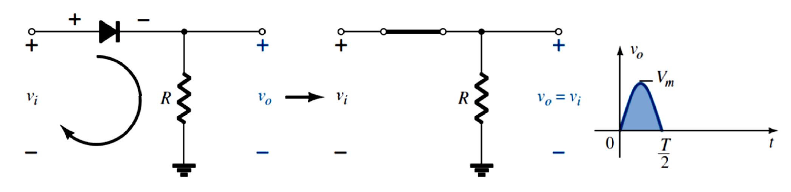
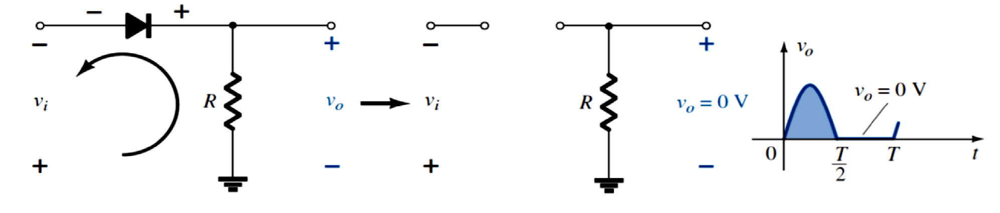
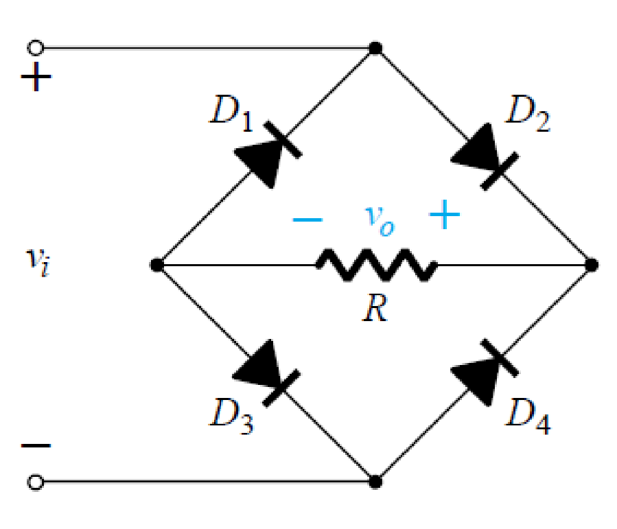
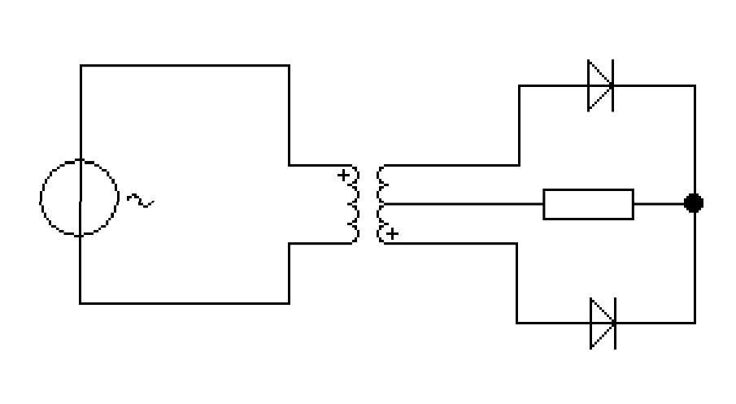
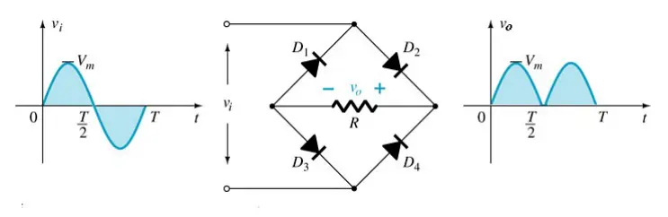

# 整流器 | Rectifier

## 定义

整流器是一种用于将交流电转换成直流电的电子元件。

> A rectifier is an electrical device that converts alternating current (AC), which periodically reverses direction, to direct current (DC), which flows in only one direction.
> \-\- [Wikipedia](https://en.wikipedia.org/wiki/Rectifier)

## 半波整流 | Half-Wave Rectifier

对于一个正弦波，如下图所示：

!!!echarts
const sineWaveData = []
for(let j = 0; j < 2 * Math.PI; j += 0.1) {
    sineWaveData.push([j, Math.sin(j)])
}
option = {
    xAxis: {},
    yAxis: {},
    series: {
      data: sineWaveData,
      type: 'line',
    }
}
!!!

在一个半波整流电路中，随着输入电压变化，输出电压会发生如下所示的变化：

对于一个交流电源输入，经过一个半波整流器，对于其输出的直流电有：

$$$
V_{dc} = 0.318 V_m
$$$

> [note] Notes
> - A real diode does not start conducting until forward signal exceeds V,,D,, ≈ 0.7 V
> - In reverse direction there is a very small leakage current
> - The peak output voltage: ##V,,p,, = V,,m,, - 0.7##
> - The average output voltage is a small positive value: V,,d,, = V,,out, avg,,  = 0.318 V,,p,,
>
> 对于公式中的一些记号：
> - V,,m,, = V,,max,,: maximum voltage from the transformer 
> - V,,p,, = V,,peek,,: peak voltage applied to the load

### 峰值逆电压 | Peak Inverse Voltage

最大的可施加在稳流器上而不使其损坏的反向电压。

The maximum reverse-bias voltage that can be applied before entering the breakdown region is called: the peak inverse voltage (referred to simply as the ##PIV rating##), or the peak reverse voltage (denoted the ##PRV rating##).

$$$
PIV > V_m \rightarrow Typically \times 2\\
PIV = 2V_m
$$$

> [note]
> 理论上 PIV 的值可以为任何大于 V,,m,, 的值，但为了安全起见，一些时候会取 V,,m,, 的倍数，如两倍。

## RMS 等效电压 | RMS Voltage equivalent

正弦波形的 RMS 等效电压等同于 $$\frac{V_m}{\sqrt 2}$$。

## 全波整流 | Full-Wave Rectification

全波整流示例电路

> [note]
> - In reverse direction there is a very small leakage current
> - Because of centre-tap, ##RMS voltage for each half section = V,,RMS,, / 2##
> - For peak output voltage, only one diode conducts at a time, so still have ##V,,p,, = V,,m,, - 0.7 (same as half-wave)##
> - However, now we have twice the average output voltage ##V,,out, avg,, = 0.636 V##
> - Still have to specify PIV rating
>     - ##PIV > 2 V,,m,, − 0.7 V##, usually select ##double## this value

### 桥式整流器 | Bridge Rectifier

> [note]
> - In reverse direction, there is still a very small leakage current
> - For peak output voltage, two diodes conduct at a time so ##V,,p,, = V,,m,, − 1.4##
> - The same average output voltage as two-diode rectifier, ##V,,dc,, = 0.636 V,,p,,##
> - Have to specify PIV rating, but with no centre-tap, it is the same as for half-wave rectifier: ##PIV > V,,m,, − 0.7##, usually allow a factor of 2

- - -

## 整流器总结

| 整流器类型 | 理想 V,,dc,, | 实际 V,,dc,, | PIV |
| 半波整流器 | V,,dc,, = 0.318 V,,m,, | V,,dc,, = 0.318 (V,,m,, - 0.7) | ~ 2 * V,,m,, |
| 中心抽头整流器 | V,,dc,, = 0.636 V,,m,, | V,,dc,, = 0.636 (V,,m,, - 0.7) | ~ 2 * (2 V,,m,, - 0.7) |
| 桥式整流器 | V,,dc,, = 0.636 V,,m,, | V,,dc,, = 0.636 (V,,m,, - 1.4) | ~ 2 * (V,,m,, - 0.7) |
