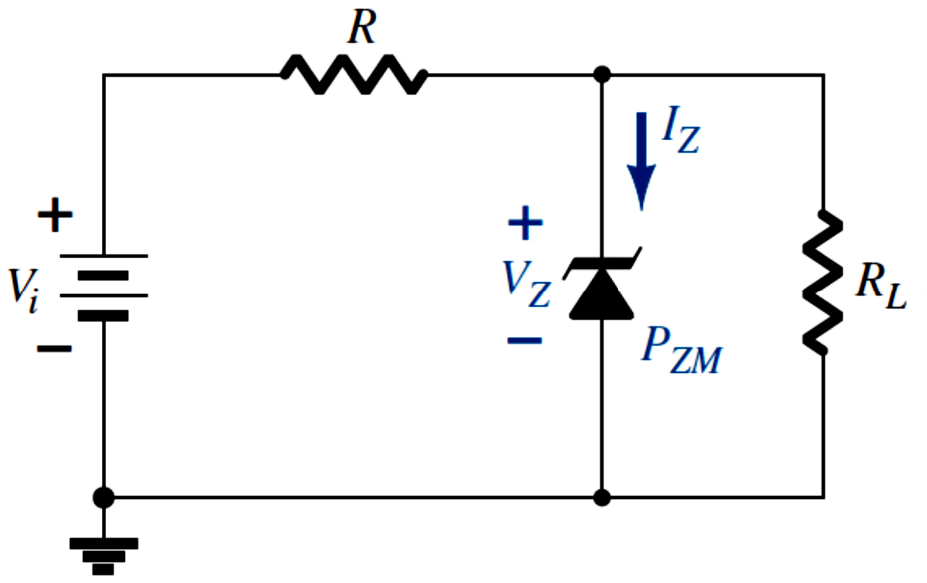

# 稳压二极管 | Zener Diode Regulation

## 稳压电路示例 | Regulator Circuit

$$$
V_L = V_Z\\
I_R = I_Z + I_L\\
P_Z = V_Z I_Z\\
$$$

> [note] 稳压二极管与普通二极管的区别
> 普通二极管具有单向导电性，假如它被反向击穿，不具可逆性，将永久损坏。
> 而稳压二极管正是利用了它的反向击穿的特性，当被反向击穿时，稳压二极管反向电阻降低到一个很小的数值，在这个低阻区中电流增加而电压则保持恒定（即保持为 V,,z,,），且不会被损坏。
