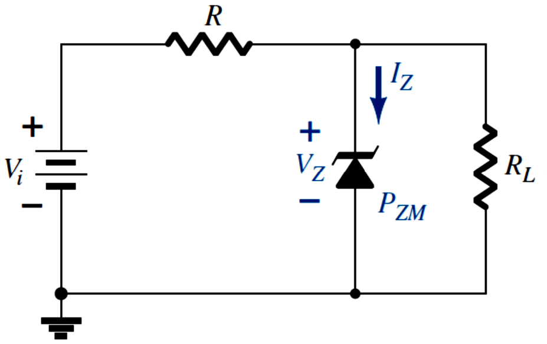
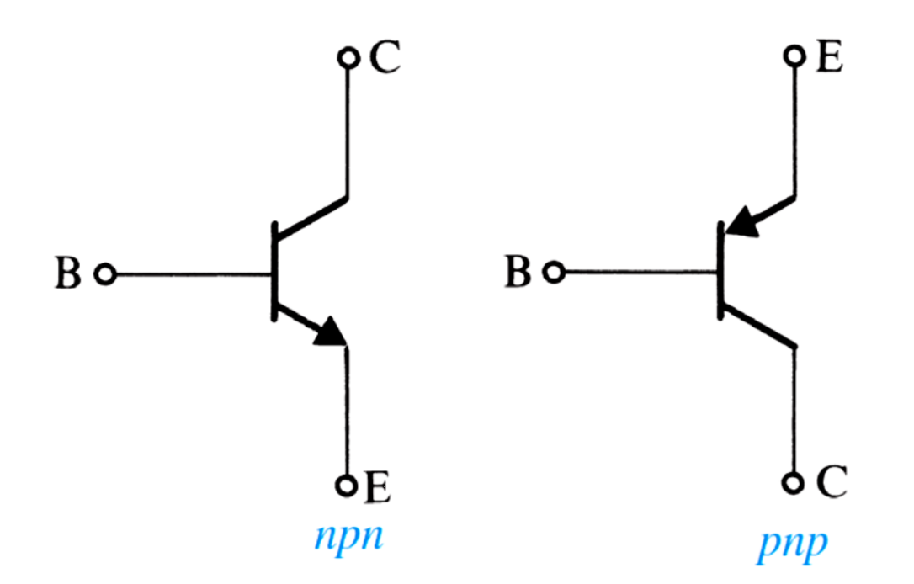
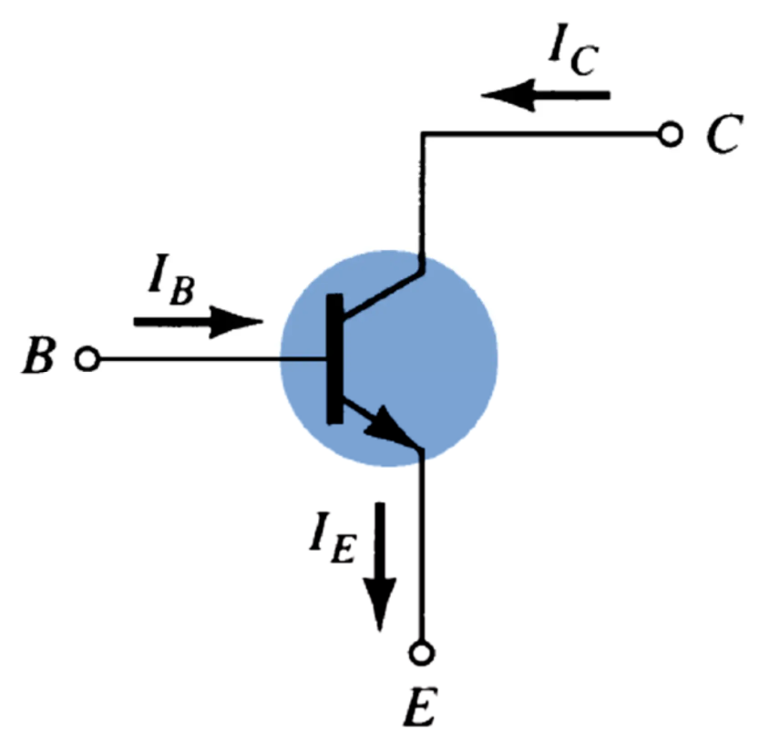
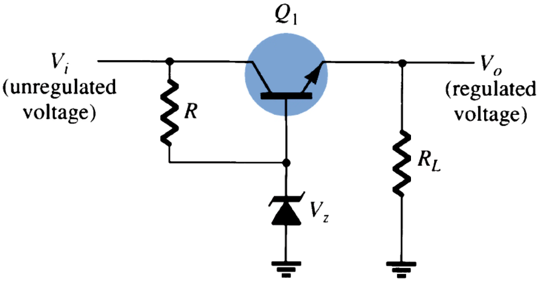
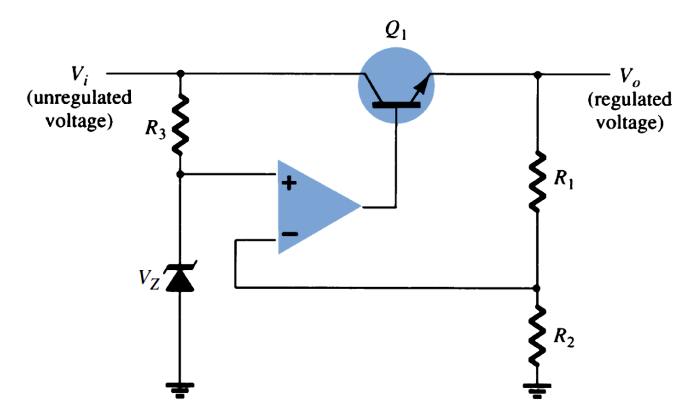
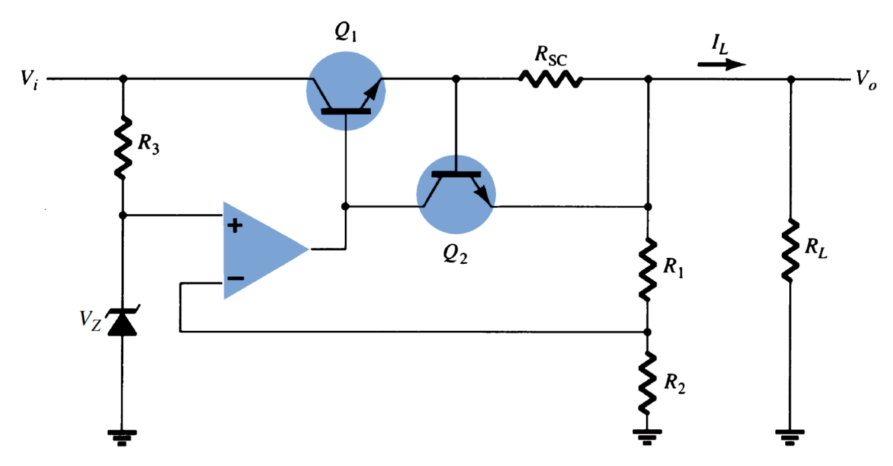
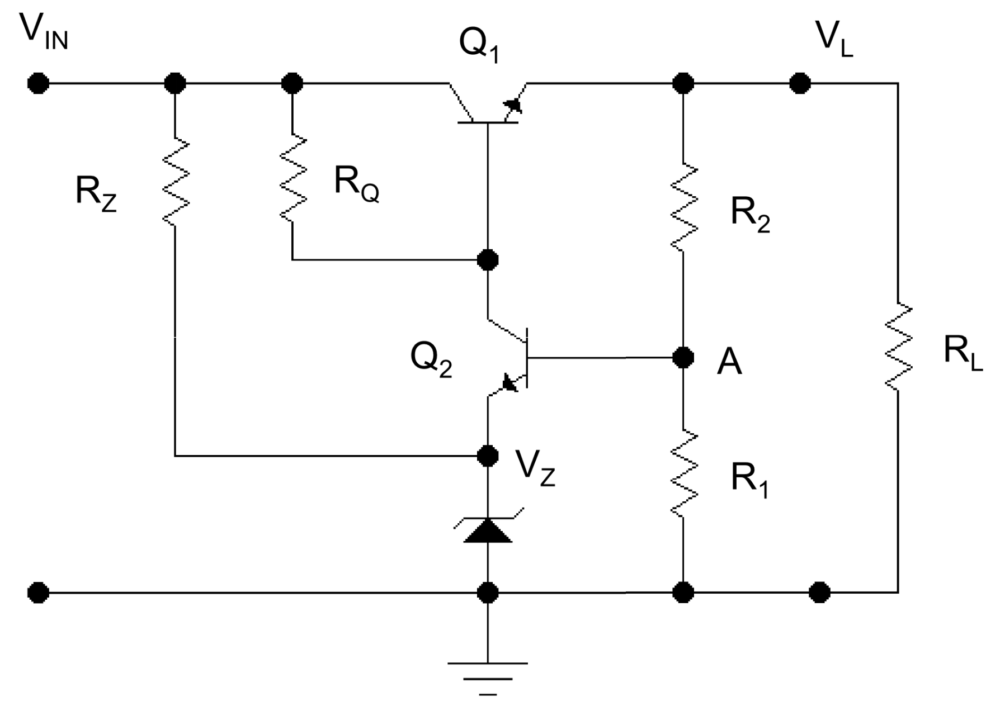

# 稳压电路 | Regulatyor Circuit

## 稳流二级管稳压 | Zener diode regulation

分析步骤如下：

1. 将电路中的稳流二极管看作断路，计算负载电阻的两端电压 V,,L,,
2. 将 V,,L,, 与稳流二极管的最大反向电压 V,,Z,, 比较，
    - 如果 V,,L,, < V,,Z,,，则该稳流二极管视为断路
    - 如果 V,,L,, >= V,,Z,,，则负载电阻两端实际电压等于 V,,Z,,
3. 则有如下计算等式：
    - I,,R,, = I,,Z,, + I,,L,,
    - P,,Z,, = V,,Z,, I,,Z,,，必须小于 P,,ZM,,

## 晶体管 | Transistors

### Bipolar Junction Transistor (BJT)

BJT 的电流流向图示：

- $$I_C \approx I_E$$
- $$V_{BE} ≅ 0.7 V$$ when BJT is ON
- $$I_B \ll I_C$$
- current gain: $$\beta = \frac{I_C}{I_B}$$

### 串联稳压器 | Series Voltage Regulator

一些用于分析此电路的计算等式：
- V,,Z,, = V,,o,, + V,,BE,,
- V,,R,, = V,,i,, - V,,Z,,
- R,,L,, = V,,o,, / I,,L,,
- I,,R,, = V,,R,, / R

> [note] 反馈调节过程
> - If the output voltage decreases, the increased base-emitter voltage causes transistor Q1 to conduct more, thereby raising the output voltage—maintaining the output constant.
> - If the output voltage increases, the decreased base-emitter voltage causes transistor Q1 to conduct less, thereby reducing the output voltage—maintaining the output constant.

## 电压调整率 | Voltage Regulation Percentage

$$$
Voltage regulation = \frac{no\text{-}load\ voltage - full\text{-}load\ voltage}{full\text{-}load\ voltage}\\
OR,\ \text{V.R.} = \frac{V_{NL} - V_{FL}}{V_{FL}} \times 100%
$$$

## 运算放大器稳压电路 | Op-amp Series Regulator

$$$
V_o = (1 + \frac{R_1}{R_2}) V_Z
$$$

## 限流稳压电路 | Series Regulator with Current Limiting

> [note] 反馈调节过程
> - When load current I,,L,, increases, the voltage across the short circuit sensing resistor R,,SC,, increases. 
> - When the voltage across RSC becomes large enough, it will drive Q,,2,, on, diverting current from the base of transistor Q,,1,,, thereby reducing the load current through transistor Q,,1,,, preventing any additional current to load R,,L,,.
> - The action of components R,,SC,, and Q,,2,, limits the maximum load current.

## 反馈稳压电路 | Feedback Stabilised Voltage Regulator

一些用于分析此电路的计算等式：
- $$V_A = V_Z + 0.7V$$
- $$V_A = V_L (\frac{R_1}{R_1 + R_2})$$

> [note] 反馈调节过程
> 当 V,,L,, 增加时
> 1. V,,A,, 增加
> 2. Q,,2,, 的 V,,BE,, 增加
> 3. Q,,2,, 的 I,,BE,, 增加
> 4. Q,,2,, 的 I,,CE,, 增加
> 5. 由于分流，Q,,1,, 的 I,,BE,, 减小
> 6. Q,,1,, 的 I,,CE,, 减小
> 7. I,,L,, 减小
> 8. V,,L,, 减小
>
> 反之亦然。
