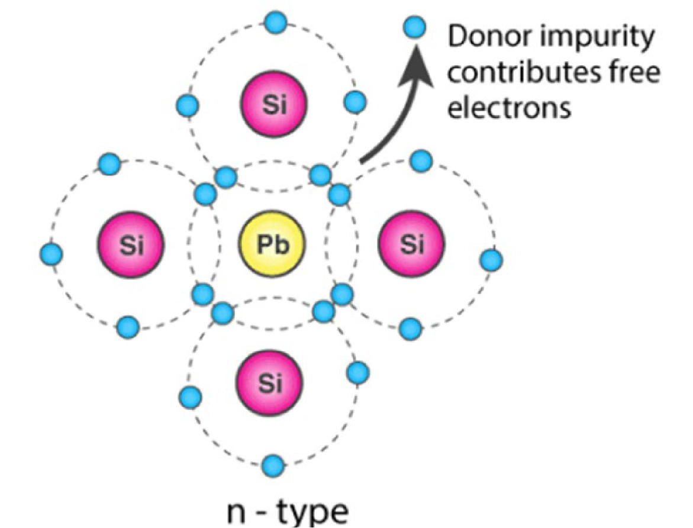
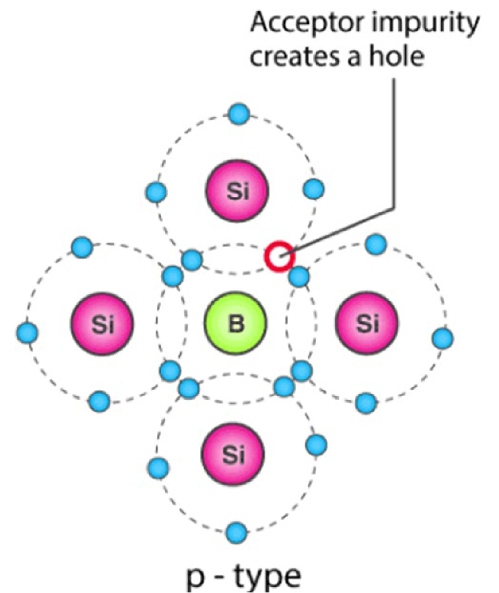
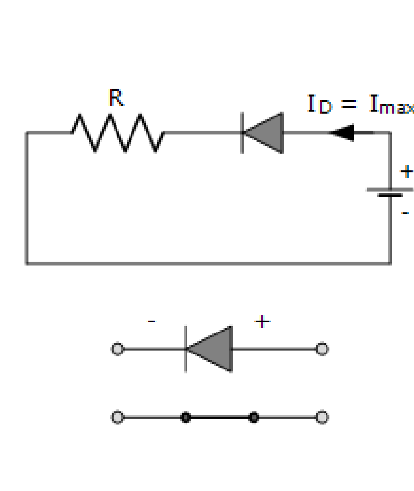
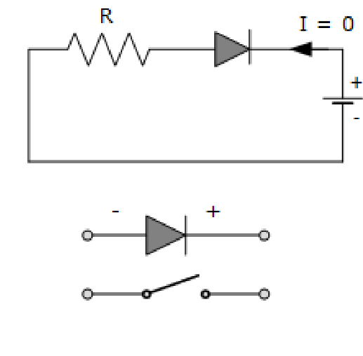
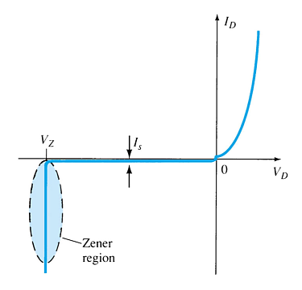

# 课程导入

## 二极管 | Diode

### 半导体 | Semiconductor

### P-N 结 | PN junction

N-type doping: Elements with 5 valence electrons are introduced as impurity to semiconductor

P-type doping: Elements with 3 valence electrons are introduced as impurity to semiconductor

### P-N 结二极管

{三种偏转情况}(Three bias conditions)：##zero bias##, ##forward bias## and ##reverse bias##

Forward Biasing

Reserve Biasing

##Zener region##: in the diode’s reverse-bias region, At some point the reverse bias voltage is so large the diode breaks down and the reverse current increases dramatically.
- This maximum voltage is called ##avalanche breakdown voltage## 
- The current is called ##avalanche current##

## 二极管测试 | Diode Testing

- Diode checker
- Ohmmeter
- Curve tracer

Silicon diode ≅ 0.7V
Germanium diode ≅ 0.3V
