# BJT DC Analysis

## I,,C,, versus V,,CE,,

图像从左到右分别为：Saturation, Active, Breakdown

绘制{负载线}(load line)：
- 在 I,,C,, 轴上找到点 $$\cfrac{V_{CC}}{R_C}$$
- 在 V,,CE,, 轴上找到点 $$V_{CC}$$
- 将两点相连

负载线与图像的交点即晶体管的{静态工作点}(Quiescent Point)。

## 四种 DC Biasing Configuration

### Base Biasing

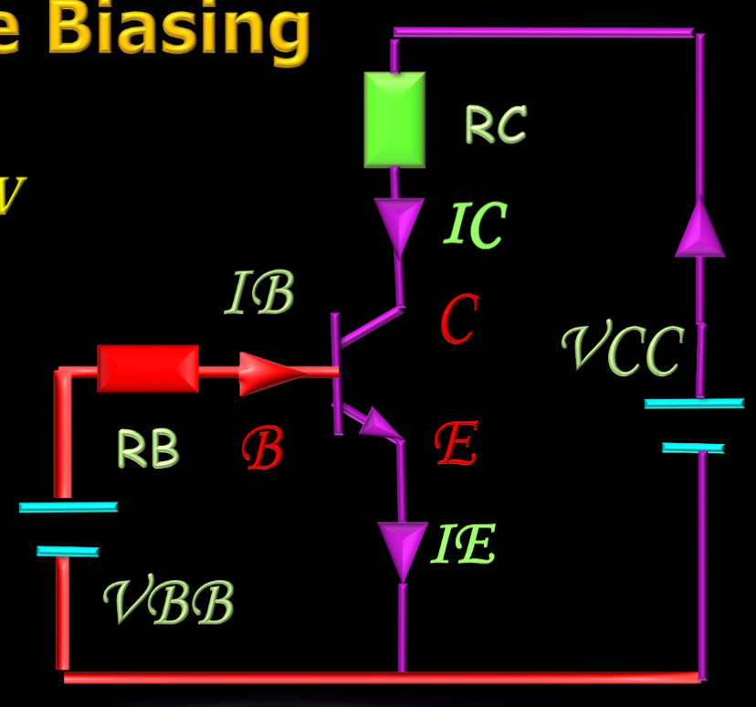

使用一个电阻 R,,B,, 连接在基极和电源 V,,CC,, 之间，基极电流由 R,,B,, 控制。

$$$
V_{BB} = I_B R_B + V_{BE}, V_{BE} = 0.7V\\
I_B = \cfrac{V_{BB} - 0.7V}{R_B}\\
I_C = \beta I_B \approx I_E\\

V_{CC} = I_C R_C + V_{CE}\\
V_{CE} = V_{CC} - I_C R_C\\
$$$

### Collect Feedback Biasing

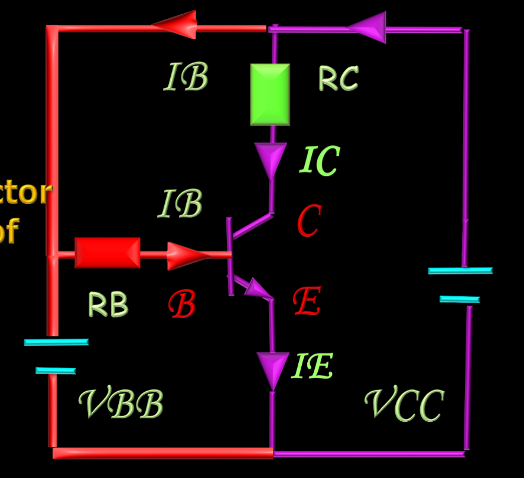
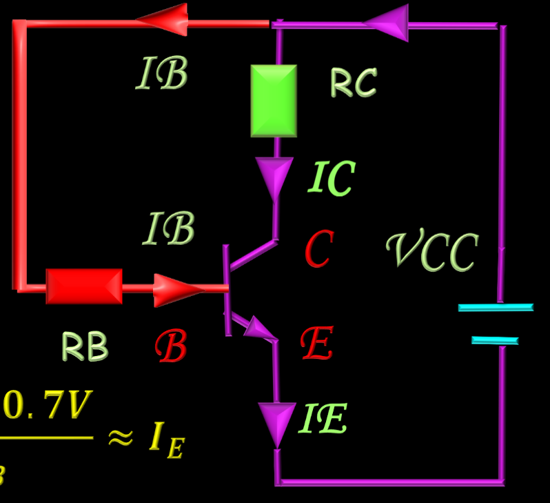

集电极通过一个反馈电阻 R,,C,,​ 连接到基极

$$$
V_{CC} = I_B R_B + V_{BE} = I_B R_B + 0.7V\\
I_C = \beta I_B = \beta \frac{V_{CC} - 0.7 \, \text{V}}{R_B} \approx I_E\\
V_{CC} = I_C R_C + V_{CE}\\
$$$

### Emitter Biasing

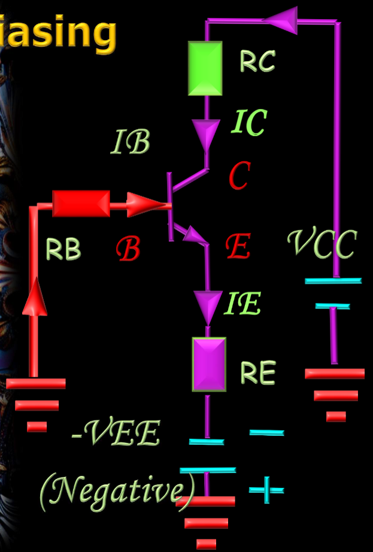

在发射极引入一个电阻 R,,E,, 和额外的电压降​，利用负反馈稳定工作点。

### Voltage Divider Biasing

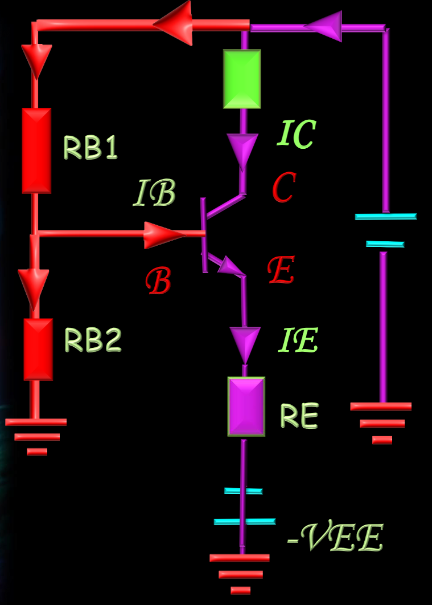

基极通过分压电阻网络 R,,1,,​ 和 R,,2,,​ 偏置，提供稳定的基极电压。

# BJT AC Analysis

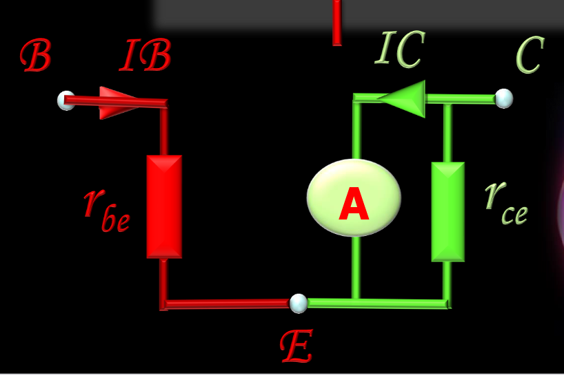

1. 使用等效电路代替电路中的 BJT
2. 将 DC 源看作接地
3. 将 电容看作导线

## {共发射极放大器}(Common-emitter Amplifier)

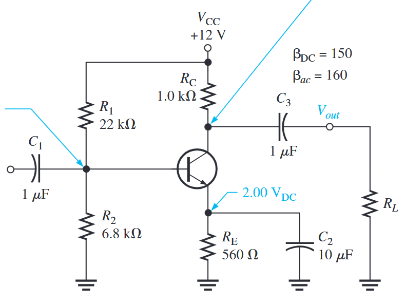

>>>计算发射极电阻 r,,e,,
计算基极电压 V,,B,,
$$$
V_B = \cfrac{R_2}{R_1 + R_2} V_{CC}
$$$

计算发射极电流 I,,E,,
$$$
I_E = \cfrac{V_E}{R_E} = \cfrac{V_B - 0.7}{R_E}
$$$

发射极电阻 r,,e,,
$$$
r_e = \cfrac{V_T}{I_E} = \cfrac{25 mV}{I_E}
$$$
>>>

>>>输入输出阻抗计算
$$$
R_{in} = R_1 \parallel R_2 \parallel R_{in(base)}\\
R_{out} = R_C
$$$
>>>

## BJT Power Amplifiers

### Class A: Emitter Follower

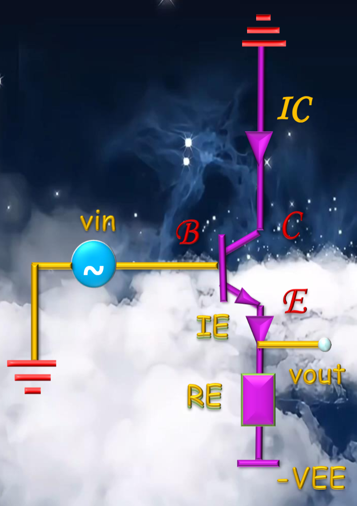
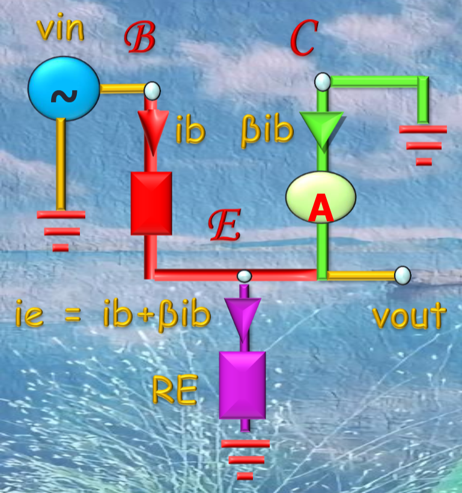

>>>增益计算
V_{in} = i_b r_{be} + (i_b + \beta i_b) R_E\\
V_{out} = (i_b + \beta i_b) R_E\\
A_v \approx 1
>>>

>>>例题 1
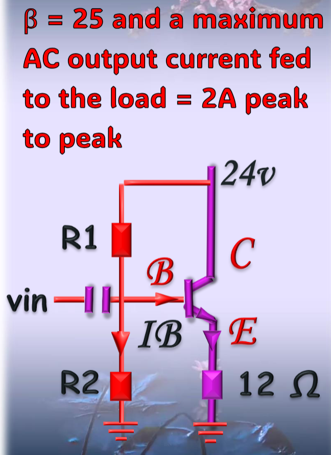

### 计算 R,,1,, 和 R,,2,,
在中点偏置下，$$V_{CE} = V_E = \frac{1}{2} V_{CC}$$
$$$
I_C = I_E = \cfrac{V_E}{R_E}\\
I_b = \cfrac{I_C}{\beta}\\
V_B = V_E + V_{BE}\\
R_2 = \cfrac{V_B}{I_b * 10}\\
V_{CC} = I_b * 10 (R_1 + R_2)\\
$$$

### 计算 Power dissipated
对于电阻：$$P_R = I_R^2 R$$
对于三极管：$$P_{TR} = I_C V_{CE}$$
>>>

### Class B

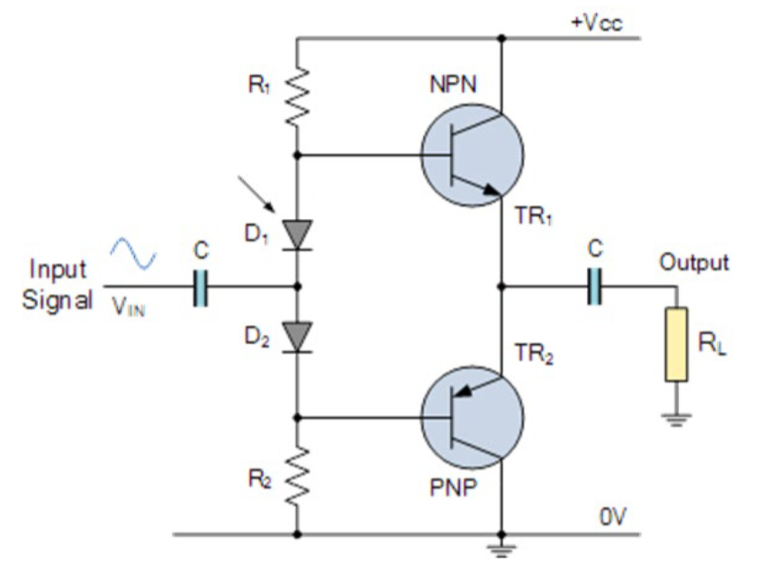
