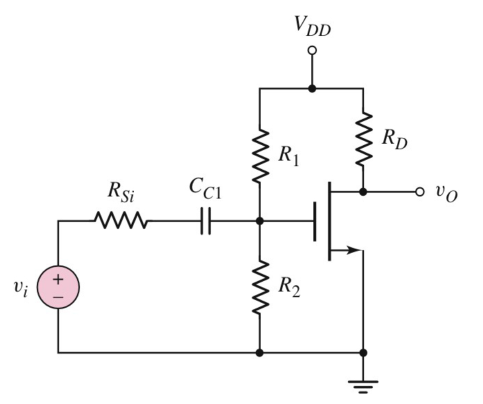

# MOSFET

## Small-Signal Parameters

$$$
g_m = \sqrt{2 K_n I_D}\\
r_0 = \infty
$$$

- - -

>>>例题 1

$$$
V_{DD} = 5\ \text{V}, \ R_1 = 520\ \text{k}\Omega, \ R_2 = 320\ \text{k}\Omega, \ R_D = 10\ \text{k}\Omega, \ \text{and} \ R_{Si} = 0
$$$

对于电压增益 $$A_v = V_o / V_i$$：
$$$
V_{GS} = V_{DD} (\cfrac{R_2}{R_1 + R_2})\\
I_D = \cfrac{k_n}{2}(V_{GS} - V_T)^2\\
A_v = -\frac{g_m R_L}{1 + g_m R_S} \left( \frac{R_g}{R_g + R_{SI}} \right), R_g = R_1 \parallel R_2, R_L = R_D \parallel R_O
$$$

对于输入和输出电阻 $$R_i and R_o$$：
$$$
R_i = R_g = R_1 \parallel R_2\\
R_o = R_L = R_D \parallel R_O = R_D
$$$
>>>
