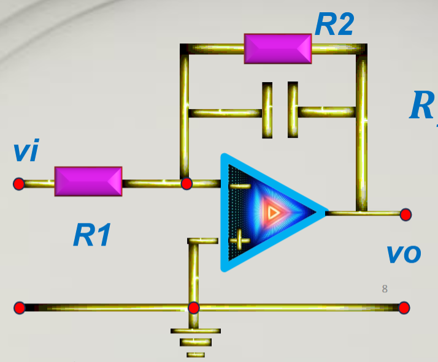
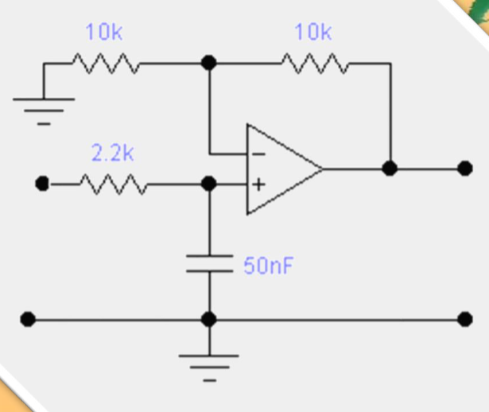
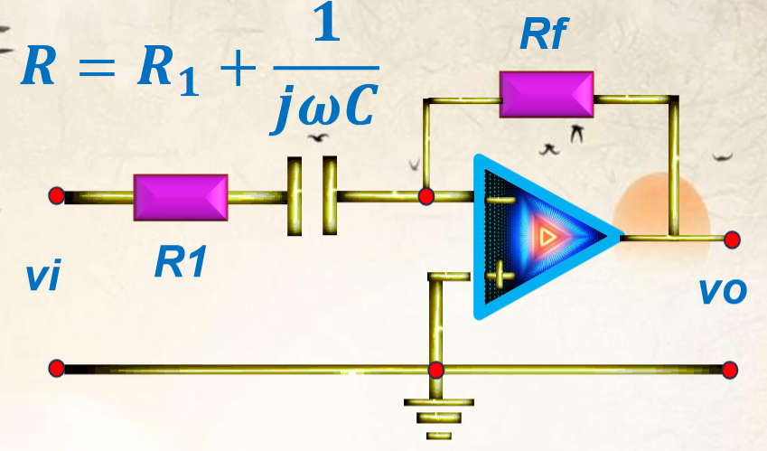
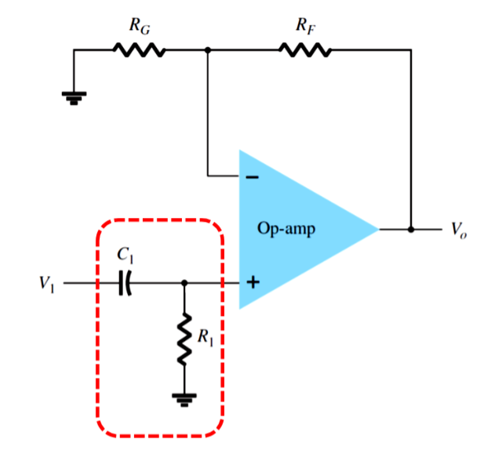

# Op-Amp Filters

Cut-off frequency: $$f_c = \cfrac{1}{2 \pi R C}$$

## Low Pass Filter

$$$
R_f = R_2 \parallel C = \frac{R_2}{1 + j \omega C R_2}\\
A_v(\omega) \approx -\cfrac{R_2}{R_1}
$$$

## High Pass Filter

$$$
R = R_1 + \cfrac{1}{j \omega C}\\
A_v(\omega) \approx -\cfrac{R_f}{R_1}
$$$

